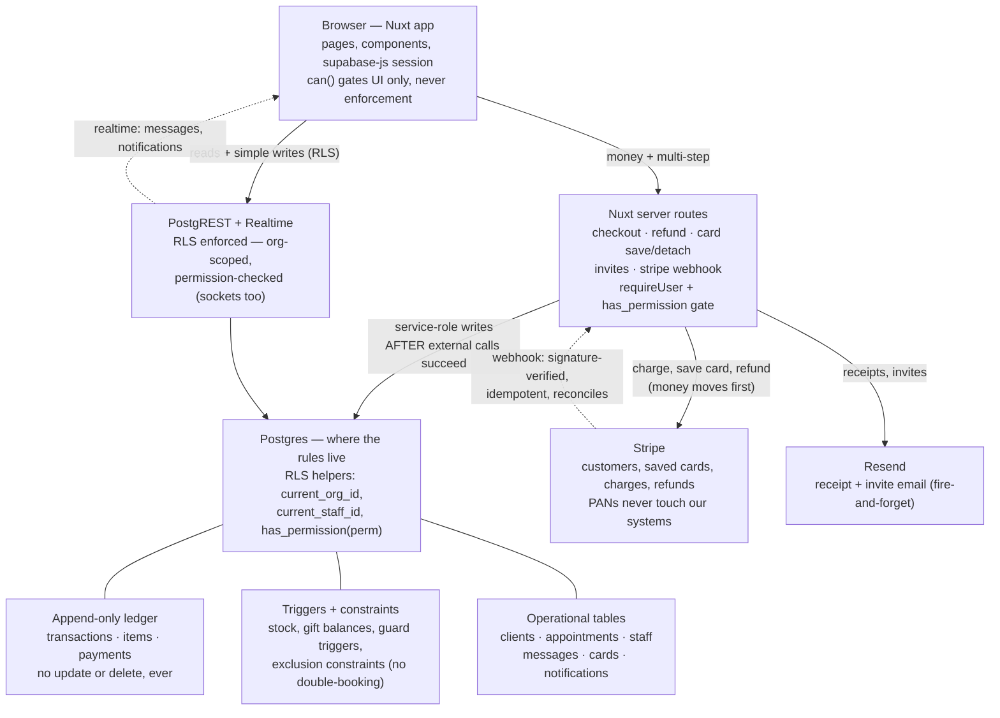

# The Reserve — architecture

Status: current as of 2026-08-30 (post-4b). Update when a new lane or
external service is added — not for new tables or routes that follow the
existing shapes.

The system has one big idea: **two doors into Postgres, chosen by
stakes.** Routine data goes through the database's own API under RLS;
anything involving money or multi-step external calls goes through a
server route. The database, not application code, is where the
non-negotiable rules live (see `.claude/skills/reserve-migrations/` and
`docs/design/`).

## The two doors

**Door 1 — browser → PostgREST, under RLS.** Everything routine: page
reads, simple owned writes (clients, appointments via policy, notes),
and the realtime subscriptions (messages, notifications — RLS applies
to sockets, so a staff member only ever receives their own rows). The
`can()` composable gates what the UI _shows_; RLS is what actually
_enforces_.

**Door 2 — browser → server routes, service role.** Used when an
operation is multi-step, prices things server-side, or calls an
external API mid-flight: checkout, refunds, card save/detach, invite
acceptance, the Stripe webhook. These tables deliberately have **no
authenticated insert policies** — the absence is the design, and it is
commented in the schema.

## Ordering rules that keep the books honest

- **Money moves before the ledger writes.** The checkout route confirms
  the PaymentIntent, the refund route pushes the Stripe refund, and only
  on success are ledger rows written. A decline writes nothing; ledger
  and bank cannot disagree.
- **The ledger is append-only.** Refunds are negative-mirror
  transactions referencing the original. Gift cards and (future)
  membership credits are liabilities, not revenue.
- **The webhook reconciles; it does not drive.** Signature-verified
  against the raw body, idempotent via `stripe_events` (insert-first;
  duplicate → 200, any other failure → 500 so Stripe redelivers). A
  payment_intent.succeeded with no matching ledger row is the timeout
  edge and raises an admin notification. Planned exception: membership
  dues will arrive via invoice.paid and write ledger rows — see
  `docs/design/memberships-notes.md`.
- **Triggers can't call external services and SELECTs can't fire
  triggers** — so anything touching Stripe/Resend lives in routes, and
  read-auditing (health notes) is a route that writes `audit_log` first.

## Where the roadmap lands on this map

- **Memberships (§3)**: no new lanes — Stripe Subscriptions live in the
  existing Stripe box; dues arrive through the existing webhook arrow.
- **Ask The Reserve (text-to-SQL)**: one new box (Anthropic API) off the
  server-routes lane, reading Postgres through a dedicated SELECT-only
  role — see `docs/design/ask-the-reserve-notes.md`.
- **pgvector (post-intake-forms)**: an embeddings table inside Postgres
  plus an embedding API call from routes on write.

## Pointers

- Schema (generated, always current): `docs/schema/`
- Design decisions and rationale: `docs/design/`
- Working conventions for humans and agents: `CLAUDE.md`,
  `.claude/skills/`
- Live project state: `docs/TODO.md`
