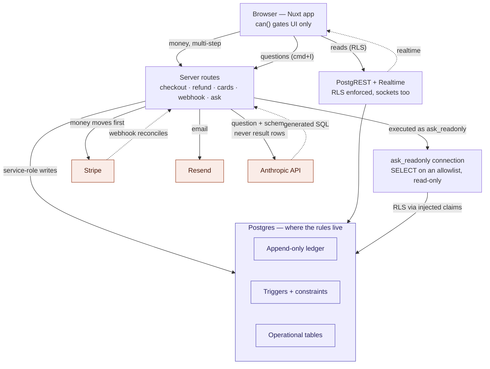

# The Reserve — architecture

Status: current as of 2026-08-30 (post-4b, post-ask phase 1). Update when
a new lane or external service is added — not for new tables or routes
that follow the existing shapes.

The system has one big idea: **three doors into Postgres, chosen by how
far the caller is trusted.** Routine data goes through the database's own
API under RLS; money and multi-step external calls go through a server
route holding the service role; and SQL the system did not write runs on
a connection that can do almost nothing. The database, not application
code, is where the non-negotiable rules live (see
`.claude/skills/reserve-migrations/` and `docs/design/`).

## The three doors

**Door 1 — browser → PostgREST, under RLS.** Everything routine: page
reads, simple owned writes (clients, appointments via policy, notes),
and the realtime subscriptions (messages, notifications — RLS applies
to sockets, so a staff member only ever receives their own rows). The
`can()` composable gates what the UI _shows_; RLS is what actually
_enforces_.

**Door 2 — browser → server routes, service role.** Used when an
operation is multi-step, prices things server-side, or calls an
external API mid-flight: checkout, refunds, card save/detach, invite
acceptance, the Stripe webhook. These tables deliberately have **no
authenticated insert policies** — the absence is the design, and it is
commented in the schema.

**Door 3 — server route → `ask_readonly`, least privilege.** For SQL the
system did not write. Ask The Reserve turns an admin's question into a
SELECT, and that statement executes on its own Postgres connection whose
**session user IS `ask_readonly`** — LOGIN, NOINHERIT, no memberships,
SELECT on an 18-table allowlist, read-only transaction, 10s timeout. RLS
still applies: the asking admin's identity is injected as
`request.jwt.claims`, so a question can never return rows that admin
could not have read anyway.

The session user is the whole point. An earlier cut ran `SET LOCAL ROLE`
on the app's own connection, which is broken — under PostgREST the
session user is `authenticator`, a member of `service_role`, so
`set_config('role', ...)` inside a generated SELECT escalates past the
role switch and the allowlist together. **Never role-switch within a
privileged session; give the session a user that is already the floor.**

## Ordering rules that keep the books honest

- **Money moves before the ledger writes.** The checkout route confirms
  the PaymentIntent, the refund route pushes the Stripe refund, and only
  on success are ledger rows written. A decline writes nothing; ledger
  and bank cannot disagree.
- **The ledger is append-only.** Refunds are negative-mirror
  transactions referencing the original. Gift cards and (future)
  membership credits are liabilities, not revenue.
- **The webhook reconciles; it does not drive.** Signature-verified
  against the raw body, idempotent via `stripe_events` (insert-first;
  duplicate → 200, any other failure → 500 so Stripe redelivers). A
  payment_intent.succeeded with no matching ledger row is the timeout
  edge and raises an admin notification. Planned exception: membership
  dues will arrive via invoice.paid and write ledger rows — see
  `docs/design/memberships-notes.md`.
- **Triggers can't call external services and SELECTs can't fire
  triggers** — so anything touching Stripe/Resend lives in routes, and
  read-auditing (health notes) is a route that writes `audit_log` first.
- **The model is asked before execution, never after.** Ask sends the
  question plus the schema description to Anthropic and gets SQL back;
  result rows are never sent anywhere. That keeps "client data never
  leaves the database" categorical rather than case-by-case — the same
  stance 4b took with card numbers. Every ask is recorded in
  `ask_queries` with the statement that ran.

## Where the roadmap lands on this map

- **Memberships (§3)**: no new lanes — Stripe Subscriptions live in the
  existing Stripe box; dues arrive through the existing webhook arrow.
- **Ask The Reserve (text-to-SQL)**: ✅ shipped — it is door 3 above, not
  a future lane. Design and decisions:
  `docs/design/ask-the-reserve-design.md`.
- **pgvector (post-intake-forms)**: an embeddings table inside Postgres
  plus an embedding API call from routes on write. Retrieval folds into
  the existing ask UI; the privacy gates (health-note embeddings, BAA)
  are the open question, not the plumbing.

## Pointers

- Schema (generated, always current): `docs/schema/`
- Design decisions and rationale: `docs/design/`
- Working conventions for humans and agents: `CLAUDE.md`,
  `.claude/skills/`
- Live project state: `docs/TODO.md`
