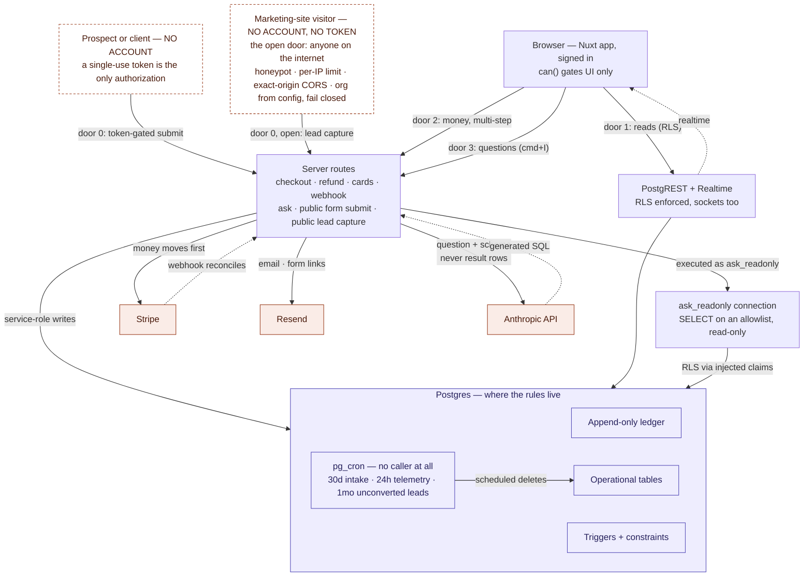

# The Reserve — architecture

Status: current as of 2026-09-19 (post-4b, post-ask, post-intake-forms,
post-leads).
Update when a new lane or external service is added — not for new tables
or routes that follow the existing shapes.

The system has one big idea: **four doors into Postgres, numbered by how
far the caller is trusted.** They descend: door 0 is a stranger holding a
link, door 3 is SQL nobody on the team wrote. In between, routine data
goes through the database's own API under RLS, and money and multi-step
external calls go through a server route holding the service role. The
database, not application code, is where the non-negotiable rules live
(see `.claude/skills/reserve-migrations/` and `docs/design/`).

Door 0 has two callers now, and they are not equally trusted: the intake
submit holds a token, the lead capture endpoint holds nothing. The
diagram draws them as two nodes for that reason.

A fifth actor has no caller at all: `pg_cron` runs retention purges on a
schedule, inside the database.

## The four doors

**Door 0 — public browser → token-gated server route.** The only
unauthenticated caller, and the most exposed path in the system: reachable
from the open internet by anyone holding a link, and it lands PHI-adjacent
data. A prospect fills an intake form, or a client signs a waiver, with no
account and no session.

Its authorization is a **single-use, expiring token** and nothing else —
there is no identity to check. What keeps it safe is that **anon holds no
database privilege anywhere on the path**: no insert policy on any response
table, and no execute grant on the function that writes. The route runs the
service role, and the token is claimed atomically inside that function, so
single-use survives two simultaneous submits. Rate limits are counted in
Postgres rather than process memory, and visitor IPs are HMAC'd under a
server-only secret so the attempt log is not a list of who visited a
health-intake page.

**Door 0 has a second, MORE exposed caller: public lead capture**
(`POST /api/public/leads`, §8) — the lowest point on the trust axis. A
marketing-site landing page posts a name, an email and an interest — no
session, and unlike the intake form NO TOKEN: the form is open by
design, so nothing bounds who may call it. Same privilege model — anon
holds no policy on `leads`, the route writes under the service role,
attempts are counted in Postgres under HMAC'd IPs — plus the layers the
missing token forces: exact-origin CORS from configuration (never `*`),
a honeypot answered exactly like a success, a tighter per-address rate
limit, a 4 KB body cap, and strict shape validation. The organisation a
lead belongs to is a server-side setting, never a client claim. Known
residual: per-address limiting is evaded by distributed bots; CAPTCHA is
the escalation, keyed to observed abuse. Proved both ways by
`verify:leads`.

Two configuration values are load-bearing here and both FAIL CLOSED:
`LEADS_ALLOWED_ORIGINS` (the exact origins that may post; unset means
no browser origin is accepted, and `*` is never honoured) and
`LEADS_ORGANIZATION_ID` (which organisation captured leads belong to;
unset means the endpoint answers 503 rather than guess). A misconfigured
server refuses leads; it never files them under the wrong club or takes
them from anywhere.

The rest of the feature sits behind doors that already exist. Staff
read and work leads through door 1 under `leads.view` / `leads.manage`
RLS (list, detail, notes, status), and the live indicators are the
existing realtime arrow — `leads` joined the publication so the nav dot
and the bell update without a refresh. Conversion is a handoff INTO the
token-gated door: "send intake form" mints a form link through the same
server route the forms feature uses, with the lead attached, so the
prospect completes the ordinary token-gated intake. That link is the
provenance chain, and it is traceable end to end in the schema:
`leads` → `form_links.lead_id` → `prospect_intake.lead_id` (copied by
`submit_form_response` at submit) → `clients` on approval. Converted
leads are therefore kept by the purge; only unconverted ones age out.
Design and decisions: `docs/design/leads-design.md`.

It shares door 2's mechanism and belongs at its own position on the trust
axis, not as a footnote to a staff flow.

**Door 1 — browser → PostgREST, under RLS.** Everything routine: page
reads, simple owned writes (clients, appointments via policy, notes),
and the realtime subscriptions (messages, notifications — RLS applies
to sockets, so a staff member only ever receives their own rows). The
`can()` composable gates what the UI _shows_; RLS is what actually
_enforces_.

**Door 2 — browser → server routes, service role.** Used when an
operation is multi-step, prices things server-side, or calls an
external API mid-flight: checkout, refunds, card save/detach, invite
acceptance, the Stripe webhook. These tables deliberately have **no
authenticated insert policies** — the absence is the design, and it is
commented in the schema.

**Door 3 — server route → `ask_readonly`, least privilege.** For SQL the
system did not write. Ask The Reserve turns an admin's question into a
SELECT, and that statement executes on its own Postgres connection whose
**session user IS `ask_readonly`** — LOGIN, NOINHERIT, no memberships,
SELECT on an 18-table allowlist, read-only transaction, 10s timeout. RLS
still applies: the asking admin's identity is injected as
`request.jwt.claims`, so a question can never return rows that admin
could not have read anyway.

The session user is the whole point. An earlier cut ran `SET LOCAL ROLE`
on the app's own connection, which is broken — under PostgREST the
session user is `authenticator`, a member of `service_role`, so
`set_config('role', ...)` inside a generated SELECT escalates past the
role switch and the allowlist together. **Never role-switch within a
privileged session; give the session a user that is already the floor.**

## Ordering rules that keep the books honest

- **Money moves before the ledger writes.** The checkout route confirms
  the PaymentIntent, the refund route pushes the Stripe refund, and only
  on success are ledger rows written. A decline writes nothing; ledger
  and bank cannot disagree.
- **The ledger is append-only.** Refunds are negative-mirror
  transactions referencing the original. Gift cards and (future)
  membership credits are liabilities, not revenue.
- **The webhook reconciles; it does not drive.** Signature-verified
  against the raw body, idempotent via `stripe_events` (insert-first;
  duplicate → 200, any other failure → 500 so Stripe redelivers). A
  payment_intent.succeeded with no matching ledger row is the timeout
  edge and raises an admin notification. Planned exception: membership
  dues will arrive via invoice.paid and write ledger rows — see
  `docs/design/memberships-notes.md`.
- **Triggers can't call external services and SELECTs can't fire
  triggers** — so anything touching Stripe/Resend lives in routes, and
  read-auditing (health notes) is a route that writes `audit_log` first.
  This constraint now decides where health data LIVES, not just how it is
  read: a client's waiver answers are copied from `form_response_health`
  into `client_notes(kind='health')` at submit, because reads of the
  submission table can never be audited and leaving health data readable
  only there would make it readable-but-unaudited. Two copies on purpose —
  the submission row is the immutable record, the note is the operational
  copy whose reads are logged.
- **Scheduled work has no caller, so it needs its own proof.** `pg_cron`
  runs the retention purges (prospect intake at 30 days, rate-limit
  telemetry at 24 hours, unconverted leads at one month — converted
  leads head a provenance chain and stay) inside the database, chosen
  over an external scheduler because one that stops firing leaves data
  past its retention window with nothing showing an error. That reduces
  the silent-failure surface without removing it — a job can be
  unscheduled or fail every run and still look like a quiet system, and
  the app's own roles cannot even read `cron.job` — so `verify:forms`
  and `verify:leads` assert the OUTCOME (no stale rows) rather than the
  existence of a schedule.
- **The model is asked before execution, never after.** Ask sends the
  question plus the schema description to Anthropic and gets SQL back;
  result rows are never sent anywhere. That keeps "client data never
  leaves the database" categorical rather than case-by-case — the same
  stance 4b took with card numbers. Every ask is recorded in
  `ask_queries` with the statement that ran.

## Where the roadmap lands on this map

- **Memberships (§3)**: no new lanes — Stripe Subscriptions live in the
  existing Stripe box; dues arrive through the existing webhook arrow.
- **Ask The Reserve (text-to-SQL)**: ✅ shipped — it is door 3 above, not
  a future lane. Design and decisions:
  `docs/design/ask-the-reserve-design.md`.
- **Intake forms + prospect onboarding (§6)**: ✅ shipped through
  `approved` — it is door 0 above, plus an ordinary review UI on door 1.
  The enroll/activate tail waits on §3's tier answers. Design:
  `docs/design/prospective-onboarding-design.md`.
- **Lead capture (§8)**: ✅ shipped, all four phases — the open caller
  on door 0 above, a review UI on door 1, and a handoff into the
  token-gated door 0 for conversion. No new lane: it is the most exposed
  caller of a door that already existed, which is exactly why it is
  drawn as its own node. Design: `docs/design/leads-design.md`.
- **pgvector**: its stated precondition (intake forms) is now met. An
  embeddings table inside Postgres plus an embedding API call from routes
  on write; retrieval folds into the existing ask UI. The privacy gates
  (health-note embeddings, BAA) are the open question, not the plumbing —
  and they are sharper now that health answers exist in two places.

## Open on this map

- **Ask's allowlist has not been extended to the forms tables.** Ask
  predates them, and nothing was decided — `prospect_intake`,
  `form_responses` and the rest appear in neither the 18-table grant nor
  the schema prompt, so "how many prospects joined this month?" fails
  twice over: Postgres refuses the SELECT, and the model was never told
  the tables exist. Whether to extend it is genuinely open; aggregate
  questions (prospect counts, approval rates) are the kind Ask is good at
  and the review queue does not answer. The same is now true of `leads`
  and `lead_notes` — "where do our leads come from?" is an aggregate
  question with no answer in the UI either.
  **`form_response_health` is permanently excluded regardless**, along
  with any future prospect health rows — the invariant that PHI never
  reaches the model is not negotiable against convenience.

## Pointers

- Schema (generated, always current): `docs/schema/`
- Design decisions and rationale: `docs/design/`
- Working conventions for humans and agents: `CLAUDE.md`,
  `.claude/skills/`
- Live project state: `docs/TODO.md`
