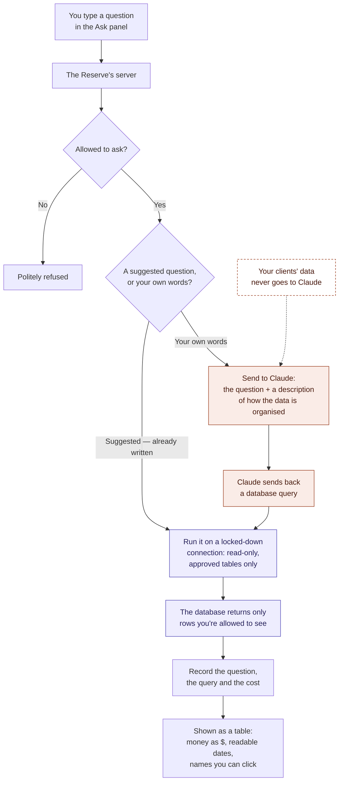

# Ask The Reserve — how it works

A plain-language walkthrough. No code. For the technical decisions and the
reasoning behind them, see `docs/design/ask-the-reserve-design.md`.

## What it is

Admins can ask questions about the business in ordinary English and get an
answer back as a table, without knowing anything about databases.

> *"Which clients haven't visited in 90 days?"*
> *"How many gift cards were used in the last 2 months?"*
> *"Who spent the most this quarter?"*

It lives in a small panel at the bottom-right of the screen. You open it
with the sparkle button in the top bar, or press ⌘I for a version with
suggested questions for the page you're on.

## The one-sentence version

Your question travels to The Reserve's own server, which asks Claude to
translate it into a database query, runs that query under a locked-down
account, and sends the rows back to your screen — **your clients' data
never goes to Claude.**

## Step by step

**1. You type a question and press Enter.**
The panel sends it to The Reserve's own server. It does *not* talk to
Claude directly from your browser.

**2. The server checks you're allowed to ask.**
Only owners and admins have this. Front desk and providers don't see the
button, and the server refuses them even if they somehow reach it.

**3. It decides which route to take.**

- If you clicked a **suggested question**, the answer is already written.
  These are hand-written and reviewed, so they're instant, free, and can't
  be misunderstood. Skip to step 6.
- If you typed your **own question**, it goes to Claude — step 4.

**4. The server asks Claude to translate the question.**
It sends two things: your question, and a written description of how the
business's information is organised — "there's a table of clients with a
first name and a last name, a table of appointments with a start time,"
and so on. Plus the rules that matter, like *selling a gift card isn't
income until it's redeemed*.

**It does not send any client information.** No names, no amounts, no
appointments. Claude is being asked to write a question, not to look at
answers.

**5. Claude sends back a database query.**
That's all it returns — the query. If your question can't be answered from
what The Reserve stores, it says so instead of guessing. Claude never sees
what the query finds.

**6. The server runs the query — carefully.**
This is the important part. The query runs through a special, heavily
restricted connection to the database, one that:

- can **only read**. It cannot change, add, or delete anything, at all.
- can only read from an approved list of tables. Client health notes,
  private staff messages, and payment card records are simply not on that
  list — a query asking for them fails.
- returns **only the rows you'd be allowed to see anyway** if you clicked
  around the app normally.
- gives up after 10 seconds, so a badly-worded question can't bog things
  down.

These aren't checks written in code that someone could forget. They're
enforced by the database itself, on the account the query runs under.

**7. The result is recorded.**
Every question is logged: what was asked, the exact query that ran, how
many rows came back, how long it took, and what it cost. That's there so a
surprising answer can always be traced back.

**8. The answer appears in the panel.**
Your browser tidies it up for reading: money shows as `$356.41` rather
than a raw number, dates as `Aug 23, 2026`, and people's names become
links straight through to their client or staff page.

## Asking a follow-up

Questions in the same conversation build on each other:

> **"How many gift cards were used in the last 2 months?"** → 3
> **"and who used it?"** → Samuel Adeyemi, $39.20

The second question works because the server looks up what you asked a
moment ago in its own log. It passes along **the earlier questions and the
queries they produced** — still never any results. Claude sees "they were
just asking about gift card redemptions," which is enough to work out what
"it" means.

The **+** button starts a fresh conversation when you want to change
subject.

## What it costs

About half a cent for a typical question, and nothing at all for the
suggested ones. Every question's cost is recorded, so it can be totalled
for any period.

## The flow, as a picture

Orange is the part that involves Claude. Purple is the part the database
itself polices. Notice that the two never touch: everything Claude is
involved in happens *before* any data is fetched.

## The short version of why it's safe

| Worry | Why it can't happen |
| --- | --- |
| "Could it change or delete something?" | The account it runs under is read-only. Not a rule in code — the database refuses. |
| "Could it read health notes or staff messages?" | Those tables aren't on its approved list. A query for them fails. |
| "Could someone see another client's data?" | It returns exactly what that person could already see in the app. |
| "Does our client data go to an AI company?" | No. Only the question and a description of the table structure. |
| "Could it give a wrong answer confidently?" | It can be wrong — it's a translation. That's why the exact query is always one click away, and every question is logged. |

## What it can't do yet

- **It can't act.** It answers questions; it never books, edits, or sends
  anything.
- **It can't read free-form notes.** Questions like "who mentioned shoulder
  tension?" need a different kind of search, planned for after intake
  forms exist.
- **It's admins only.** A limited version for providers — answering only
  about their own schedule — is possible but not built.
