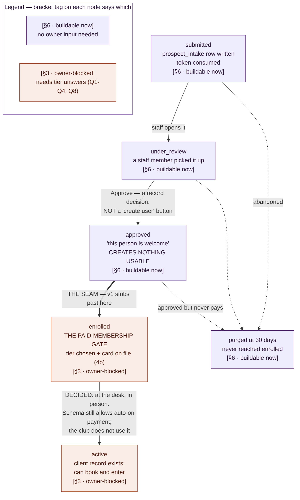

# Prospective-member onboarding — design

Status: DESIGN, not built. Partly owner-blocked (see the matrix at the end).
Written in the design room 2026-09-06. Produces the plan; no SQL yet.

## What this is (and the naming correction)

A prospect — not yet a client — receives a unique link, fills an intake
form, and a staff member reviews it and decides whether they may join.
The Reserve is members-only, so this is the **front door to the business**,
not a waiver bolted onto an existing account.

That places this feature across two roadmap items, and the split is the
first thing to get right:

- **§6 intake forms = the FORM ENGINE.** Form definitions (fields,
  required-ness, waiver text, versioning), response storage, tokenized
  delivery, submission. Reusable: it serves BOTH this prospect pipeline
  AND the original §6 case (an existing client signing a waiver before a
  booking). Mostly UNBLOCKED.
- **§3 memberships = the APPROVAL→ENROLL→ACTIVATE pipeline.** What
  approval grants, what a paid membership grants, tiers, and the moment a
  prospect becomes a paying member. Partly OWNER-BLOCKED (it depends on
  how someone becomes a member — owner question 8 in
  memberships-notes.md).

Build the engine; design the pipeline against it; gate the owner-blocked
transitions until §3's answers land.

## The state machine (the core correction to the a/b question)

The original sketch offered "auto-create account on approval" vs "wait
till they're in the facility." Those aren't a fork to commit to in schema
— they're WHEN the last transition fires. Model it as stages, and a/b
becomes a timing choice, not a data-model choice:

Purple is buildable now, terracotta is owner-blocked — the same two
readings architecture.md gives those colours (ours to enforce vs. not
ours to decide). The bracket tag on every node says the same thing in
text, so the diagram survives being read in greyscale.

The heavy arrow is THE SEAM: everything above it ships in v1, everything
below it waits for §3. Dashed arrows are the 30-day retention purge —
every state before `enrolled` can end there.

Read the right-hand half with the in-person-only decision below in mind:
approve, enroll and activate are three transitions that all fire in a
single moment at the front desk. The diagram spaces them out because the
SCHEMA keeps them apart, not because the prospect experiences three steps.

Key semantics, from the answers given:

- **approved ≠ member.** Approval is "this person is welcome." It creates
  nothing usable yet. A members-only, PAID-membership facility means the
  real gate is `enrolled` — tier chosen, card on file (the 4b machinery),
  money flowing. Someone approved but not enrolled cannot book or enter.
- **a/b is the enrolled→active timing.** Auto-activate on enrollment (the
  pre-approved VIP who paid online) OR activate at the front desk when
  they show — both reachable without schema change, because activation is
  a transition, not a table shape. Don't foreclose either.
- **Approval and account creation are separate events.** The client
  record is created at `enrolled`/`active`, not at `approved` — so an
  approved-but-never-paid prospect never pollutes the clients table.

**Decision: approval and enrollment happen in person — and only in
person.** The intended prospect experience, end to end:

> fill the form (remotely or on-site) → show up → approved and enrolled
> at the desk, on the spot.

There is NO remote approval step. Nobody is approved by a staff member at
a laptop and told to come in later. The prospect submits, hears nothing,
arrives, and becomes a member in one conversation.

What this does to the state machine: the last three transitions —
approve, enroll, activate — all fire in one in-person moment. The STATES
still exist and still happen in order; what collapses is the staff-facing
experience of them, from three screens across days into one interaction
at the desk. Keep them distinct in schema — they are separately
auditable, and THE SEAM cuts between them — and do NOT collapse them in
data merely because they are collapsed in time.

Consequences, written down so they are not later mistaken for gaps:

- **There is no "approved, awaiting visit" notification.** Not deferred,
  not a v2 nicety — there is nothing to notify about, because approval
  does not happen while the prospect is away.
- **The submit-then-silence gap is INTENDED.** A prospect who submits a
  form and hears nothing has not fallen through a crack. The silence is
  the product: a members-only club that decides in person is behaving
  like an exclusive club, not like a signup funnel that owes an instant
  confirmation. Anyone meeting this flow later will read the gap as a
  defect and try to close it with an email — it is a decision, and this
  paragraph is here to stop that.
- **The review UI's Approve button gets pressed with the prospect
  standing there.** Same screens as designed below, different moment: the
  pending list is a desk tool, not an inbox worked between appointments.
- **Not foreclosed, because it is a different thing:** a plain submission
  RECEIPT ("we have your form") is not an approval notification and does
  not leak a decision. If one is ever wanted, it does not reopen this.

## Where the data lives — PII before there's an account

The prospect's data does NOT go in `clients`. Two reasons: a prospect
isn't a client (the members-only invariant says clients are members), and
status-flagging clients with `status='prospect'` would force every
existing clients query and RLS policy to start filtering — eroding the
clean boundary. This mirrors the existing pattern: `staff_invites` is a
separate table from `staff`, not a `staff` row with `pending=true`.

**Model: a dedicated `prospect_intake` table = TEMPORARY CUSTODY.**

- Contact fields (name, email, phone) as columns; the rest of the form as
  a `responses` jsonb, plus the form-version answered and the token.
- RLS: reads gated behind a review permission (e.g. `intake.review`),
  org-scoped. No authenticated insert policy — submission is public and
  token-gated (see the security surface below), written by a server route
  under the service role. Append-only-ish: staff annotate status, never
  edit the prospect's answers.
- On `enrolled`/`active`: the relevant fields are PROMOTED into the
  permanent homes — contact into `clients`, and crucially **health
  answers become `client_notes` with kind='health'**, which already has
  the sensitivity tier (`clients.notes.health.view`) and audit-on-read
  (the route that logs `health_note.viewed`). So the PHI's permanent home
  is machinery you already built; `prospect_intake` only holds it in
  transit.
- After promotion, the prospect row's raw PII is purged (the durable copy
  now lives in the client record it became).

**Retention: 30 days.** Rows that never reach `enrolled` (abandoned or
rejected) are purged after 30 days. Mechanism options for the design
session to pick: a `pg_cron` scheduled sweep, or a nightly job — either
deletes `where status in ('submitted','under_review','approved') and
created_at < now() - interval '30 days'`. The retention window is stated
on the table comment so it reads as policy, not an accident.

**Health data specifically.** A wellness facility's intake likely
collects health history — PHI-adjacent, and here it's collected BEFORE an
account exists. Design consequences: (1) it lives in `prospect_intake`
for at most 30 days in transit, then moves to the audited `client_notes`
health tier or is purged; (2) the review UI showing a prospect's health
answers sits behind the same permission discipline as health notes, not
general `intake.review`.

**Decision: approval is a non-health decision.** Health and personal
history are collected to KNOW the member — what a provider should be
aware of before laying hands on them — NOT as a criterion for letting
them join. Nothing in the health answers decides approval, so reading
them is not part of approving. Settled, not a lean:

- **The review/approval UI shows contact and non-sensitive fields only.**
  Health answers are not rendered on the approval screen at all — not
  collapsed, not redacted-with-a-reveal. Absent.
- **Health answers stay behind `clients.notes.health.view`** — the tier
  they permanently live in after promotion, applied while they are still
  in transit. A reviewer holding `intake.review` and nothing else can
  take a prospect from submitted to approved and never see them.
- **Approval and health-visibility are fully decoupled**, in both
  directions. Approval rights grant no health access; health access is
  not a route to approving. Neither permission implies the other.

The alternative is what makes this worth writing down. Putting health
answers on the approval screen would make every reviewer a health-note
reader BY CONSTRUCTION — silently widening PHI access to whoever happens
to staff the front desk, and doing it through a screen nobody would think
to audit as a health surface. It would also make admission look
health-conditioned, which is not what this facility does. Keeping them
apart leaves the audited health tier as the only way anyone reads that
data, prospect or client.

## The public-submission security surface (genuinely new)

Every write surface so far has been authenticated. This one is not — a
prospect has no account. That is a new class of endpoint and needs care:

- **Token-gated.** The unique link carries a single-use, expiring token
  (reuse the `staff_invites` token pattern — tokenized link, expiry,
  consumed on submit). No token, no submission.
- **Unauthenticated but not open.** The submit route accepts anon, but
  writes via service role to `prospect_intake` — no anon RLS insert
  policy exists. The token is the authorization.
- **Rate-limited + abuse-guarded.** A public endpoint invites spam; needs
  a rate limit and probably a captcha or equivalent, since the token
  alone doesn't stop a leaked-link flood. Flag for the build.
- **Input-bounded.** Field lengths capped, `responses` shape validated
  against the form definition server-side — never trust the submitted
  shape.

This surface is the riskiest part of the feature and deserves the same
"verify the assumption" rigor the ask feature got — an unauthenticated
write to a table holding PHI-adjacent data is exactly where a silent hole
would hurt most.

## The engine, reusable (§6 proper)

The form definition + versioned responses is the piece worth building
well because it serves two callers:

- Prospect onboarding (this doc).
- Existing-client waivers (§6's original scope — the booking route's
  `requires_intake` TODO).

Form definitions carry: fields, required-ness, waiver/consent text, and a
VERSION — so a waiver's wording change snapshots what each person actually
agreed to (same discipline as card-consent policy_text and price
snapshots). A response records which form version it answered.

## The form engine — locked schema decisions (phase 1)

Status: DECIDED 2026-09-06, in the design room, before any SQL. Four
schema-shape questions the sections above left open. Each records the
deciding principle, not just the pick.

**1. Answers are JSONB; health answers are separate ROWS.** Ordinary
answers live in `form_responses.answers` jsonb. Answers to fields the
definition marks `sensitive` are written instead to
`form_response_health`, one row per answer, with its own RLS requiring
`clients.notes.health.view`.

The deciding principle is the failure mode, not the ergonomics. RLS is
row-level: it cannot hide a column. Keeping health answers in a second
jsonb column on the same row would make the gate a server-side filter
that every endpoint must remember, and forgetting it leaks PHI with no
error — the silent-failure shape `CLAUDE.md` names. Splitting by row
makes the database the gate: a caller without the permission gets missing
data, which is LOUD, instead of leaked data, which is silent. It also
mirrors `client_notes.kind='health'` exactly, so enrollment-time
promotion is row → row into the tier that already has audit-on-read.

Rejected: one row per answer (EAV) with a `sensitive` flag. Fully
DB-enforced and per-field queryable, but per-field querying is not a
requirement today and the typing and row-count costs are real. Revisit
only if Ask ever needs to reach inside answers.

**2. Definitions are identified by key; versions are immutable rows;
consent text is copied.** `form_definitions` carries identity
(`organization_id` + `key`, e.g. `prospect_intake`, `service_waiver`).
`form_versions` carries the answerable shape — `fields` jsonb,
`consent_text`, `published_at` — and is APPEND-ONLY: no update or delete
policy exists, and `revoke update, delete` states the intent.
`form_responses` references the version it answered AND copies
`consent_text` onto itself.

The deciding principle is that structure and consent have different
natures. Field structure is reference material: because version rows
cannot change, a foreign key is exactly as durable as a copy, without
duplicating the field blob on every response — and it preserves
provenance, so "which responses answered v3" is a FK query rather than a
scan. Consent text is the legal artifact: it is copied physically, the
same discipline as card-consent `policy_text`, because the record of what
a person agreed to must not depend on a lookup resolving correctly years
later. The immutability of versions is what makes referencing structure
safe; the legal weight of consent is what makes copying it necessary.

Rejected: one definition row with a bumped `version` column — editing
mutates history, so a past response stops being reconstructible, which
defeats the point of versioning a waiver.

**A consequence of 2 that runs the dangerous way. Publishing a new
version does NOT remediate a sensitivity mistake in an old one.**
Sensitivity is a per-field property of the versioned field list, so it
freezes with the version — which is exactly what makes the split
trustworthy at submit time: answers are routed against the flags that
were in force when the person answered, and nobody can retroactively
change what a past submission meant.

The same immutability cuts the other way on remediation. Answers are
split ONCE, at write time, into `form_responses.answers` (un-gated) and
`form_response_health` (behind `clients.notes.health.view`). Marking a
field sensitive in v2 changes where FUTURE answers land and nothing else.
Every answer already collected under v1 stays exactly where the v1 flags
put it — so PHI that should have been gated is sitting in `answers`,
readable by anyone with `forms.responses.view`, including front desk.

The failure mode is a person, not a bug: someone notices a health
question was never marked sensitive, publishes a corrected version,
sees the new field flagged, and believes the problem is fixed. It is not.
The collected answers are untouched, and the belief that they were
handled is what stops anyone looking again.

**A sensitivity mistake is repaired by MIGRATING THE EXISTING ROWS** —
moving those answers out of `form_responses.answers` into
`form_response_health` with their question labels — and only then
publishing the corrected version. Publishing alone is the visible half of
a two-part fix. Whoever builds phase 2 or 3 inherits this: it is already
true of the schema as shipped, not a future hazard.

**3. Permissions: adopt the existing `forms.*` keys. Mint nothing.**
`forms.manage` (author definitions), `forms.send` (issue a link),
`forms.responses.view` (see submissions) were seeded by migration 1 and
have never been referenced by any route or component. The design sketch
above proposed `intake.review`; that would be a second family for one
concept — the `organization.manage` duplication that already cost a
cleanup migration. [AS-BUILT] `intake.review` is NOT minted; read every
mention of it above as `forms.responses.view`.

The migration grants all three to `front_desk`, which holds none of them
today. That grant is required by the in-person decision: review happens
at the desk, so deferring it would leave phase 3 untestable as its real
user.

Health gating needs no new work, and this is the part worth noticing:
`front_desk` does not hold `clients.notes.health.view` and is not being
granted it. The review screen therefore cannot show health answers —
enforced by a permission deliberately NOT granted, which is a stronger
guarantee than a UI that chooses not to render them.

**4. One `form_responses` table, not one per subject.** [AS-BUILT] The
sections above describe `prospect_intake` carrying its own `responses`
jsonb. The build unifies instead: a single response store, with a
nullable `client_id` in phase 1 and `prospect_intake_id` added in phase 2
when that table exists, the subject check widened then.

The reason for the deviation is phase 1's scope. Once the engine has to
serve both prospect onboarding and existing-client waivers, per-subject
stores mean two retention purges, two shape validators and two
renderers — the duplication this phase exists to remove.

**The cost that deviation creates, and how it gets paid.** Retention is
now a FILTERED DELETE on a shared table rather than a table-scoped sweep.
The purge must delete only responses belonging to un-enrolled prospects
and must NEVER touch a response belonging to a client — a signed waiver
is a legal record, and a client's is kept for as long as the client is.
So the phase-3 purge is built with a precise where-clause and TESTED IN
BOTH DIRECTIONS: that a 31-day-old prospect response is deleted, AND that
a client waiver of any age survives. Proving only the first is the
familiar mistake — it passes while the destructive half goes unchecked.

### Who enforces what

| Rule | Enforced by |
| --- | --- |
| Org isolation | RLS on every table (`current_org_id()`) |
| Health answers need the health permission | RLS on `form_response_health` |
| Versions never change after publish | No update/delete policy + explicit `revoke` |
| A response's answers match its form | Server route validating against the version's `fields` (Postgres cannot check jsonb shape) |
| Only validated writes land | No authenticated INSERT policy on responses — writes go through the server route |
| Consent survives version edits | `consent_text` copied onto the response |

The middle row is the one with no database backstop, so it is where the
tests go.

## Delivery and public submission — locked decisions (phase 2)

Status: DECIDED 2026-09-06. The phase containing the app's first
unauthenticated write, landing PHI-adjacent data.

**5. One `form_links` issuance table, subject optional.** A link carries
its token, a FROZEN `form_version_id`, expiry, consumption, revocation,
who issued it, and the delivery address. No subject means a prospect
link; `client_id` set means an existing client's waiver. Same "one store,
nullable subject" shape as the unified response store, for the same
reason: a waiver link for an existing client has no prospect row to hang
a token on, so per-subject issuance would force a second mechanism and
reintroduce the duplication phase 1 removed.

Two consequences follow. `prospect_intake` is created AT SUBMIT, from the
answers — issuing a link creates nothing, so there are no phantom
prospects in the review queue or the purge for people who never answered,
and the state machine keeps its word that a prospect begins at
`submitted`. And `form_links` is the natural home for the atomic
single-use claim.

**6. The version is frozen at issue time, not resolved at submit.** The
link stores `form_version_id`, not the definition. Publishing a new
version between issuing a link and someone answering it must not change
the questions they see or the flags their answers are split against —
that is decision 2's immutability applied to the moment of delivery.

**7. Single-use is an ATOMIC CLAIM in the database, not a check in the
route.** Consumption is a conditional update — `set consumed_at = now()
where token = ... and consumed_at is null and revoked_at is null and
expires_at > now()` — inside a `security definer` function that also
writes the response and its health rows, so claim and write are one
transaction. Reading the link and then inserting would be a race two
simultaneous submits both win. This mirrors `accept_staff_invite()`,
which re-validates atomically for the same reason.

The function is `revoke execute ... from public, anon, authenticated`:
service-role only. That is what makes the security claim literal — anon
holds no privilege anywhere on this path, no insert policy and no
function grant, so "a direct anon insert fails" is a property of the
grants rather than an accident of routing.

**8. Contact details promote from reserved field keys.** The engine
reserves `first_name`, `last_name`, `email`, `phone`; a prospect-intake
form must define them, validated when the version is published, and the
submit path copies them into `prospect_intake`'s columns while leaving
them in `answers`.

Rejected: a `contact_role` on the field descriptor, because it would
extend the field contract that decision 2 froze — old versions would lack
it, putting a per-version compatibility seam through the exact structure
whose value is that it never changes — and the flexibility it buys has no
use case, since there is one right email field, while adding a
uniqueness-rule bug class that exists only because the flexibility does.
Also rejected: staff typing contact at issue time, which drifts from what
the person actually entered. Their own answer is the source of truth for
details that become their client record.

**9. Rate limiting in the database; captcha DEFERRED.** Per-token and
per-IP limits recorded in `form_submission_attempts` and enforced in the
route. No captcha in v1.

The reasoning is what makes it defensible rather than lazy. Links are
staff-issued and not publicly discoverable, so the threat is not a bot
finding a public form — it is a leaked link, and a per-token limit caps
that hard on a token that is single-use anyway. Against that, a captcha
costs the two things this page can least afford: it lands on the
prospect's FIRST touch, where the accessibility rule bites hardest (older,
low-vision, less tech-fluent people should not have to fight a widget),
and it adds an external dependency that can fail in a flow that has to
work at the front desk.

REVISIT IF: there is evidence of link-leak abuse, or links ever become
publicly reachable (a self-serve "request to join" page would do it).
Either changes the threat model this deferral rests on.

State lives in the database, not process memory, because in-memory
counters silently stop limiting the moment there is a second instance —
a security control that fails green. There is no deployment-platform
config in the repo, so single-instance cannot be assumed.

**[AS-BUILT] What the verification caught.** The end-to-end harness found
a real divergence the database-layer checks could not see: the route
decided "this is a prospect link" as `client_id is null AND the definition
key is prospect_intake`, while the function decided it as `client_id is
null` alone, per decision 5. A subject-less link on any other form
therefore sent no contact into a NOT NULL column — a 500 at submit time,
for a stranger who had already filled the form in.

The route was wrong; the decision is what it says. Two consequences kept:
the route now derives contact for ANY subject-less link, and the ISSUE
route refuses to mint a subject-less link for a version lacking contact
fields, so an unsubmittable link cannot exist. The lesson worth carrying
is the shape of the bug — two places independently deciding the same
question, agreeing on the common case and diverging on the edge — not the
null violation.

### What phase 2 must PROVE, not assume

Every failure here is silent, so each boundary is verified in both
directions rather than exercised on the happy path:

| Boundary | Proof |
| --- | --- |
| Single-use | second submit with the same token is refused |
| Expiry | a link past `expires_at` is refused |
| No anon write path | the token route succeeds AND a direct anon insert into each response table fails |
| Shape validation | malformed input rejected; unknown keys rejected, never dropped |
| Sensitivity split | a sensitive answer is present in `form_response_health` AND absent from `form_responses.answers` |
| Rate limit | the limit actually limits, and per-token state survives across requests (proving it is DB-backed, not per-process) |

The two that would leak PHI are the anon-write and split rows. They are
asserted on ABSENCE, which is the only way to catch them: a test that
only checks the happy path passes while the hole is open.

## The review UI (buildable now, §6)

Three screens' worth of behaviour, all of it a shape the app already has:

1. **A pending list** — prospects awaiting review, newest first, behind
   `intake.review`. Contact fields and submitted-at only (see the
   health-gating decision above: the list is not a health surface).
2. **A detail view** — one prospect's full submission, the non-sensitive
   fields rendered against the form version they answered, so a wording
   change later doesn't silently re-caption an old answer.
3. **An action** — the decision, taken on the detail view.

This is the staff-invite pattern pointed at a different table: a list of
pending things, each opening to detail, each carrying an act affordance
(`app/pages/staff/index.vue` for the pending list + act idiom,
`app/pages/staff/[id].vue` for list → detail). Nothing here needs a new
interaction model; it needs `prospect_intake` in place of `staff_invites`
and a review permission in place of `staff.invite`.

**THE CRITICAL SEAM: the button says "Approve", not "Create user".**

This is the one thing to get right, because the wrong button is the
easier button to build and it looks finished. "Create user" would
collapse three events the state machine above deliberately holds apart:

- **approve** — a record decision. "This person is welcome." Creates
  nothing. Buildable now.
- **enroll** — tier chosen, card on file, money moving. THE paid-membership
  gate. §3, owner-blocked.
- **activate** — the client account comes into being and can book or enter.

A single "create user" click jumps from the first to the third and skips
the second. What it produces is a client record for someone who never
chose a tier and never put a card on file — a member by existence rather
than by enrollment. That is the members-only invariant leaking through
the review screen: the exact gate this feature exists to enforce, routed
around by the feature itself.

**Do NOT build a "create user" button that skips enrollment.** v1 builds
submitted → under_review → approved and stops there. Account creation and
enrollment stay stubbed per THE SEAM below, and the stub is replaced —
not supplemented — when §3 lands.

One honest tension, since the two look alike: THE SEAM's stub also creates
a client with no membership. The difference is what it is FOR and who can
reach it. The stub exists so the pipeline is end-to-end testable, is
reached by traversing the state machine, and is marked in code as
temporary. A "Create user" button is a standing affordance offered to
staff on the review screen — it teaches the front desk that approving IS
admitting, and that habit outlives the stub. Keep the stub unlabelled and
out of the reviewer's normal path; if it is easier to reason about, gate
it to non-production until §3 replaces it.

## Owner-blocked vs buildable

BUILDABLE NOW (no owner input needed):

- The form engine: definitions, versioning, response storage.
- `prospect_intake` table + tokenized link delivery (reuse invite flow).
- The public token-gated submission endpoint (with its security surface).
- States submitted → under_review → approved, and the staff review UI.
- 30-day retention purge.
- The health-answers → client_notes promotion mechanism.

OWNER-BLOCKED (needs memberships-notes.md answers):

- What `enrolled`/`active` actually does — membership enrollment needs
  tier definitions (owner Q1–Q4).
- Whether approval is same-day walk-up vs application review (owner Q8) —
  changes the review UI's urgency and whether the "email a link" flow is
  even the primary path or a secondary one.
- Guest / comp / grandfathered cases (owner Q9, Q11).
- Whether the direct "Add client" button survives at all — the two-doors
  question below.

THE SEAM: build through `approved`. Stub `active` to simply create a
client with no membership (so the pipeline is end-to-end testable) until
§3 lands, then replace the stub with real membership enrollment. Do NOT
build the enrollment step on guesses about tiers.

## Two doors to clienthood (owner-blocked — needs a §3 answer)

Building this pipeline surfaces a contradiction that predates it. There
is already a second, unguarded way to become a client: the **"New client"**
button on the clients list (`app/pages/clients/index.vue`) opens a form
and writes a client row immediately. No approval, no intake, no
membership, no card. It is a door around the gate this whole feature
exists to be.

Both doors cannot stay open as they are. If the members-only invariant is
real, a client record means a member, and a button that mints one in a
single form submission contradicts a pipeline that requires review and
enrollment to do the same thing. The onboarding flow does not create this
problem — it makes it visible.

The question for the §3 / owner design, NOT resolved here:

**Does the direct "Add client" button survive the members-only model, or
does every path to clienthood route through the same membership gate?**

Shapes it could take, listed to show the range rather than to pick one:

- "Add client" becomes "Start enrollment" — the front-desk same-day path,
  landing in the same state machine at a later stage (the walk-up who
  fills intake on a staff device and pays at the desk). One gate, two
  entry points.
- It stays, but only for cases the owner names as legitimately
  non-membered (Q10's trials, day passes, gift-card recipients, retail
  pickup) — which requires Q10 to come back as something other than "no
  exceptions."
- It stays as a grandfathering / data-entry tool behind a high
  permission, explicitly outside the normal flow.

**Narrowed by the in-person-only decision.** That decision closes the
frightening version of this question. If nobody can be approved or
enrolled remotely, there is no remote path to clienthood at all — no
self-serve back door, no way to become a member without standing in the
building. The direct "Add client" button is then a DESK affordance being
used by staff who are face to face with the person, not a bypass someone
could drive from outside.

What is left is a smaller, in-building question:

- **Walk-ins with no prior form** — does the desk start them in the same
  flow (fill it on a staff device, then approve and enroll), or is there
  a shortcut, and if so what does the shortcut skip?
- **Guests, comps, and grandfathered arrangements** — owner Q9 and Q11.

So read Q12 in that narrowed form: not "is there a remote back door"
(closed by the in-person decision), but "what does the desk do for
someone who arrives having submitted nothing."

Recorded as owner question 12 in memberships-notes.md. It is
owner-blocked because it turns on Q8 (how someone becomes a member) and
especially Q10 (is there anyone who enters without a membership) — Q10 is
what decides whether an exception can exist at all. Do not resolve it by
building — a v1 that quietly leaves both doors open ships the
contradiction into production, where the clients table stops being a
reliable answer to "who is a member."

## Open questions for the eventual build/design continuation

- Purge mechanism: pg_cron vs nightly job? (Either; pg_cron if available.)
- Captcha/abuse strategy for the public endpoint — which provider, or a
  simpler rate-limit-only v1?
- Emailed link vs filled in-facility — NARROWED by the in-person-only
  decision, no longer a fork. Both remain valid ways to collect the FORM,
  and neither is a path to approval, which is always at the desk. What
  remains is logistics (do most prospects arrive with it already done?),
  which changes no schema.
- One form, or versioned form types (adult vs minor waiver, service-
  specific health questions)? Start with one; the version field leaves
  room.

## Relationship to other docs

- memberships-notes.md — the enrollment half of the same front door.
  This doc owns submitted → approved (the form engine, buildable now);
  memberships owns enrolled → active (tiers and paid enrollment,
  owner-blocked). They share owner question 8 — how someone becomes a
  member — whose answer sets whether intake is an application reviewed
  ahead of time or a form filled at the desk during same-day signup.
- The health-note sensitivity tier + audit-on-read is in
  migration3_booking_contract.md and the rls-patterns reference.
- Card-on-file consent (4b) is the model for versioned waiver-text
  snapshots.
