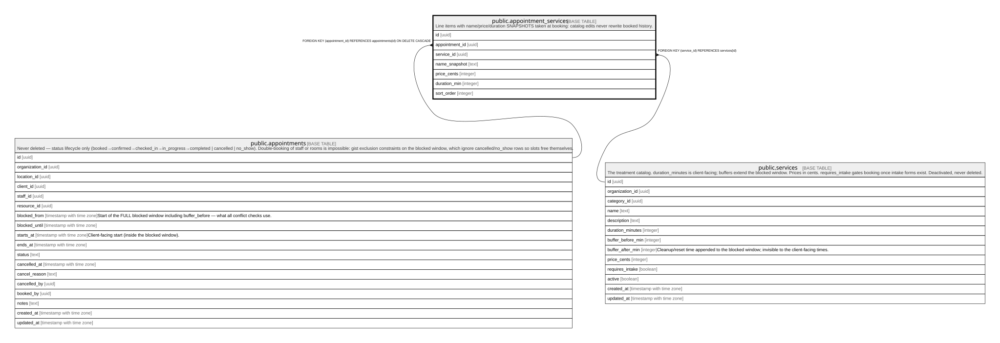

# public.appointment_services

## Description

Line items with name/price/duration SNAPSHOTS taken at booking: catalog edits never rewrite booked history.

## Columns

| Name           | Type    | Default           | Nullable | Children | Parents                                       | Comment |
| -------------- | ------- | ----------------- | -------- | -------- | --------------------------------------------- | ------- |
| id             | uuid    | gen_random_uuid() | false    |          |                                               |         |
| appointment_id | uuid    |                   | false    |          | [public.appointments](public.appointments.md) |         |
| service_id     | uuid    |                   | false    |          | [public.services](public.services.md)         |         |
| name_snapshot  | text    |                   | false    |          |                                               |         |
| price_cents    | integer |                   | false    |          |                                               |         |
| duration_min   | integer |                   | false    |          |                                               |         |
| sort_order     | integer | 0                 | false    |          |                                               |         |

## Constraints

| Name                                     | Type        | Definition                                                                 |
| ---------------------------------------- | ----------- | -------------------------------------------------------------------------- |
| appointment_services_service_id_fkey     | FOREIGN KEY | FOREIGN KEY (service_id) REFERENCES services(id)                           |
| appointment_services_appointment_id_fkey | FOREIGN KEY | FOREIGN KEY (appointment_id) REFERENCES appointments(id) ON DELETE CASCADE |
| appointment_services_pkey                | PRIMARY KEY | PRIMARY KEY (id)                                                           |

## Indexes

| Name                      | Definition                                                                                         |
| ------------------------- | -------------------------------------------------------------------------------------------------- |
| appointment_services_pkey | CREATE UNIQUE INDEX appointment_services_pkey ON public.appointment_services USING btree (id)      |
| appointment_services_appt | CREATE INDEX appointment_services_appt ON public.appointment_services USING btree (appointment_id) |

## Relations

---

> Generated by [tbls](https://github.com/k1LoW/tbls)
