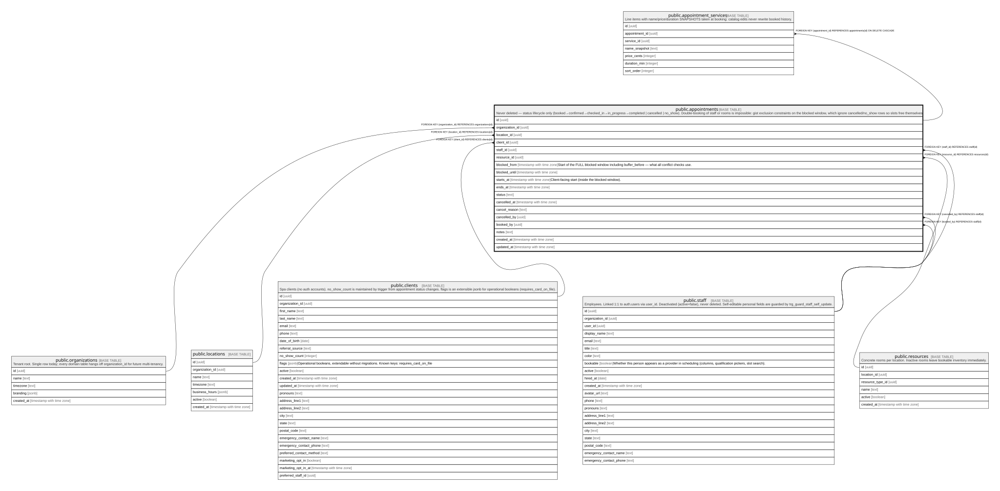

# public.appointments

## Description

Never deleted — status lifecycle only (booked→confirmed→checked_in→in_progress→completed | cancelled | no_show). Double-booking of staff or rooms is impossible: gist exclusion constraints on the blocked window, which ignore cancelled/no_show rows so slots free themselves.

## Columns

| Name            | Type                     | Default           | Nullable | Children                                                                                                                                                                                                                                                                                    | Parents                                         | Comment                                                                                  |
| --------------- | ------------------------ | ----------------- | -------- | ------------------------------------------------------------------------------------------------------------------------------------------------------------------------------------------------------------------------------------------------------------------------------------------- | ----------------------------------------------- | ---------------------------------------------------------------------------------------- |
| id              | uuid                     | gen_random_uuid() | false    | [public.appointment_services](public.appointment_services.md) [public.transactions](public.transactions.md) [public.transaction_items](public.transaction_items.md) [public.cancellation_tokens](public.cancellation_tokens.md) [public.communications_sent](public.communications_sent.md) |                                                 |                                                                                          |
| organization_id | uuid                     |                   | false    |                                                                                                                                                                                                                                                                                             | [public.organizations](public.organizations.md) |                                                                                          |
| location_id     | uuid                     |                   | false    |                                                                                                                                                                                                                                                                                             | [public.locations](public.locations.md)         |                                                                                          |
| client_id       | uuid                     |                   | false    |                                                                                                                                                                                                                                                                                             | [public.clients](public.clients.md)             |                                                                                          |
| staff_id        | uuid                     |                   | false    |                                                                                                                                                                                                                                                                                             | [public.staff](public.staff.md)                 |                                                                                          |
| resource_id     | uuid                     |                   | true     |                                                                                                                                                                                                                                                                                             | [public.resources](public.resources.md)         |                                                                                          |
| blocked_from    | timestamp with time zone |                   | false    |                                                                                                                                                                                                                                                                                             |                                                 | Start of the FULL blocked window including buffer_before — what all conflict checks use. |
| blocked_until   | timestamp with time zone |                   | false    |                                                                                                                                                                                                                                                                                             |                                                 |                                                                                          |
| starts_at       | timestamp with time zone |                   | false    |                                                                                                                                                                                                                                                                                             |                                                 | Client-facing start (inside the blocked window).                                         |
| ends_at         | timestamp with time zone |                   | false    |                                                                                                                                                                                                                                                                                             |                                                 |                                                                                          |
| status          | text                     | 'booked'::text    | false    |                                                                                                                                                                                                                                                                                             |                                                 |                                                                                          |
| cancelled_at    | timestamp with time zone |                   | true     |                                                                                                                                                                                                                                                                                             |                                                 |                                                                                          |
| cancel_reason   | text                     |                   | true     |                                                                                                                                                                                                                                                                                             |                                                 |                                                                                          |
| cancelled_by    | uuid                     |                   | true     |                                                                                                                                                                                                                                                                                             | [public.staff](public.staff.md)                 |                                                                                          |
| booked_by       | uuid                     |                   | false    |                                                                                                                                                                                                                                                                                             | [public.staff](public.staff.md)                 |                                                                                          |
| notes           | text                     |                   | true     |                                                                                                                                                                                                                                                                                             |                                                 |                                                                                          |
| created_at      | timestamp with time zone | now()             | false    |                                                                                                                                                                                                                                                                                             |                                                 |                                                                                          |
| updated_at      | timestamp with time zone | now()             | false    |                                                                                                                                                                                                                                                                                             |                                                 |                                                                                          |

## Constraints

| Name                              | Type        | Definition                                                                                                                                                                                  |
| --------------------------------- | ----------- | ------------------------------------------------------------------------------------------------------------------------------------------------------------------------------------------- |
| appointments_check                | CHECK       | CHECK ((starts_at < ends_at))                                                                                                                                                               |
| appointments_check1               | CHECK       | CHECK (((blocked_from <= starts_at) AND (ends_at <= blocked_until)))                                                                                                                        |
| appointments_status_check         | CHECK       | CHECK ((status = ANY (ARRAY['booked'::text, 'confirmed'::text, 'checked_in'::text, 'in_progress'::text, 'completed'::text, 'cancelled'::text, 'no_show'::text])))                           |
| appointments_organization_id_fkey | FOREIGN KEY | FOREIGN KEY (organization_id) REFERENCES organizations(id)                                                                                                                                  |
| appointments_location_id_fkey     | FOREIGN KEY | FOREIGN KEY (location_id) REFERENCES locations(id)                                                                                                                                          |
| appointments_booked_by_fkey       | FOREIGN KEY | FOREIGN KEY (booked_by) REFERENCES staff(id)                                                                                                                                                |
| appointments_cancelled_by_fkey    | FOREIGN KEY | FOREIGN KEY (cancelled_by) REFERENCES staff(id)                                                                                                                                             |
| appointments_staff_id_fkey        | FOREIGN KEY | FOREIGN KEY (staff_id) REFERENCES staff(id)                                                                                                                                                 |
| appointments_resource_id_fkey     | FOREIGN KEY | FOREIGN KEY (resource_id) REFERENCES resources(id)                                                                                                                                          |
| appointments_client_id_fkey       | FOREIGN KEY | FOREIGN KEY (client_id) REFERENCES clients(id)                                                                                                                                              |
| appointments_pkey                 | PRIMARY KEY | PRIMARY KEY (id)                                                                                                                                                                            |
| no_staff_double_booking           | x           | EXCLUDE USING gist (staff_id WITH =, tstzrange(blocked_from, blocked_until) WITH &&) WHERE ((status <> ALL (ARRAY['cancelled'::text, 'no_show'::text])))                                    |
| no_room_double_booking            | x           | EXCLUDE USING gist (resource_id WITH =, tstzrange(blocked_from, blocked_until) WITH &&) WHERE (((status <> ALL (ARRAY['cancelled'::text, 'no_show'::text])) AND (resource_id IS NOT NULL))) |

## Indexes

| Name                    | Definition                                                                                                                                                                                                                    |
| ----------------------- | ----------------------------------------------------------------------------------------------------------------------------------------------------------------------------------------------------------------------------- |
| appointments_pkey       | CREATE UNIQUE INDEX appointments_pkey ON public.appointments USING btree (id)                                                                                                                                                 |
| appointments_calendar   | CREATE INDEX appointments_calendar ON public.appointments USING btree (location_id, blocked_from)                                                                                                                             |
| appointments_staff_day  | CREATE INDEX appointments_staff_day ON public.appointments USING btree (staff_id, blocked_from)                                                                                                                               |
| appointments_client     | CREATE INDEX appointments_client ON public.appointments USING btree (client_id, starts_at DESC)                                                                                                                               |
| no_staff_double_booking | CREATE INDEX no_staff_double_booking ON public.appointments USING gist (staff_id, tstzrange(blocked_from, blocked_until)) WHERE (status <> ALL (ARRAY['cancelled'::text, 'no_show'::text]))                                   |
| no_room_double_booking  | CREATE INDEX no_room_double_booking ON public.appointments USING gist (resource_id, tstzrange(blocked_from, blocked_until)) WHERE ((status <> ALL (ARRAY['cancelled'::text, 'no_show'::text])) AND (resource_id IS NOT NULL)) |

## Triggers

| Name                   | Definition                                                                                                                    |
| ---------------------- | ----------------------------------------------------------------------------------------------------------------------------- |
| trg_appointments_touch | CREATE TRIGGER trg_appointments_touch BEFORE UPDATE ON public.appointments FOR EACH ROW EXECUTE FUNCTION touch_updated_at()   |
| trg_no_show_counter    | CREATE TRIGGER trg_no_show_counter AFTER UPDATE ON public.appointments FOR EACH ROW EXECUTE FUNCTION maintain_no_show_count() |

## Relations

---

> Generated by [tbls](https://github.com/k1LoW/tbls)
