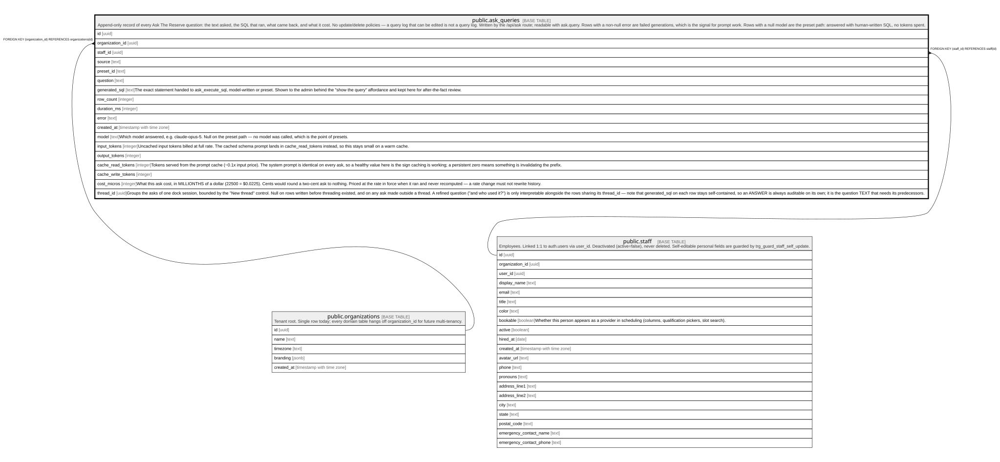

# public.ask_queries

## Description

Append-only record of every Ask The Reserve question: the text asked, the SQL that ran, what came back, and what it cost. No update/delete policies — a query log that can be edited is not a query log. Written by the /api/ask route; readable with ask.query. Rows with a non-null error are failed generations, which is the signal for prompt work. Rows with a null model are the preset path: answered with human-written SQL, no tokens spent.

## Columns

| Name               | Type                     | Default           | Nullable | Children | Parents                                         | Comment                                                                                                                                                                                                                                                                                                                                                                                                                             |
| ------------------ | ------------------------ | ----------------- | -------- | -------- | ----------------------------------------------- | ----------------------------------------------------------------------------------------------------------------------------------------------------------------------------------------------------------------------------------------------------------------------------------------------------------------------------------------------------------------------------------------------------------------------------------- |
| id                 | uuid                     | gen_random_uuid() | false    |          |                                                 |                                                                                                                                                                                                                                                                                                                                                                                                                                     |
| organization_id    | uuid                     |                   | false    |          | [public.organizations](public.organizations.md) |                                                                                                                                                                                                                                                                                                                                                                                                                                     |
| staff_id           | uuid                     |                   | false    |          | [public.staff](public.staff.md)                 |                                                                                                                                                                                                                                                                                                                                                                                                                                     |
| source             | text                     |                   | false    |          |                                                 |                                                                                                                                                                                                                                                                                                                                                                                                                                     |
| preset_id          | text                     |                   | true     |          |                                                 |                                                                                                                                                                                                                                                                                                                                                                                                                                     |
| question           | text                     |                   | true     |          |                                                 |                                                                                                                                                                                                                                                                                                                                                                                                                                     |
| generated_sql      | text                     |                   | true     |          |                                                 | The exact statement handed to ask_execute_sql, model-written or preset. Shown to the admin behind the "show the query" affordance and kept here for after-the-fact review.                                                                                                                                                                                                                                                          |
| row_count          | integer                  |                   | true     |          |                                                 |                                                                                                                                                                                                                                                                                                                                                                                                                                     |
| duration_ms        | integer                  |                   | true     |          |                                                 |                                                                                                                                                                                                                                                                                                                                                                                                                                     |
| error              | text                     |                   | true     |          |                                                 |                                                                                                                                                                                                                                                                                                                                                                                                                                     |
| created_at         | timestamp with time zone | now()             | false    |          |                                                 |                                                                                                                                                                                                                                                                                                                                                                                                                                     |
| model              | text                     |                   | true     |          |                                                 | Which model answered, e.g. claude-opus-5. Null on the preset path — no model was called, which is the point of presets.                                                                                                                                                                                                                                                                                                             |
| input_tokens       | integer                  |                   | true     |          |                                                 | Uncached input tokens billed at full rate. The cached schema prompt lands in cache_read_tokens instead, so this stays small on a warm cache.                                                                                                                                                                                                                                                                                        |
| output_tokens      | integer                  |                   | true     |          |                                                 |                                                                                                                                                                                                                                                                                                                                                                                                                                     |
| cache_read_tokens  | integer                  |                   | true     |          |                                                 | Tokens served from the prompt cache (~0.1x input price). The system prompt is identical on every ask, so a healthy value here is the sign caching is working; a persistent zero means something is invalidating the prefix.                                                                                                                                                                                                         |
| cache_write_tokens | integer                  |                   | true     |          |                                                 |                                                                                                                                                                                                                                                                                                                                                                                                                                     |
| cost_micros        | integer                  |                   | true     |          |                                                 | What this ask cost, in MILLIONTHS of a dollar (22500 = $0.0225). Cents would round a two-cent ask to nothing. Priced at the rate in force when it ran and never recomputed — a rate change must not rewrite history.                                                                                                                                                                                                                |
| thread_id          | uuid                     |                   | true     |          |                                                 | Groups the asks of one dock session, bounded by the "New thread" control. Null on rows written before threading existed, and on any ask made outside a thread. A refined question ("and who used it?") is only interpretable alongside the rows sharing its thread_id — note that generated_sql on each row stays self-contained, so an ANSWER is always auditable on its own; it is the question TEXT that needs its predecessors. |

## Constraints

| Name                             | Type        | Definition                                                    |
| -------------------------------- | ----------- | ------------------------------------------------------------- |
| ask_queries_check                | CHECK       | CHECK (((source = 'preset'::text) = (preset_id IS NOT NULL))) |
| ask_queries_source_check         | CHECK       | CHECK ((source = ANY (ARRAY['preset'::text, 'llm'::text])))   |
| ask_queries_organization_id_fkey | FOREIGN KEY | FOREIGN KEY (organization_id) REFERENCES organizations(id)    |
| ask_queries_staff_id_fkey        | FOREIGN KEY | FOREIGN KEY (staff_id) REFERENCES staff(id)                   |
| ask_queries_pkey                 | PRIMARY KEY | PRIMARY KEY (id)                                              |

## Indexes

| Name                 | Definition                                                                                                                             |
| -------------------- | -------------------------------------------------------------------------------------------------------------------------------------- |
| ask_queries_pkey     | CREATE UNIQUE INDEX ask_queries_pkey ON public.ask_queries USING btree (id)                                                            |
| ask_queries_org_day  | CREATE INDEX ask_queries_org_day ON public.ask_queries USING btree (organization_id, created_at DESC)                                  |
| ask_queries_staff    | CREATE INDEX ask_queries_staff ON public.ask_queries USING btree (staff_id, created_at DESC)                                           |
| ask_queries_org_cost | CREATE INDEX ask_queries_org_cost ON public.ask_queries USING btree (organization_id, created_at DESC) WHERE (cost_micros IS NOT NULL) |
| ask_queries_thread   | CREATE INDEX ask_queries_thread ON public.ask_queries USING btree (thread_id, created_at DESC) WHERE (thread_id IS NOT NULL)           |

## Relations

---

> Generated by [tbls](https://github.com/k1LoW/tbls)
