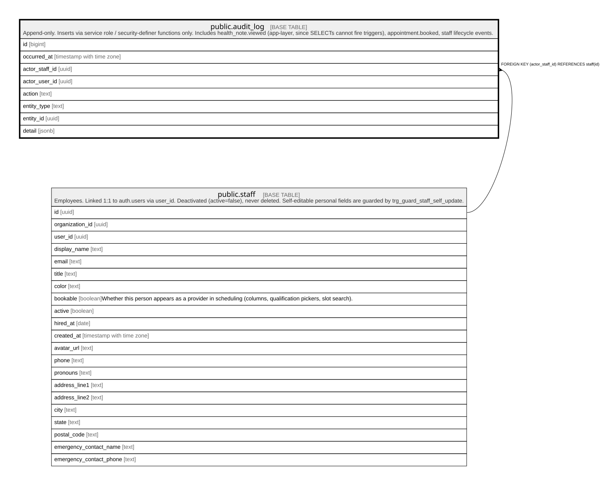

# public.audit_log

## Description

Append-only. Inserts via service role / security-definer functions only. Includes health_note.viewed (app-layer, since SELECTs cannot fire triggers), appointment.booked, staff lifecycle events.

## Columns

| Name           | Type                     | Default | Nullable | Children | Parents                         | Comment |
| -------------- | ------------------------ | ------- | -------- | -------- | ------------------------------- | ------- |
| id             | bigint                   |         | false    |          |                                 |         |
| occurred_at    | timestamp with time zone | now()   | false    |          |                                 |         |
| actor_staff_id | uuid                     |         | true     |          | [public.staff](public.staff.md) |         |
| actor_user_id  | uuid                     |         | true     |          |                                 |         |
| action         | text                     |         | false    |          |                                 |         |
| entity_type    | text                     |         | true     |          |                                 |         |
| entity_id      | uuid                     |         | true     |          |                                 |         |
| detail         | jsonb                    |         | true     |          |                                 |         |

## Constraints

| Name                          | Type        | Definition                                        |
| ----------------------------- | ----------- | ------------------------------------------------- |
| audit_log_actor_staff_id_fkey | FOREIGN KEY | FOREIGN KEY (actor_staff_id) REFERENCES staff(id) |
| audit_log_pkey                | PRIMARY KEY | PRIMARY KEY (id)                                  |

## Indexes

| Name           | Definition                                                              |
| -------------- | ----------------------------------------------------------------------- |
| audit_log_pkey | CREATE UNIQUE INDEX audit_log_pkey ON public.audit_log USING btree (id) |

## Relations

---

> Generated by [tbls](https://github.com/k1LoW/tbls)
