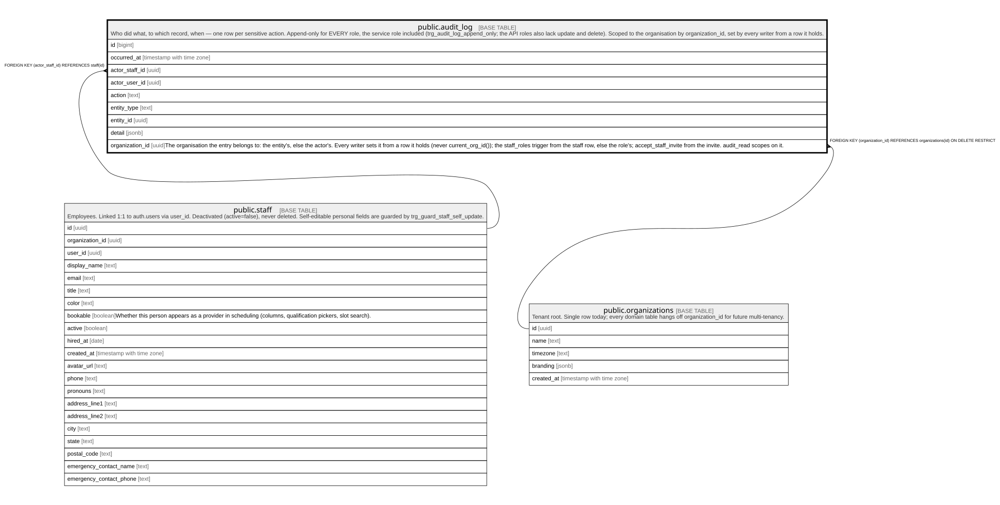

# public.audit_log

## Description

Who did what, to which record, when — one row per sensitive action. Append-only for EVERY role, the service role included (trg_audit_log_append_only; the API roles also lack update and delete). Scoped to the organisation by organization_id, set by every writer from a row it holds.

## Columns

| Name            | Type                     | Default | Nullable | Children | Parents                                         | Comment                                                                                                                                                                                                                                                              |
| --------------- | ------------------------ | ------- | -------- | -------- | ----------------------------------------------- | -------------------------------------------------------------------------------------------------------------------------------------------------------------------------------------------------------------------------------------------------------------------- |
| id              | bigint                   |         | false    |          |                                                 |                                                                                                                                                                                                                                                                      |
| occurred_at     | timestamp with time zone | now()   | false    |          |                                                 |                                                                                                                                                                                                                                                                      |
| actor_staff_id  | uuid                     |         | true     |          | [public.staff](public.staff.md)                 |                                                                                                                                                                                                                                                                      |
| actor_user_id   | uuid                     |         | true     |          |                                                 |                                                                                                                                                                                                                                                                      |
| action          | text                     |         | false    |          |                                                 |                                                                                                                                                                                                                                                                      |
| entity_type     | text                     |         | true     |          |                                                 |                                                                                                                                                                                                                                                                      |
| entity_id       | uuid                     |         | true     |          |                                                 |                                                                                                                                                                                                                                                                      |
| detail          | jsonb                    |         | true     |          |                                                 |                                                                                                                                                                                                                                                                      |
| organization_id | uuid                     |         | false    |          | [public.organizations](public.organizations.md) | The organisation the entry belongs to: the entity's, else the actor's. Every writer sets it from a row it holds (never current_org_id()); the staff_roles trigger from the staff row, else the role's; accept_staff_invite from the invite. audit_read scopes on it. |

## Constraints

| Name                           | Type        | Definition                                                                    |
| ------------------------------ | ----------- | ----------------------------------------------------------------------------- |
| audit_log_organization_id_fkey | FOREIGN KEY | FOREIGN KEY (organization_id) REFERENCES organizations(id) ON DELETE RESTRICT |
| audit_log_actor_staff_id_fkey  | FOREIGN KEY | FOREIGN KEY (actor_staff_id) REFERENCES staff(id)                             |
| audit_log_pkey                 | PRIMARY KEY | PRIMARY KEY (id)                                                              |

## Indexes

| Name               | Definition                                                                                          |
| ------------------ | --------------------------------------------------------------------------------------------------- |
| audit_log_pkey     | CREATE UNIQUE INDEX audit_log_pkey ON public.audit_log USING btree (id)                             |
| audit_log_org_time | CREATE INDEX audit_log_org_time ON public.audit_log USING btree (organization_id, occurred_at DESC) |

## Triggers

| Name                      | Definition                                                                                                                             |
| ------------------------- | -------------------------------------------------------------------------------------------------------------------------------------- |
| trg_audit_log_append_only | CREATE TRIGGER trg_audit_log_append_only BEFORE DELETE OR UPDATE ON public.audit_log FOR EACH ROW EXECUTE FUNCTION append_only_block() |

## Relations

---

> Generated by [tbls](https://github.com/k1LoW/tbls)
