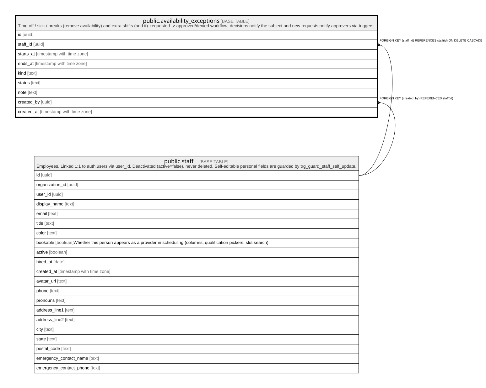

# public.availability_exceptions

## Description

Time off / sick / breaks (remove availability) and extra shifts (add it). requested -> approved/denied workflow; decisions notify the subject and new requests notify approvers via triggers.

## Columns

| Name       | Type                     | Default           | Nullable | Children | Parents                         | Comment |
| ---------- | ------------------------ | ----------------- | -------- | -------- | ------------------------------- | ------- |
| id         | uuid                     | gen_random_uuid() | false    |          |                                 |         |
| staff_id   | uuid                     |                   | false    |          | [public.staff](public.staff.md) |         |
| starts_at  | timestamp with time zone |                   | false    |          |                                 |         |
| ends_at    | timestamp with time zone |                   | false    |          |                                 |         |
| kind       | text                     |                   | false    |          |                                 |         |
| status     | text                     | 'approved'::text  | false    |          |                                 |         |
| note       | text                     |                   | true     |          |                                 |         |
| created_by | uuid                     |                   | false    |          | [public.staff](public.staff.md) |         |
| created_at | timestamp with time zone | now()             | false    |          |                                 |         |

## Constraints

| Name                                    | Type        | Definition                                                                                       |
| --------------------------------------- | ----------- | ------------------------------------------------------------------------------------------------ |
| availability_exceptions_check           | CHECK       | CHECK ((starts_at < ends_at))                                                                    |
| availability_exceptions_kind_check      | CHECK       | CHECK ((kind = ANY (ARRAY['time_off'::text, 'sick'::text, 'break'::text, 'extra_shift'::text]))) |
| availability_exceptions_status_check    | CHECK       | CHECK ((status = ANY (ARRAY['requested'::text, 'approved'::text, 'denied'::text])))              |
| availability_exceptions_created_by_fkey | FOREIGN KEY | FOREIGN KEY (created_by) REFERENCES staff(id)                                                    |
| availability_exceptions_staff_id_fkey   | FOREIGN KEY | FOREIGN KEY (staff_id) REFERENCES staff(id) ON DELETE CASCADE                                    |
| availability_exceptions_pkey            | PRIMARY KEY | PRIMARY KEY (id)                                                                                 |

## Indexes

| Name                          | Definition                                                                                                     |
| ----------------------------- | -------------------------------------------------------------------------------------------------------------- |
| availability_exceptions_pkey  | CREATE UNIQUE INDEX availability_exceptions_pkey ON public.availability_exceptions USING btree (id)            |
| availability_exceptions_staff | CREATE INDEX availability_exceptions_staff ON public.availability_exceptions USING btree (staff_id, starts_at) |

## Triggers

| Name                         | Definition                                                                                                                                          |
| ---------------------------- | --------------------------------------------------------------------------------------------------------------------------------------------------- |
| trg_notify_timeoff_decision  | CREATE TRIGGER trg_notify_timeoff_decision AFTER UPDATE ON public.availability_exceptions FOR EACH ROW EXECUTE FUNCTION notify_timeoff_decision()   |
| trg_notify_timeoff_requested | CREATE TRIGGER trg_notify_timeoff_requested AFTER INSERT ON public.availability_exceptions FOR EACH ROW EXECUTE FUNCTION notify_timeoff_requested() |

## Relations

---

> Generated by [tbls](https://github.com/k1LoW/tbls)
