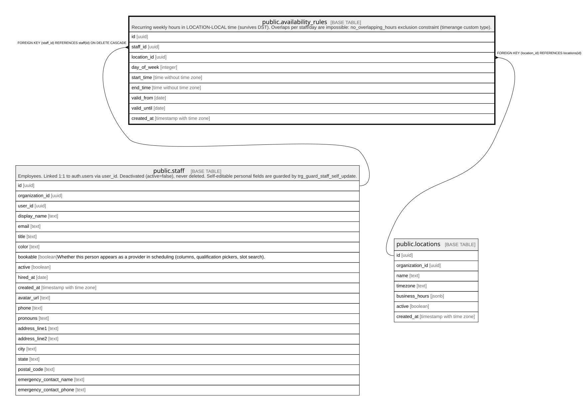

# public.availability_rules

## Description

Recurring weekly hours in LOCATION-LOCAL time (survives DST). Overlaps per staff/day are impossible: no_overlapping_hours exclusion constraint (timerange custom type).

## Columns

| Name        | Type                     | Default           | Nullable | Children | Parents                                 | Comment |
| ----------- | ------------------------ | ----------------- | -------- | -------- | --------------------------------------- | ------- |
| id          | uuid                     | gen_random_uuid() | false    |          |                                         |         |
| staff_id    | uuid                     |                   | false    |          | [public.staff](public.staff.md)         |         |
| location_id | uuid                     |                   | false    |          | [public.locations](public.locations.md) |         |
| day_of_week | integer                  |                   | false    |          |                                         |         |
| start_time  | time without time zone   |                   | false    |          |                                         |         |
| end_time    | time without time zone   |                   | false    |          |                                         |         |
| valid_from  | date                     | CURRENT_DATE      | false    |          |                                         |         |
| valid_until | date                     |                   | true     |          |                                         |         |
| created_at  | timestamp with time zone | now()             | false    |          |                                         |         |

## Constraints

| Name                                 | Type        | Definition                                                                                        |
| ------------------------------------ | ----------- | ------------------------------------------------------------------------------------------------- |
| availability_rules_check             | CHECK       | CHECK ((start_time < end_time))                                                                   |
| availability_rules_day_of_week_check | CHECK       | CHECK (((day_of_week >= 0) AND (day_of_week <= 6)))                                               |
| availability_rules_location_id_fkey  | FOREIGN KEY | FOREIGN KEY (location_id) REFERENCES locations(id)                                                |
| availability_rules_staff_id_fkey     | FOREIGN KEY | FOREIGN KEY (staff_id) REFERENCES staff(id) ON DELETE CASCADE                                     |
| availability_rules_pkey              | PRIMARY KEY | PRIMARY KEY (id)                                                                                  |
| no_overlapping_hours                 | x           | EXCLUDE USING gist (staff_id WITH =, day_of_week WITH =, timerange(start_time, end_time) WITH &&) |

## Indexes

| Name                     | Definition                                                                                                                         |
| ------------------------ | ---------------------------------------------------------------------------------------------------------------------------------- |
| availability_rules_pkey  | CREATE UNIQUE INDEX availability_rules_pkey ON public.availability_rules USING btree (id)                                          |
| availability_rules_staff | CREATE INDEX availability_rules_staff ON public.availability_rules USING btree (staff_id, day_of_week)                             |
| no_overlapping_hours     | CREATE INDEX no_overlapping_hours ON public.availability_rules USING gist (staff_id, day_of_week, timerange(start_time, end_time)) |

## Relations

---

> Generated by [tbls](https://github.com/k1LoW/tbls)
