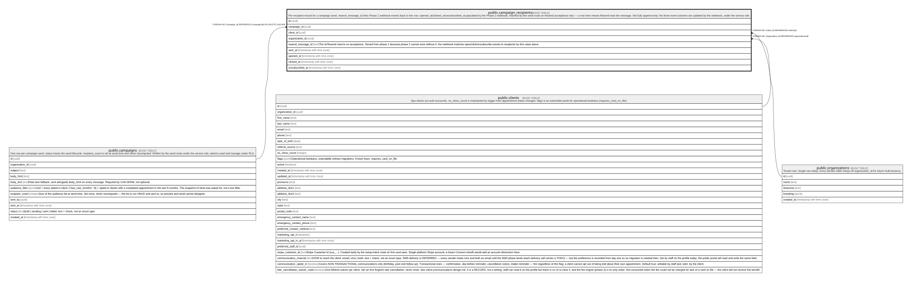

# public.campaign_recipients

## Description

Per-recipient record for a campaign send. resend_message_id links Phase 2 webhook events back to this row. opened_at/clicked_at/unsubscribed_at populated by the Phase 2 webhook. Inserted by the send route on Resend acceptance only — a row here means Resend took the message. Not fully append-only: the three event columns are updated by the webhook, under the service role.

## Columns

| Name              | Type                     | Default           | Nullable | Children | Parents                                         | Comment                                                                                                                                                                                |
| ----------------- | ------------------------ | ----------------- | -------- | -------- | ----------------------------------------------- | -------------------------------------------------------------------------------------------------------------------------------------------------------------------------------------- |
| id                | uuid                     | gen_random_uuid() | false    |          |                                                 |                                                                                                                                                                                        |
| campaign_id       | uuid                     |                   | false    |          | [public.campaigns](public.campaigns.md)         |                                                                                                                                                                                        |
| client_id         | uuid                     |                   | false    |          | [public.clients](public.clients.md)             |                                                                                                                                                                                        |
| organization_id   | uuid                     |                   | false    |          | [public.organizations](public.organizations.md) |                                                                                                                                                                                        |
| resend_message_id | text                     |                   | true     |          |                                                 | The id Resend returns on acceptance. Stored from phase 1 because phase 2 cannot exist without it: the webhook matches open/click/unsubscribe events to recipients by this value alone. |
| sent_at           | timestamp with time zone |                   | true     |          |                                                 |                                                                                                                                                                                        |
| opened_at         | timestamp with time zone |                   | true     |          |                                                 |                                                                                                                                                                                        |
| clicked_at        | timestamp with time zone |                   | true     |          |                                                 |                                                                                                                                                                                        |
| unsubscribed_at   | timestamp with time zone |                   | true     |          |                                                 |                                                                                                                                                                                        |

## Constraints

| Name                                     | Type        | Definition                                                           |
| ---------------------------------------- | ----------- | -------------------------------------------------------------------- |
| campaign_recipients_organization_id_fkey | FOREIGN KEY | FOREIGN KEY (organization_id) REFERENCES organizations(id)           |
| campaign_recipients_client_id_fkey       | FOREIGN KEY | FOREIGN KEY (client_id) REFERENCES clients(id)                       |
| campaign_recipients_campaign_id_fkey     | FOREIGN KEY | FOREIGN KEY (campaign_id) REFERENCES campaigns(id) ON DELETE CASCADE |
| campaign_recipients_pkey                 | PRIMARY KEY | PRIMARY KEY (id)                                                     |

## Indexes

| Name                               | Definition                                                                                                    |
| ---------------------------------- | ------------------------------------------------------------------------------------------------------------- |
| campaign_recipients_pkey           | CREATE UNIQUE INDEX campaign_recipients_pkey ON public.campaign_recipients USING btree (id)                   |
| campaign_recipients_campaign       | CREATE INDEX campaign_recipients_campaign ON public.campaign_recipients USING btree (campaign_id)             |
| campaign_recipients_resend_message | CREATE INDEX campaign_recipients_resend_message ON public.campaign_recipients USING btree (resend_message_id) |

## Relations

---

> Generated by [tbls](https://github.com/k1LoW/tbls)
