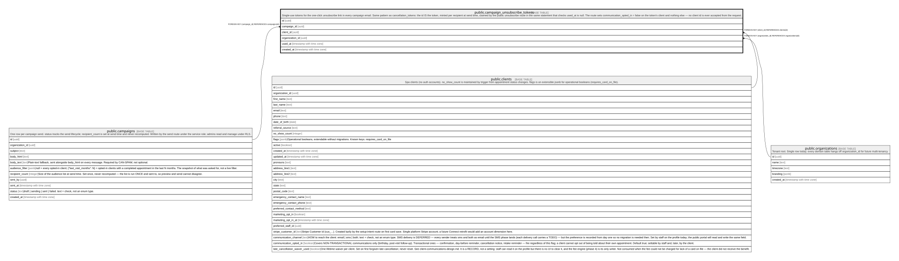

# public.campaign_unsubscribe_tokens

## Description

Single-use tokens for the one-click unsubscribe link in every campaign email. Same pattern as cancellation_tokens: the id IS the token, minted per recipient at send time, claimed by the public unsubscribe route in the same statement that checks used_at is null. The route sets communication_opted_in = false on the token's client and nothing else — no client id is ever accepted from the request.

## Columns

| Name            | Type                     | Default           | Nullable | Children | Parents                                         | Comment |
| --------------- | ------------------------ | ----------------- | -------- | -------- | ----------------------------------------------- | ------- |
| id              | uuid                     | gen_random_uuid() | false    |          |                                                 |         |
| campaign_id     | uuid                     |                   | false    |          | [public.campaigns](public.campaigns.md)         |         |
| client_id       | uuid                     |                   | false    |          | [public.clients](public.clients.md)             |         |
| organization_id | uuid                     |                   | false    |          | [public.organizations](public.organizations.md) |         |
| used_at         | timestamp with time zone |                   | true     |          |                                                 |         |
| created_at      | timestamp with time zone | now()             | false    |          |                                                 |         |

## Constraints

| Name                                             | Type        | Definition                                                 |
| ------------------------------------------------ | ----------- | ---------------------------------------------------------- |
| campaign_unsubscribe_tokens_organization_id_fkey | FOREIGN KEY | FOREIGN KEY (organization_id) REFERENCES organizations(id) |
| campaign_unsubscribe_tokens_client_id_fkey       | FOREIGN KEY | FOREIGN KEY (client_id) REFERENCES clients(id)             |
| campaign_unsubscribe_tokens_campaign_id_fkey     | FOREIGN KEY | FOREIGN KEY (campaign_id) REFERENCES campaigns(id)         |
| campaign_unsubscribe_tokens_pkey                 | PRIMARY KEY | PRIMARY KEY (id)                                           |

## Indexes

| Name                               | Definition                                                                                                    |
| ---------------------------------- | ------------------------------------------------------------------------------------------------------------- |
| campaign_unsubscribe_tokens_pkey   | CREATE UNIQUE INDEX campaign_unsubscribe_tokens_pkey ON public.campaign_unsubscribe_tokens USING btree (id)   |
| campaign_unsubscribe_tokens_client | CREATE INDEX campaign_unsubscribe_tokens_client ON public.campaign_unsubscribe_tokens USING btree (client_id) |

## Relations

---

> Generated by [tbls](https://github.com/k1LoW/tbls)
