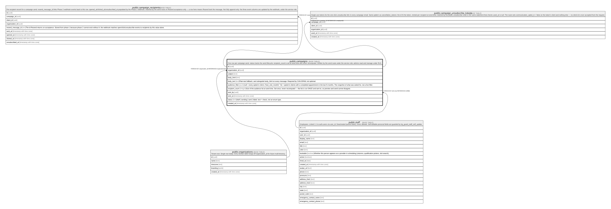

# public.campaigns

## Description

One row per campaign send. status tracks the send lifecycle; recipient_count is set at send time and never recomputed. Written by the send route under the service role; admins read and manage under RLS.

## Columns

| Name            | Type                     | Default           | Nullable | Children                                                                                                                                | Parents                                         | Comment                                                                                                                                                                             |
| --------------- | ------------------------ | ----------------- | -------- | --------------------------------------------------------------------------------------------------------------------------------------- | ----------------------------------------------- | ----------------------------------------------------------------------------------------------------------------------------------------------------------------------------------- |
| id              | uuid                     | gen_random_uuid() | false    | [public.campaign_recipients](public.campaign_recipients.md) [public.campaign_unsubscribe_tokens](public.campaign_unsubscribe_tokens.md) |                                                 |                                                                                                                                                                                     |
| organization_id | uuid                     |                   | false    |                                                                                                                                         | [public.organizations](public.organizations.md) |                                                                                                                                                                                     |
| subject         | text                     |                   | false    |                                                                                                                                         |                                                 |                                                                                                                                                                                     |
| body_html       | text                     |                   | false    |                                                                                                                                         |                                                 |                                                                                                                                                                                     |
| body_text       | text                     |                   | false    |                                                                                                                                         |                                                 | Plain-text fallback, sent alongside body_html on every message. Required by CAN-SPAM; not optional.                                                                                 |
| audience_filter | jsonb                    |                   | true     |                                                                                                                                         |                                                 | null = every opted-in client; {"last_visit_months": N} = opted-in clients with a completed appointment in the last N months. The snapshot of what was asked for, not a live filter. |
| recipient_count | integer                  |                   | true     |                                                                                                                                         |                                                 | Size of the audience list at send time. Set once, never recomputed — the list is run ONCE and sent to, so preview and send cannot disagree.                                         |
| sent_by         | uuid                     |                   | false    |                                                                                                                                         | [public.staff](public.staff.md)                 |                                                                                                                                                                                     |
| sent_at         | timestamp with time zone |                   | true     |                                                                                                                                         |                                                 |                                                                                                                                                                                     |
| status          | text                     | 'draft'::text     | false    |                                                                                                                                         |                                                 | draft \| sending \| sent \| failed. text + check, not an enum type.                                                                                                                 |
| created_at      | timestamp with time zone | now()             | false    |                                                                                                                                         |                                                 |                                                                                                                                                                                     |

## Constraints

| Name                           | Type        | Definition                                                                                   |
| ------------------------------ | ----------- | -------------------------------------------------------------------------------------------- |
| campaigns_status_check         | CHECK       | CHECK ((status = ANY (ARRAY['draft'::text, 'sending'::text, 'sent'::text, 'failed'::text]))) |
| campaigns_organization_id_fkey | FOREIGN KEY | FOREIGN KEY (organization_id) REFERENCES organizations(id)                                   |
| campaigns_sent_by_fkey         | FOREIGN KEY | FOREIGN KEY (sent_by) REFERENCES staff(id)                                                   |
| campaigns_pkey                 | PRIMARY KEY | PRIMARY KEY (id)                                                                             |

## Indexes

| Name                  | Definition                                                                                            |
| --------------------- | ----------------------------------------------------------------------------------------------------- |
| campaigns_pkey        | CREATE UNIQUE INDEX campaigns_pkey ON public.campaigns USING btree (id)                               |
| campaigns_org_created | CREATE INDEX campaigns_org_created ON public.campaigns USING btree (organization_id, created_at DESC) |

## Relations

---

> Generated by [tbls](https://github.com/k1LoW/tbls)
