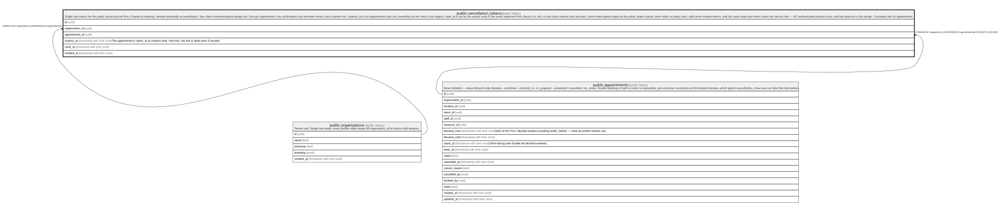

# public.cancellation_tokens

## Description

Single-use tokens for the public cancel-via-link flow. Created at booking, claimed atomically at cancellation. See client-communications-design.md. One per appointment: the confirmation and reminder emails carry /cancel/<id>; expires_at is the appointment start (no cancelling via link once it has begun); used_at is set by the cancel route in the same statement that checks it is null, so two clicks cannot both succeed. Same token-gated shape as the public intake submit: anon holds no policy here, staff never browse tokens, and the route reads and writes under the service role — NO authenticated policies exist, and that absence is the design. Cascades with its appointment.

## Columns

| Name            | Type                     | Default           | Nullable | Children | Parents                                         | Comment                                                                                   |
| --------------- | ------------------------ | ----------------- | -------- | -------- | ----------------------------------------------- | ----------------------------------------------------------------------------------------- |
| id              | uuid                     | gen_random_uuid() | false    |          |                                                 |                                                                                           |
| organization_id | uuid                     |                   | false    |          | [public.organizations](public.organizations.md) |                                                                                           |
| appointment_id  | uuid                     |                   | false    |          | [public.appointments](public.appointments.md)   |                                                                                           |
| expires_at      | timestamp with time zone |                   | false    |          |                                                 | The appointment's starts_at at creation time. Past this, the link is dead even if unused. |
| used_at         | timestamp with time zone |                   | true     |          |                                                 |                                                                                           |
| created_at      | timestamp with time zone | now()             | false    |          |                                                 |                                                                                           |

## Constraints

| Name                                     | Type        | Definition                                                                 |
| ---------------------------------------- | ----------- | -------------------------------------------------------------------------- |
| cancellation_tokens_organization_id_fkey | FOREIGN KEY | FOREIGN KEY (organization_id) REFERENCES organizations(id)                 |
| cancellation_tokens_appointment_id_fkey  | FOREIGN KEY | FOREIGN KEY (appointment_id) REFERENCES appointments(id) ON DELETE CASCADE |
| cancellation_tokens_pkey                 | PRIMARY KEY | PRIMARY KEY (id)                                                           |

## Indexes

| Name                            | Definition                                                                                              |
| ------------------------------- | ------------------------------------------------------------------------------------------------------- |
| cancellation_tokens_pkey        | CREATE UNIQUE INDEX cancellation_tokens_pkey ON public.cancellation_tokens USING btree (id)             |
| cancellation_tokens_appointment | CREATE INDEX cancellation_tokens_appointment ON public.cancellation_tokens USING btree (appointment_id) |

## Relations

---

> Generated by [tbls](https://github.com/k1LoW/tbls)
