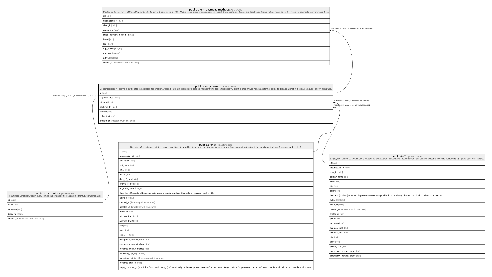

# public.card_consents

## Description

Consent records for storing a card on file (cancellation-fee enabler). Append-only: no update/delete policies. method=front_desk_attested is v1; client_signed arrives with intake forms. policy_text is a snapshot of the exact language shown at capture.

## Columns

| Name            | Type                     | Default                     | Nullable | Children                                                          | Parents                                         | Comment |
| --------------- | ------------------------ | --------------------------- | -------- | ----------------------------------------------------------------- | ----------------------------------------------- | ------- |
| id              | uuid                     | gen_random_uuid()           | false    | [public.client_payment_methods](public.client_payment_methods.md) |                                                 |         |
| organization_id | uuid                     |                             | false    |                                                                   | [public.organizations](public.organizations.md) |         |
| client_id       | uuid                     |                             | false    |                                                                   | [public.clients](public.clients.md)             |         |
| captured_by     | uuid                     |                             | false    |                                                                   | [public.staff](public.staff.md)                 |         |
| method          | text                     | 'front_desk_attested'::text | false    |                                                                   |                                                 |         |
| policy_text     | text                     |                             | false    |                                                                   |                                                 |         |
| created_at      | timestamp with time zone | now()                       | false    |                                                                   |                                                 |         |

## Constraints

| Name                               | Type        | Definition                                                                         |
| ---------------------------------- | ----------- | ---------------------------------------------------------------------------------- |
| card_consents_method_check         | CHECK       | CHECK ((method = ANY (ARRAY['front_desk_attested'::text, 'client_signed'::text]))) |
| card_consents_organization_id_fkey | FOREIGN KEY | FOREIGN KEY (organization_id) REFERENCES organizations(id)                         |
| card_consents_captured_by_fkey     | FOREIGN KEY | FOREIGN KEY (captured_by) REFERENCES staff(id)                                     |
| card_consents_client_id_fkey       | FOREIGN KEY | FOREIGN KEY (client_id) REFERENCES clients(id)                                     |
| card_consents_pkey                 | PRIMARY KEY | PRIMARY KEY (id)                                                                   |

## Indexes

| Name                 | Definition                                                                                         |
| -------------------- | -------------------------------------------------------------------------------------------------- |
| card_consents_pkey   | CREATE UNIQUE INDEX card_consents_pkey ON public.card_consents USING btree (id)                    |
| card_consents_client | CREATE INDEX card_consents_client ON public.card_consents USING btree (client_id, created_at DESC) |

## Relations

---

> Generated by [tbls](https://github.com/k1LoW/tbls)
