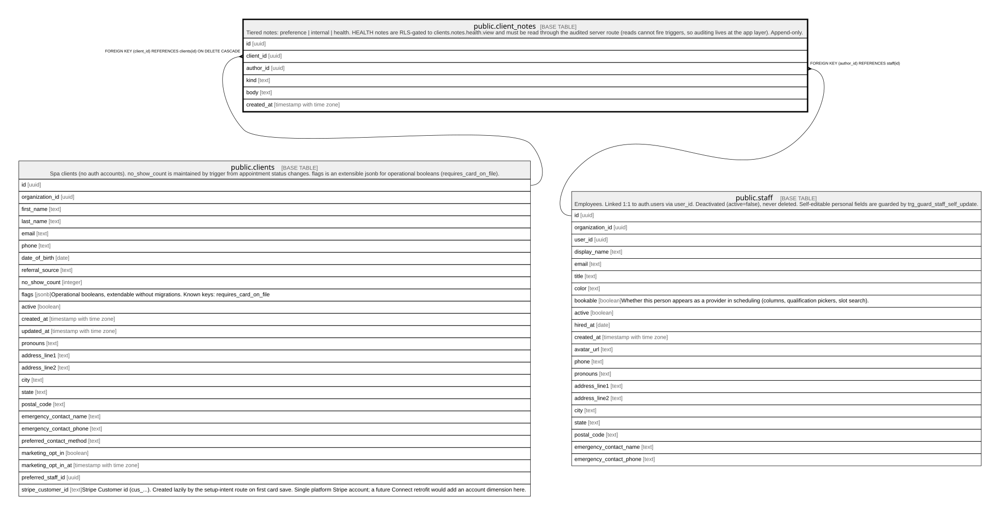

# public.client_notes

## Description

Tiered notes: preference | internal | health. HEALTH notes are RLS-gated to clients.notes.health.view and must be read through the audited server route (reads cannot fire triggers, so auditing lives at the app layer). Append-only.

## Columns

| Name       | Type                     | Default           | Nullable | Children | Parents                             | Comment |
| ---------- | ------------------------ | ----------------- | -------- | -------- | ----------------------------------- | ------- |
| id         | uuid                     | gen_random_uuid() | false    |          |                                     |         |
| client_id  | uuid                     |                   | false    |          | [public.clients](public.clients.md) |         |
| author_id  | uuid                     |                   | false    |          | [public.staff](public.staff.md)     |         |
| kind       | text                     |                   | false    |          |                                     |         |
| body       | text                     |                   | false    |          |                                     |         |
| created_at | timestamp with time zone | now()             | false    |          |                                     |         |

## Constraints

| Name                        | Type        | Definition                                                                         |
| --------------------------- | ----------- | ---------------------------------------------------------------------------------- |
| client_notes_kind_check     | CHECK       | CHECK ((kind = ANY (ARRAY['preference'::text, 'health'::text, 'internal'::text]))) |
| client_notes_author_id_fkey | FOREIGN KEY | FOREIGN KEY (author_id) REFERENCES staff(id)                                       |
| client_notes_client_id_fkey | FOREIGN KEY | FOREIGN KEY (client_id) REFERENCES clients(id) ON DELETE CASCADE                   |
| client_notes_pkey           | PRIMARY KEY | PRIMARY KEY (id)                                                                   |

## Indexes

| Name                | Definition                                                                                       |
| ------------------- | ------------------------------------------------------------------------------------------------ |
| client_notes_pkey   | CREATE UNIQUE INDEX client_notes_pkey ON public.client_notes USING btree (id)                    |
| client_notes_client | CREATE INDEX client_notes_client ON public.client_notes USING btree (client_id, created_at DESC) |

## Relations

---

> Generated by [tbls](https://github.com/k1LoW/tbls)
