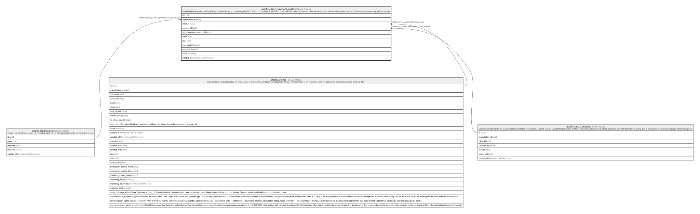

# public.client_payment_methods

## Description

Display-fields-only mirror of Stripe PaymentMethods (pm_...). consent_id is NOT NULL: no card exists without a consent record. Detached/expired cards are deactivated (active=false), never deleted — historical payments may reference them.

## Columns

| Name                     | Type                     | Default           | Nullable | Children | Parents                                         | Comment |
| ------------------------ | ------------------------ | ----------------- | -------- | -------- | ----------------------------------------------- | ------- |
| id                       | uuid                     | gen_random_uuid() | false    |          |                                                 |         |
| organization_id          | uuid                     |                   | false    |          | [public.organizations](public.organizations.md) |         |
| client_id                | uuid                     |                   | false    |          | [public.clients](public.clients.md)             |         |
| consent_id               | uuid                     |                   | false    |          | [public.card_consents](public.card_consents.md) |         |
| stripe_payment_method_id | text                     |                   | false    |          |                                                 |         |
| brand                    | text                     |                   | false    |          |                                                 |         |
| last4                    | text                     |                   | false    |          |                                                 |         |
| exp_month                | integer                  |                   | false    |          |                                                 |         |
| exp_year                 | integer                  |                   | false    |          |                                                 |         |
| active                   | boolean                  | true              | false    |          |                                                 |         |
| created_at               | timestamp with time zone | now()             | false    |          |                                                 |         |

## Constraints

| Name                                                | Type        | Definition                                                 |
| --------------------------------------------------- | ----------- | ---------------------------------------------------------- |
| client_payment_methods_exp_month_check              | CHECK       | CHECK (((exp_month >= 1) AND (exp_month <= 12)))           |
| client_payment_methods_organization_id_fkey         | FOREIGN KEY | FOREIGN KEY (organization_id) REFERENCES organizations(id) |
| client_payment_methods_client_id_fkey               | FOREIGN KEY | FOREIGN KEY (client_id) REFERENCES clients(id)             |
| client_payment_methods_consent_id_fkey              | FOREIGN KEY | FOREIGN KEY (consent_id) REFERENCES card_consents(id)      |
| client_payment_methods_pkey                         | PRIMARY KEY | PRIMARY KEY (id)                                           |
| client_payment_methods_stripe_payment_method_id_key | UNIQUE      | UNIQUE (stripe_payment_method_id)                          |

## Indexes

| Name                                                | Definition                                                                                                                                      |
| --------------------------------------------------- | ----------------------------------------------------------------------------------------------------------------------------------------------- |
| client_payment_methods_pkey                         | CREATE UNIQUE INDEX client_payment_methods_pkey ON public.client_payment_methods USING btree (id)                                               |
| client_payment_methods_stripe_payment_method_id_key | CREATE UNIQUE INDEX client_payment_methods_stripe_payment_method_id_key ON public.client_payment_methods USING btree (stripe_payment_method_id) |
| client_payment_methods_client                       | CREATE INDEX client_payment_methods_client ON public.client_payment_methods USING btree (client_id) WHERE active                                |

## Relations

---

> Generated by [tbls](https://github.com/k1LoW/tbls)
