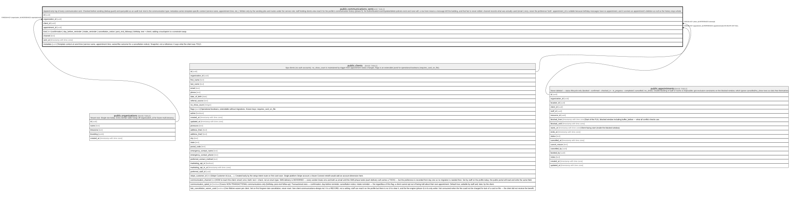

# public.communications_sent

## Description

Append-only log of every communication sent. Checked before sending (dedup guard) and queryable as an audit trail. kind is the communication type; metadata carries template-specific context (service name, appointment time, etc.). Written only by the sending jobs and routes under the service role; staff holding clients.view read it for the profile's communication history (phase 5). No authenticated insert/update/delete policies exist and none will: a row here means a message left the building, and that fact is never edited. channel records what was actually used (email | sms), never the preference 'both'. appointment_id is nullable because birthday messages have no appointment, and it survives an appointment's deletion as null so the history stays whole.

## Columns

| Name            | Type                     | Default           | Nullable | Children | Parents                                         | Comment                                                                                                                                                                    |
| --------------- | ------------------------ | ----------------- | -------- | -------- | ----------------------------------------------- | -------------------------------------------------------------------------------------------------------------------------------------------------------------------------- |
| id              | uuid                     | gen_random_uuid() | false    |          |                                                 |                                                                                                                                                                            |
| organization_id | uuid                     |                   | false    |          | [public.organizations](public.organizations.md) |                                                                                                                                                                            |
| client_id       | uuid                     |                   | false    |          | [public.clients](public.clients.md)             |                                                                                                                                                                            |
| appointment_id  | uuid                     |                   | true     |          | [public.appointments](public.appointments.md)   |                                                                                                                                                                            |
| kind            | text                     |                   | false    |          |                                                 | confirmation \| day_before_reminder \| intake_reminder \| cancellation_notice \| post_visit_followup \| birthday. text + check; adding a touchpoint is a constraint swap.  |
| channel         | text                     |                   | false    |          |                                                 |                                                                                                                                                                            |
| sent_at         | timestamp with time zone | now()             | false    |          |                                                 |                                                                                                                                                                            |
| metadata        | jsonb                    |                   | true     |          |                                                 | Template context at send time (service name, appointment time, waiver/fee outcome for a cancellation notice). Snapshot, not a reference: it says what the client was TOLD. |

## Constraints

| Name                                     | Type        | Definition                                                                                                                                                                           |
| ---------------------------------------- | ----------- | ------------------------------------------------------------------------------------------------------------------------------------------------------------------------------------ |
| communications_sent_channel_check        | CHECK       | CHECK ((channel = ANY (ARRAY['email'::text, 'sms'::text])))                                                                                                                          |
| communications_sent_kind_check           | CHECK       | CHECK ((kind = ANY (ARRAY['confirmation'::text, 'day_before_reminder'::text, 'intake_reminder'::text, 'cancellation_notice'::text, 'post_visit_followup'::text, 'birthday'::text]))) |
| communications_sent_organization_id_fkey | FOREIGN KEY | FOREIGN KEY (organization_id) REFERENCES organizations(id)                                                                                                                           |
| communications_sent_client_id_fkey       | FOREIGN KEY | FOREIGN KEY (client_id) REFERENCES clients(id)                                                                                                                                       |
| communications_sent_appointment_id_fkey  | FOREIGN KEY | FOREIGN KEY (appointment_id) REFERENCES appointments(id) ON DELETE SET NULL                                                                                                          |
| communications_sent_pkey                 | PRIMARY KEY | PRIMARY KEY (id)                                                                                                                                                                     |

## Indexes

| Name                                 | Definition                                                                                                                  |
| ------------------------------------ | --------------------------------------------------------------------------------------------------------------------------- |
| communications_sent_pkey             | CREATE UNIQUE INDEX communications_sent_pkey ON public.communications_sent USING btree (id)                                 |
| communications_sent_client_kind_sent | CREATE INDEX communications_sent_client_kind_sent ON public.communications_sent USING btree (client_id, kind, sent_at DESC) |
| communications_sent_appointment      | CREATE INDEX communications_sent_appointment ON public.communications_sent USING btree (appointment_id)                     |

## Relations

---

> Generated by [tbls](https://github.com/k1LoW/tbls)
