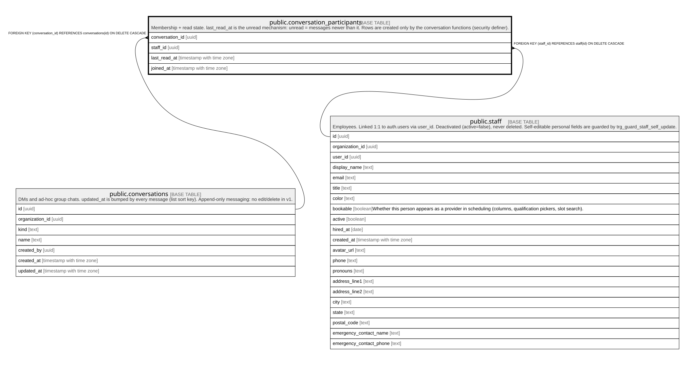

# public.conversation_participants

## Description

Membership + read state. last_read_at is the unread mechanism: unread = messages newer than it. Rows are created only by the conversation functions (security definer).

## Columns

| Name            | Type                     | Default | Nullable | Children | Parents                                         | Comment |
| --------------- | ------------------------ | ------- | -------- | -------- | ----------------------------------------------- | ------- |
| conversation_id | uuid                     |         | false    |          | [public.conversations](public.conversations.md) |         |
| staff_id        | uuid                     |         | false    |          | [public.staff](public.staff.md)                 |         |
| last_read_at    | timestamp with time zone | now()   | false    |          |                                                 |         |
| joined_at       | timestamp with time zone | now()   | false    |          |                                                 |         |

## Constraints

| Name                                           | Type        | Definition                                                                   |
| ---------------------------------------------- | ----------- | ---------------------------------------------------------------------------- |
| conversation_participants_staff_id_fkey        | FOREIGN KEY | FOREIGN KEY (staff_id) REFERENCES staff(id) ON DELETE CASCADE                |
| conversation_participants_conversation_id_fkey | FOREIGN KEY | FOREIGN KEY (conversation_id) REFERENCES conversations(id) ON DELETE CASCADE |
| conversation_participants_pkey                 | PRIMARY KEY | PRIMARY KEY (conversation_id, staff_id)                                      |

## Indexes

| Name                            | Definition                                                                                                                     |
| ------------------------------- | ------------------------------------------------------------------------------------------------------------------------------ |
| conversation_participants_pkey  | CREATE UNIQUE INDEX conversation_participants_pkey ON public.conversation_participants USING btree (conversation_id, staff_id) |
| conversation_participants_staff | CREATE INDEX conversation_participants_staff ON public.conversation_participants USING btree (staff_id)                        |

## Relations

---

> Generated by [tbls](https://github.com/k1LoW/tbls)
