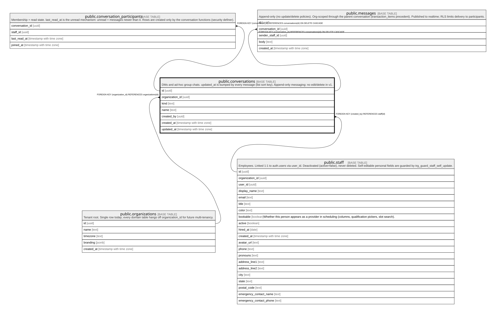

# public.conversations

## Description

DMs and ad-hoc group chats. updated_at is bumped by every message (list sort key). Append-only messaging: no edit/delete in v1.

## Columns

| Name            | Type                     | Default           | Nullable | Children                                                                                                      | Parents                                         | Comment |
| --------------- | ------------------------ | ----------------- | -------- | ------------------------------------------------------------------------------------------------------------- | ----------------------------------------------- | ------- |
| id              | uuid                     | gen_random_uuid() | false    | [public.conversation_participants](public.conversation_participants.md) [public.messages](public.messages.md) |                                                 |         |
| organization_id | uuid                     |                   | false    |                                                                                                               | [public.organizations](public.organizations.md) |         |
| kind            | text                     |                   | false    |                                                                                                               |                                                 |         |
| name            | text                     |                   | true     |                                                                                                               |                                                 |         |
| created_by      | uuid                     |                   | false    |                                                                                                               | [public.staff](public.staff.md)                 |         |
| created_at      | timestamp with time zone | now()             | false    |                                                                                                               |                                                 |         |
| updated_at      | timestamp with time zone | now()             | false    |                                                                                                               |                                                 |         |

## Constraints

| Name                               | Type        | Definition                                                 |
| ---------------------------------- | ----------- | ---------------------------------------------------------- |
| conversations_kind_check           | CHECK       | CHECK ((kind = ANY (ARRAY['dm'::text, 'group'::text])))    |
| conversations_organization_id_fkey | FOREIGN KEY | FOREIGN KEY (organization_id) REFERENCES organizations(id) |
| conversations_created_by_fkey      | FOREIGN KEY | FOREIGN KEY (created_by) REFERENCES staff(id)              |
| conversations_pkey                 | PRIMARY KEY | PRIMARY KEY (id)                                           |

## Indexes

| Name               | Definition                                                                      |
| ------------------ | ------------------------------------------------------------------------------- |
| conversations_pkey | CREATE UNIQUE INDEX conversations_pkey ON public.conversations USING btree (id) |

## Relations

---

> Generated by [tbls](https://github.com/k1LoW/tbls)
