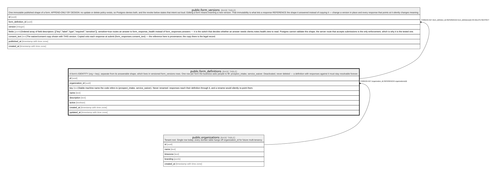

# public.form_definitions

## Description

A form's IDENTITY (org + key), separate from its answerable shape, which lives in versioned form_versions rows. One row per form the business asks people to fill: prospect_intake, service_waiver. Deactivated, never deleted — a definition with responses against it must stay resolvable forever.

## Columns

| Name            | Type                     | Default           | Nullable | Children                                        | Parents                                         | Comment                                                                                                                                                                          |
| --------------- | ------------------------ | ----------------- | -------- | ----------------------------------------------- | ----------------------------------------------- | -------------------------------------------------------------------------------------------------------------------------------------------------------------------------------- |
| id              | uuid                     | gen_random_uuid() | false    | [public.form_versions](public.form_versions.md) |                                                 |                                                                                                                                                                                  |
| organization_id | uuid                     |                   | false    |                                                 | [public.organizations](public.organizations.md) |                                                                                                                                                                                  |
| key             | text                     |                   | false    |                                                 |                                                 | Stable machine name the code refers to (prospect_intake, service_waiver). Never renamed: responses reach their definition through it, and a rename would silently re-point them. |
| name            | text                     |                   | false    |                                                 |                                                 |                                                                                                                                                                                  |
| description     | text                     |                   | true     |                                                 |                                                 |                                                                                                                                                                                  |
| active          | boolean                  | true              | false    |                                                 |                                                 |                                                                                                                                                                                  |
| created_at      | timestamp with time zone | now()             | false    |                                                 |                                                 |                                                                                                                                                                                  |
| updated_at      | timestamp with time zone | now()             | false    |                                                 |                                                 |                                                                                                                                                                                  |

## Constraints

| Name                                     | Type        | Definition                                                 |
| ---------------------------------------- | ----------- | ---------------------------------------------------------- |
| form_definitions_organization_id_fkey    | FOREIGN KEY | FOREIGN KEY (organization_id) REFERENCES organizations(id) |
| form_definitions_pkey                    | PRIMARY KEY | PRIMARY KEY (id)                                           |
| form_definitions_organization_id_key_key | UNIQUE      | UNIQUE (organization_id, key)                              |

## Indexes

| Name                                     | Definition                                                                                                                 |
| ---------------------------------------- | -------------------------------------------------------------------------------------------------------------------------- |
| form_definitions_pkey                    | CREATE UNIQUE INDEX form_definitions_pkey ON public.form_definitions USING btree (id)                                      |
| form_definitions_organization_id_key_key | CREATE UNIQUE INDEX form_definitions_organization_id_key_key ON public.form_definitions USING btree (organization_id, key) |

## Triggers

| Name                       | Definition                                                                                                                          |
| -------------------------- | ----------------------------------------------------------------------------------------------------------------------------------- |
| trg_form_definitions_touch | CREATE TRIGGER trg_form_definitions_touch BEFORE UPDATE ON public.form_definitions FOR EACH ROW EXECUTE FUNCTION touch_updated_at() |

## Relations

---

> Generated by [tbls](https://github.com/k1LoW/tbls)
