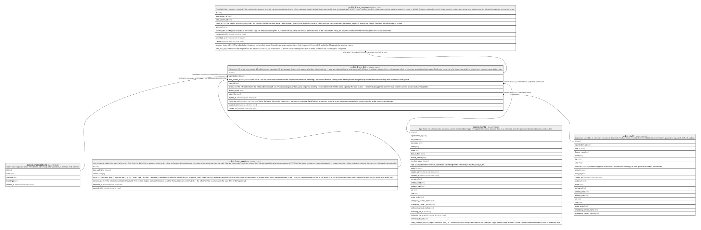

# public.form_links

## Description

A tokenized link to one form version. NO subject means a prospect link (the prospect_intake row is created when they submit, not now — issuing creates nothing, so an unanswered link leaves no phantom prospect in the review queue). client_id set means an existing client's waiver. Single-use: consumed_at is claimed atomically by submit_form_response, never by the route.

## Columns

| Name            | Type                     | Default                       | Nullable | Children                                          | Parents                                         | Comment                                                                                                                                                                                                                                                                                                                                                                         |
| --------------- | ------------------------ | ----------------------------- | -------- | ------------------------------------------------- | ----------------------------------------------- | ------------------------------------------------------------------------------------------------------------------------------------------------------------------------------------------------------------------------------------------------------------------------------------------------------------------------------------------------------------------------------- |
| id              | uuid                     | gen_random_uuid()             | false    | [public.form_responses](public.form_responses.md) |                                                 |                                                                                                                                                                                                                                                                                                                                                                                 |
| organization_id | uuid                     |                               | false    |                                                   | [public.organizations](public.organizations.md) |                                                                                                                                                                                                                                                                                                                                                                                 |
| form_version_id | uuid                     |                               | false    |                                                   | [public.form_versions](public.form_versions.md) | FROZEN AT ISSUE. The link points at the exact version the recipient will answer, so publishing a new version between sending and submitting cannot change their questions or the sensitive flags their answers are split against.                                                                                                                                               |
| client_id       | uuid                     |                               | true     |                                                   | [public.clients](public.clients.md)             |                                                                                                                                                                                                                                                                                                                                                                                 |
| token           | uuid                     | gen_random_uuid()             | false    |                                                   |                                                 | The only authorization the public submission path has. Unguessable (gen_random_uuid), single-use, expiring. There is deliberately no RLS policy exposing this table to anon — token lookup happens in a server route under the service role, the staff_invites pattern.                                                                                                         |
| delivery_email  | text                     |                               | true     |                                                   |                                                 |                                                                                                                                                                                                                                                                                                                                                                                 |
| issued_by       | uuid                     |                               | false    |                                                   | [public.staff](public.staff.md)                 |                                                                                                                                                                                                                                                                                                                                                                                 |
| expires_at      | timestamp with time zone | (now() + '14 days'::interval) | false    |                                                   |                                                 |                                                                                                                                                                                                                                                                                                                                                                                 |
| consumed_at     | timestamp with time zone |                               | true     |                                                   |                                                 | Set by the atomic claim inside submit_form_response. A route-side check followed by an insert would be a race; this column moves in the same transaction as the response it authorises.                                                                                                                                                                                         |
| revoked_at      | timestamp with time zone |                               | true     |                                                   |                                                 |                                                                                                                                                                                                                                                                                                                                                                                 |
| created_at      | timestamp with time zone | now()                         | false    |                                                   |                                                 |                                                                                                                                                                                                                                                                                                                                                                                 |
| lead_id         | uuid                     |                               | true     |                                                   | [public.leads](public.leads.md)                 | The lead this link was issued for by conversion (convert_lead). Read by submit_form_response and copied onto the prospect_intake row it creates — the provenance thread leads → prospect_intake → clients. Null for links issued any other way; never set together with client_id. on delete set null: a lead removed by hand ends the chain here rather than voiding the link. |

## Constraints

| Name                            | Type        | Definition                                                                    |
| ------------------------------- | ----------- | ----------------------------------------------------------------------------- |
| form_links_subject_not_both     | CHECK       | CHECK (((client_id IS NULL) OR (lead_id IS NULL)))                            |
| form_links_organization_id_fkey | FOREIGN KEY | FOREIGN KEY (organization_id) REFERENCES organizations(id)                    |
| form_links_issued_by_fkey       | FOREIGN KEY | FOREIGN KEY (issued_by) REFERENCES staff(id)                                  |
| form_links_client_id_fkey       | FOREIGN KEY | FOREIGN KEY (client_id) REFERENCES clients(id) ON DELETE CASCADE              |
| form_links_form_version_id_fkey | FOREIGN KEY | FOREIGN KEY (form_version_id) REFERENCES form_versions(id) ON DELETE RESTRICT |
| form_links_pkey                 | PRIMARY KEY | PRIMARY KEY (id)                                                              |
| form_links_token_key            | UNIQUE      | UNIQUE (token)                                                                |
| form_links_lead_id_fkey         | FOREIGN KEY | FOREIGN KEY (lead_id) REFERENCES leads(id) ON DELETE SET NULL                 |

## Indexes

| Name                  | Definition                                                                                                                                         |
| --------------------- | -------------------------------------------------------------------------------------------------------------------------------------------------- |
| form_links_pkey       | CREATE UNIQUE INDEX form_links_pkey ON public.form_links USING btree (id)                                                                          |
| form_links_token_key  | CREATE UNIQUE INDEX form_links_token_key ON public.form_links USING btree (token)                                                                  |
| form_links_org_recent | CREATE INDEX form_links_org_recent ON public.form_links USING btree (organization_id, created_at DESC)                                             |
| form_links_open       | CREATE INDEX form_links_open ON public.form_links USING btree (organization_id, expires_at) WHERE ((consumed_at IS NULL) AND (revoked_at IS NULL)) |
| form_links_lead       | CREATE INDEX form_links_lead ON public.form_links USING btree (lead_id) WHERE (lead_id IS NOT NULL)                                                |

## Relations

---

> Generated by [tbls](https://github.com/k1LoW/tbls)
