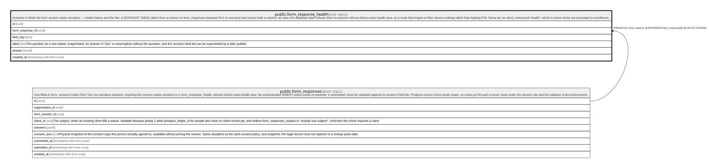

# public.form_response_health

## Description

Answers to fields the form version marks sensitive — health history and the like. A SEPARATE TABLE rather than a column on form_responses because RLS is row-level and cannot hide a column: as rows, the database itself refuses them to anyone without clients.notes.health.view, so a route that forgets to filter returns nothing rather than leaking PHI. Same tier as client_notes.kind='health', which is where these are promoted on enrollment.

## Columns

| Name             | Type                     | Default           | Nullable | Children | Parents                                           | Comment                                                                                                                                                               |
| ---------------- | ------------------------ | ----------------- | -------- | -------- | ------------------------------------------------- | --------------------------------------------------------------------------------------------------------------------------------------------------------------------- |
| id               | uuid                     | gen_random_uuid() | false    |          |                                                   |                                                                                                                                                                       |
| form_response_id | uuid                     |                   | false    |          | [public.form_responses](public.form_responses.md) |                                                                                                                                                                       |
| field_key        | text                     |                   | false    |          |                                                   |                                                                                                                                                                       |
| label            | text                     |                   | false    |          |                                                   | The question as it was asked, snapshotted. An answer of "yes" is meaningless without the question, and the version's field list can be superseded by a later publish. |
| answer           | jsonb                    |                   | false    |          |                                                   |                                                                                                                                                                       |
| created_at       | timestamp with time zone | now()             | false    |          |                                                   |                                                                                                                                                                       |

## Constraints

| Name                                                | Type        | Definition                                                                     |
| --------------------------------------------------- | ----------- | ------------------------------------------------------------------------------ |
| form_response_health_form_response_id_fkey          | FOREIGN KEY | FOREIGN KEY (form_response_id) REFERENCES form_responses(id) ON DELETE CASCADE |
| form_response_health_pkey                           | PRIMARY KEY | PRIMARY KEY (id)                                                               |
| form_response_health_form_response_id_field_key_key | UNIQUE      | UNIQUE (form_response_id, field_key)                                           |

## Indexes

| Name                                                | Definition                                                                                                                                       |
| --------------------------------------------------- | ------------------------------------------------------------------------------------------------------------------------------------------------ |
| form_response_health_pkey                           | CREATE UNIQUE INDEX form_response_health_pkey ON public.form_response_health USING btree (id)                                                    |
| form_response_health_form_response_id_field_key_key | CREATE UNIQUE INDEX form_response_health_form_response_id_field_key_key ON public.form_response_health USING btree (form_response_id, field_key) |

## Relations

---

> Generated by [tbls](https://github.com/k1LoW/tbls)
