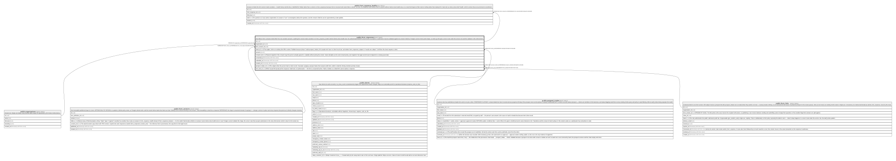

# public.form_responses

## Description

One filled-in form. answers holds ONLY the non-sensitive answers; anything the version marks sensitive is in form_response_health, behind clients.notes.health.view. No authenticated INSERT policy exists on purpose: a submission must be validated against its version's field list, Postgres cannot check jsonb shape, so writes go through a server route under the service role and the validator is the enforcement.

## Columns

| Name               | Type                     | Default           | Nullable | Children                                                      | Parents                                             | Comment                                                                                                                                                                                                                                             |
| ------------------ | ------------------------ | ----------------- | -------- | ------------------------------------------------------------- | --------------------------------------------------- | --------------------------------------------------------------------------------------------------------------------------------------------------------------------------------------------------------------------------------------------------- |
| id                 | uuid                     | gen_random_uuid() | false    | [public.form_response_health](public.form_response_health.md) |                                                     |                                                                                                                                                                                                                                                     |
| organization_id    | uuid                     |                   | false    |                                                               | [public.organizations](public.organizations.md)     |                                                                                                                                                                                                                                                     |
| form_version_id    | uuid                     |                   | false    |                                                               | [public.form_versions](public.form_versions.md)     |                                                                                                                                                                                                                                                     |
| client_id          | uuid                     |                   | true     |                                                               | [public.clients](public.clients.md)                 | The subject, when an existing client fills a waiver. Nullable because phase 2 adds prospect_intake_id for people who have no client record yet, and widens form_responses_subject to "exactly one subject". Until then the check requires a client. |
| answers            | jsonb                    | '{}'::jsonb       | false    |                                                               |                                                     |                                                                                                                                                                                                                                                     |
| consent_text       | text                     |                   | true     |                                                               |                                                     | Physical snapshot of the consent copy this person actually agreed to, readable without joining the version. Same discipline as the card-consent policy_text snapshot: the legal record must not depend on a lookup years later.                     |
| consented_at       | timestamp with time zone |                   | true     |                                                               |                                                     |                                                                                                                                                                                                                                                     |
| submitted_at       | timestamp with time zone | now()             | false    |                                                               |                                                     |                                                                                                                                                                                                                                                     |
| created_at         | timestamp with time zone | now()             | false    |                                                               |                                                     |                                                                                                                                                                                                                                                     |
| prospect_intake_id | uuid                     |                   | true     |                                                               | [public.prospect_intake](public.prospect_intake.md) | The subject when the person had no client record. Cascades: purging a prospect takes their answers with them, which is what the 30-day retention promise means.                                                                                     |
| form_link_id       | uuid                     |                   | true     |                                                               | [public.form_links](public.form_links.md)           | Which issued link produced this response. Audit trail, not authorization — the link is consumed by then. Nulls on delete so a tidied link cannot orphan a response.                                                                                 |

## Constraints

| Name                                   | Type        | Definition                                                                        | Comment                                                                                      |
| -------------------------------------- | ----------- | --------------------------------------------------------------------------------- | -------------------------------------------------------------------------------------------- |
| form_responses_subject                 | CHECK       | CHECK ((num_nonnulls(client_id, prospect_intake_id) = 1))                         | Exactly one subject: a client (waiver) or a prospect (intake), never both and never neither. |
| form_responses_organization_id_fkey    | FOREIGN KEY | FOREIGN KEY (organization_id) REFERENCES organizations(id)                        |                                                                                              |
| form_responses_client_id_fkey          | FOREIGN KEY | FOREIGN KEY (client_id) REFERENCES clients(id) ON DELETE CASCADE                  |                                                                                              |
| form_responses_form_version_id_fkey    | FOREIGN KEY | FOREIGN KEY (form_version_id) REFERENCES form_versions(id) ON DELETE RESTRICT     |                                                                                              |
| form_responses_pkey                    | PRIMARY KEY | PRIMARY KEY (id)                                                                  |                                                                                              |
| form_responses_form_link_id_fkey       | FOREIGN KEY | FOREIGN KEY (form_link_id) REFERENCES form_links(id) ON DELETE SET NULL           |                                                                                              |
| form_responses_prospect_intake_id_fkey | FOREIGN KEY | FOREIGN KEY (prospect_intake_id) REFERENCES prospect_intake(id) ON DELETE CASCADE |                                                                                              |

## Indexes

| Name                    | Definition                                                                                                                                               |
| ----------------------- | -------------------------------------------------------------------------------------------------------------------------------------------------------- |
| form_responses_pkey     | CREATE UNIQUE INDEX form_responses_pkey ON public.form_responses USING btree (id)                                                                        |
| form_responses_client   | CREATE INDEX form_responses_client ON public.form_responses USING btree (client_id, submitted_at DESC) WHERE (client_id IS NOT NULL)                     |
| form_responses_version  | CREATE INDEX form_responses_version ON public.form_responses USING btree (form_version_id)                                                               |
| form_responses_prospect | CREATE INDEX form_responses_prospect ON public.form_responses USING btree (prospect_intake_id, submitted_at DESC) WHERE (prospect_intake_id IS NOT NULL) |

## Relations

---

> Generated by [tbls](https://github.com/k1LoW/tbls)
