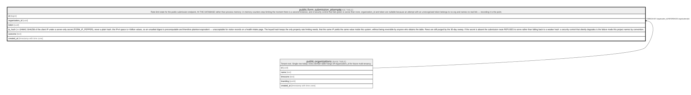

# public.form_submission_attempts

## Description

Rate-limit state for the public submission endpoint, IN THE DATABASE rather than process memory: in-memory counters stop limiting the moment there is a second instance, and a security control that fails green is worse than none. organization_id and token are nullable because an attempt with an unrecognised token belongs to no org and names no real link — recording it is the point.

## Columns

| Name            | Type                     | Default | Nullable | Children | Parents                                         | Comment                                                                                                                                                                                                                                                                                                                                                                                                                                                                                                                                                                                                                                                                                                      |
| --------------- | ------------------------ | ------- | -------- | -------- | ----------------------------------------------- | ------------------------------------------------------------------------------------------------------------------------------------------------------------------------------------------------------------------------------------------------------------------------------------------------------------------------------------------------------------------------------------------------------------------------------------------------------------------------------------------------------------------------------------------------------------------------------------------------------------------------------------------------------------------------------------------------------------ |
| id              | bigint                   |         | false    |          |                                                 |                                                                                                                                                                                                                                                                                                                                                                                                                                                                                                                                                                                                                                                                                                              |
| organization_id | uuid                     |         | true     |          | [public.organizations](public.organizations.md) |                                                                                                                                                                                                                                                                                                                                                                                                                                                                                                                                                                                                                                                                                                              |
| token           | uuid                     |         | true     |          |                                                 |                                                                                                                                                                                                                                                                                                                                                                                                                                                                                                                                                                                                                                                                                                              |
| ip_hash         | text                     |         | false    |          |                                                 | HMAC-SHA256 of the client IP under a server-only secret (FORM_IP_PEPPER), never a plain hash: the IPv4 space is 4 billion values, so an unsalted digest is precomputable and therefore plaintext-equivalent — unacceptable for visitor records on a health-intake page. The keyed hash keeps the only property rate limiting needs, that the same IP yields the same value inside this system, without being reversible by anyone who obtains the table. Rows are still purged by the 30-day sweep. If the secret is absent the submission route REFUSES to serve rather than falling back to a weaker hash: a security control that silently degrades is the failure mode this project names by convention. |
| outcome         | text                     |         | false    |          |                                                 |                                                                                                                                                                                                                                                                                                                                                                                                                                                                                                                                                                                                                                                                                                              |
| created_at      | timestamp with time zone | now()   | false    |          |                                                 |                                                                                                                                                                                                                                                                                                                                                                                                                                                                                                                                                                                                                                                                                                              |

## Constraints

| Name                                          | Type        | Definition                                                          |
| --------------------------------------------- | ----------- | ------------------------------------------------------------------- |
| form_submission_attempts_outcome_check        | CHECK       | CHECK ((outcome = ANY (ARRAY['accepted'::text, 'rejected'::text]))) |
| form_submission_attempts_organization_id_fkey | FOREIGN KEY | FOREIGN KEY (organization_id) REFERENCES organizations(id)          |
| form_submission_attempts_pkey                 | PRIMARY KEY | PRIMARY KEY (id)                                                    |

## Indexes

| Name                           | Definition                                                                                                                                    |
| ------------------------------ | --------------------------------------------------------------------------------------------------------------------------------------------- |
| form_submission_attempts_pkey  | CREATE UNIQUE INDEX form_submission_attempts_pkey ON public.form_submission_attempts USING btree (id)                                         |
| form_submission_attempts_token | CREATE INDEX form_submission_attempts_token ON public.form_submission_attempts USING btree (token, created_at DESC) WHERE (token IS NOT NULL) |
| form_submission_attempts_ip    | CREATE INDEX form_submission_attempts_ip ON public.form_submission_attempts USING btree (ip_hash, created_at DESC)                            |

## Relations

---

> Generated by [tbls](https://github.com/k1LoW/tbls)
