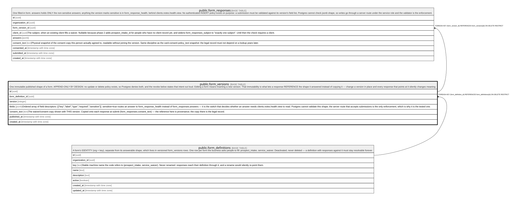

# public.form_versions

## Description

One immutable published shape of a form. APPEND-ONLY BY DESIGN: no update or delete policy exists, so Postgres denies both, and the revoke below states that intent out loud. Editing a form means inserting a new version. That immutability is what lets a response REFERENCE the shape it answered instead of copying it — change a version in place and every response that points at it silently changes meaning.

## Columns

| Name               | Type                     | Default           | Nullable | Children                                          | Parents                                               | Comment                                                                                                                                                                                                                                                                                                                                                                                                              |
| ------------------ | ------------------------ | ----------------- | -------- | ------------------------------------------------- | ----------------------------------------------------- | -------------------------------------------------------------------------------------------------------------------------------------------------------------------------------------------------------------------------------------------------------------------------------------------------------------------------------------------------------------------------------------------------------------------- |
| id                 | uuid                     | gen_random_uuid() | false    | [public.form_responses](public.form_responses.md) |                                                       |                                                                                                                                                                                                                                                                                                                                                                                                                      |
| form_definition_id | uuid                     |                   | false    |                                                   | [public.form_definitions](public.form_definitions.md) |                                                                                                                                                                                                                                                                                                                                                                                                                      |
| version            | integer                  |                   | false    |                                                   |                                                       |                                                                                                                                                                                                                                                                                                                                                                                                                      |
| fields             | jsonb                    |                   | false    |                                                   |                                                       | Ordered array of field descriptors: [{"key","label","type","required","sensitive"}]. sensitive=true routes an answer to form_response_health instead of form_responses.answers — it is the switch that decides whether an answer needs clients.notes.health.view to read. Postgres cannot validate this shape; the server route that accepts submissions is the only enforcement, which is why it is the tested one. |
| consent_text       | text                     |                   | true     |                                                   |                                                       | The waiver/consent copy shown with THIS version. Copied onto each response at submit (form_responses.consent_text) — the reference here is provenance; the copy there is the legal record.                                                                                                                                                                                                                           |
| published_at       | timestamp with time zone | now()             | false    |                                                   |                                                       |                                                                                                                                                                                                                                                                                                                                                                                                                      |
| created_at         | timestamp with time zone | now()             | false    |                                                   |                                                       |                                                                                                                                                                                                                                                                                                                                                                                                                      |

## Constraints

| Name                                         | Type        | Definition                                                                          |
| -------------------------------------------- | ----------- | ----------------------------------------------------------------------------------- |
| form_versions_version_check                  | CHECK       | CHECK ((version > 0))                                                               |
| form_versions_form_definition_id_fkey        | FOREIGN KEY | FOREIGN KEY (form_definition_id) REFERENCES form_definitions(id) ON DELETE RESTRICT |
| form_versions_pkey                           | PRIMARY KEY | PRIMARY KEY (id)                                                                    |
| form_versions_form_definition_id_version_key | UNIQUE      | UNIQUE (form_definition_id, version)                                                |

## Indexes

| Name                                         | Definition                                                                                                                         |
| -------------------------------------------- | ---------------------------------------------------------------------------------------------------------------------------------- |
| form_versions_pkey                           | CREATE UNIQUE INDEX form_versions_pkey ON public.form_versions USING btree (id)                                                    |
| form_versions_form_definition_id_version_key | CREATE UNIQUE INDEX form_versions_form_definition_id_version_key ON public.form_versions USING btree (form_definition_id, version) |

## Relations

---

> Generated by [tbls](https://github.com/k1LoW/tbls)
