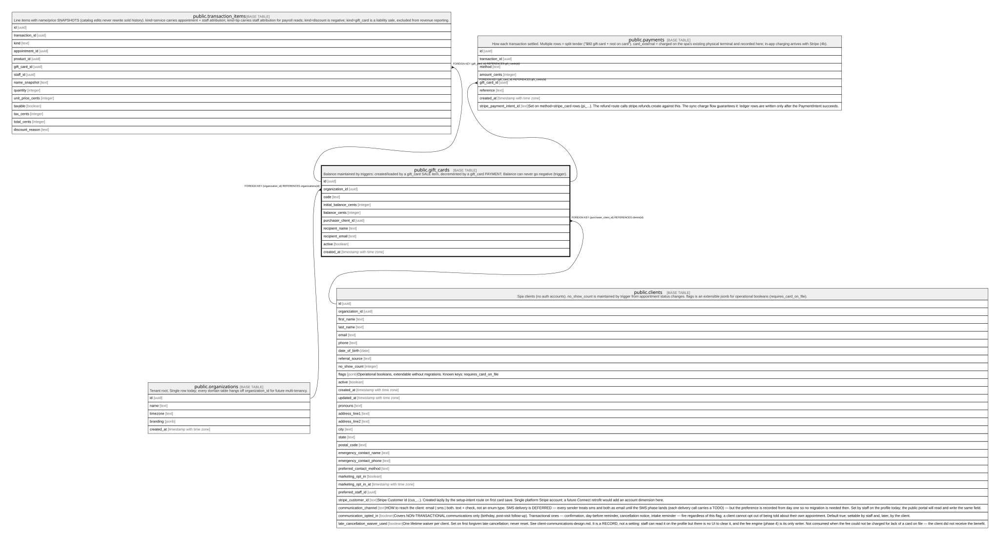

# public.gift_cards

## Description

Balance maintained by triggers: created/loaded by a gift_card SALE item, decremented by a gift_card PAYMENT. Balance can never go negative (trigger).

## Columns

| Name                  | Type                     | Default           | Nullable | Children                                                                                      | Parents                                         | Comment |
| --------------------- | ------------------------ | ----------------- | -------- | --------------------------------------------------------------------------------------------- | ----------------------------------------------- | ------- |
| id                    | uuid                     | gen_random_uuid() | false    | [public.transaction_items](public.transaction_items.md) [public.payments](public.payments.md) |                                                 |         |
| organization_id       | uuid                     |                   | false    |                                                                                               | [public.organizations](public.organizations.md) |         |
| code                  | text                     |                   | false    |                                                                                               |                                                 |         |
| initial_balance_cents | integer                  |                   | false    |                                                                                               |                                                 |         |
| balance_cents         | integer                  |                   | false    |                                                                                               |                                                 |         |
| purchaser_client_id   | uuid                     |                   | true     |                                                                                               | [public.clients](public.clients.md)             |         |
| recipient_name        | text                     |                   | true     |                                                                                               |                                                 |         |
| recipient_email       | text                     |                   | true     |                                                                                               |                                                 |         |
| active                | boolean                  | true              | false    |                                                                                               |                                                 |         |
| created_at            | timestamp with time zone | now()             | false    |                                                                                               |                                                 |         |

## Constraints

| Name                                   | Type        | Definition                                                 |
| -------------------------------------- | ----------- | ---------------------------------------------------------- |
| gift_cards_balance_cents_check         | CHECK       | CHECK ((balance_cents >= 0))                               |
| gift_cards_initial_balance_cents_check | CHECK       | CHECK ((initial_balance_cents > 0))                        |
| gift_cards_organization_id_fkey        | FOREIGN KEY | FOREIGN KEY (organization_id) REFERENCES organizations(id) |
| gift_cards_purchaser_client_id_fkey    | FOREIGN KEY | FOREIGN KEY (purchaser_client_id) REFERENCES clients(id)   |
| gift_cards_pkey                        | PRIMARY KEY | PRIMARY KEY (id)                                           |
| gift_cards_code_key                    | UNIQUE      | UNIQUE (code)                                              |

## Indexes

| Name                | Definition                                                                      |
| ------------------- | ------------------------------------------------------------------------------- |
| gift_cards_pkey     | CREATE UNIQUE INDEX gift_cards_pkey ON public.gift_cards USING btree (id)       |
| gift_cards_code_key | CREATE UNIQUE INDEX gift_cards_code_key ON public.gift_cards USING btree (code) |

## Relations

---

> Generated by [tbls](https://github.com/k1LoW/tbls)
