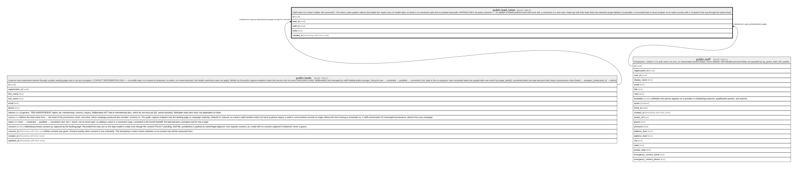

# public.lead_notes

## Description

Staff notes on a lead ("called, left voicemail"). The client_notes pattern without the health tier: leads carry no health data, so there is no sensitivity split and no audited read path. APPEND-ONLY by policy omission — no update or delete policies exist and none will; a correction is a new note. Notes go with their lead when the retention purge deletes it (cascade); a converted lead is never purged, so its notes survive with it. Scoped to the org through the parent lead.

## Columns

| Name       | Type                     | Default           | Nullable | Children | Parents                         | Comment |
| ---------- | ------------------------ | ----------------- | -------- | -------- | ------------------------------- | ------- |
| id         | uuid                     | gen_random_uuid() | false    |          |                                 |         |
| lead_id    | uuid                     |                   | false    |          | [public.leads](public.leads.md) |         |
| staff_id   | uuid                     |                   | false    |          | [public.staff](public.staff.md) |         |
| body       | text                     |                   | false    |          |                                 |         |
| created_at | timestamp with time zone | now()             | false    |          |                                 |         |

## Constraints

| Name                     | Type        | Definition                                                   |
| ------------------------ | ----------- | ------------------------------------------------------------ |
| lead_notes_body_check    | CHECK       | CHECK (((length(body) >= 1) AND (length(body) <= 4000)))     |
| lead_notes_staff_id_fkey | FOREIGN KEY | FOREIGN KEY (staff_id) REFERENCES staff(id)                  |
| lead_notes_lead_id_fkey  | FOREIGN KEY | FOREIGN KEY (lead_id) REFERENCES leads(id) ON DELETE CASCADE |
| lead_notes_pkey          | PRIMARY KEY | PRIMARY KEY (id)                                             |

## Indexes

| Name            | Definition                                                                               |
| --------------- | ---------------------------------------------------------------------------------------- |
| lead_notes_pkey | CREATE UNIQUE INDEX lead_notes_pkey ON public.lead_notes USING btree (id)                |
| lead_notes_lead | CREATE INDEX lead_notes_lead ON public.lead_notes USING btree (lead_id, created_at DESC) |

## Relations

---

> Generated by [tbls](https://github.com/k1LoW/tbls)
