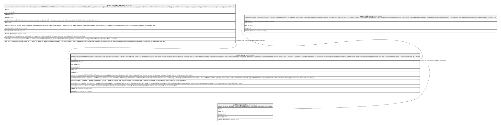

# public.leads

## Description

A person who expressed interest through a public landing page and is not yet a prospect. CONTACT INFORMATION ONLY — no health data, no consent to treatment, no token, no review decision; the health machinery does not apply. Written by the public capture endpoint under the service role (no anon insert policy exists, deliberately) and managed by staff holding leads.manage. Lifecycle new → contacted → qualified → converted | lost, kept to five on purpose. Non-converted leads are purged after one month by purge_leads(); converted leads are kept because they head a provenance chain (leads → prospect_intake.lead_id → clients).

## Columns

| Name            | Type                     | Default           | Nullable | Children                                                                                                                                | Parents                                         | Comment                                                                                                                                                                                                                                                                                                                                                                                                                                         |
| --------------- | ------------------------ | ----------------- | -------- | --------------------------------------------------------------------------------------------------------------------------------------- | ----------------------------------------------- | ----------------------------------------------------------------------------------------------------------------------------------------------------------------------------------------------------------------------------------------------------------------------------------------------------------------------------------------------------------------------------------------------------------------------------------------------- |
| id              | uuid                     | gen_random_uuid() | false    | [public.form_links](public.form_links.md) [public.prospect_intake](public.prospect_intake.md) [public.lead_notes](public.lead_notes.md) |                                                 |                                                                                                                                                                                                                                                                                                                                                                                                                                                 |
| organization_id | uuid                     |                   | false    |                                                                                                                                         | [public.organizations](public.organizations.md) |                                                                                                                                                                                                                                                                                                                                                                                                                                                 |
| first_name      | text                     |                   | false    |                                                                                                                                         |                                                 |                                                                                                                                                                                                                                                                                                                                                                                                                                                 |
| last_name       | text                     |                   | false    |                                                                                                                                         |                                                 |                                                                                                                                                                                                                                                                                                                                                                                                                                                 |
| email           | text                     |                   | false    |                                                                                                                                         |                                                 |                                                                                                                                                                                                                                                                                                                                                                                                                                                 |
| phone           | text                     |                   | true     |                                                                                                                                         |                                                 |                                                                                                                                                                                                                                                                                                                                                                                                                                                 |
| interest        | text                     |                   | false    |                                                                                                                                         |                                                 | A generic, TIER-INDEPENDENT option set: membership \| service \| inquiry. Deliberately NOT tied to membership tiers, which do not exist yet (§3, owner-blocked). Refinable when tiers land; not dependent on them.                                                                                                                                                                                                                              |
| source          | text                     | 'manual'::text    | false    |                                                                                                                                         |                                                 | Where the lead came from — the head of the provenance chain, and what "which campaign produced this member" resolves to. The public capture endpoint sets the landing page or campaign explicitly. Defaults to 'manual' so a lead a staff member enters by hand (a phone inquiry, a walk-in conversation) records its origin without the form having to remember to: a staff conversation IS meaningful provenance, distinct from any campaign. |
| status          | text                     | 'new'::text       | false    |                                                                                                                                         |                                                 | new → contacted → qualified → converted \| lost. text + check, not an enum type, so adding a value is a constraint swap. converted is the funnel handoff: the lead became a prospect and its row is kept.                                                                                                                                                                                                                                       |
| consent         | boolean                  | false             | false    |                                                                                                                                         |                                                 | Marketing-contact consent as captured by the landing page. Recorded from day one so the data model is ready even though the consent POLICY (wording, shelf life, jurisdiction) is parked as owner/legal-adjacent. true requires consent_at; a lead with no consent captured is false/null, never a guess.                                                                                                                                       |
| consent_at      | timestamp with time zone |                   | true     |                                                                                                                                         |                                                 | When consent was given. Present exactly when consent is true (checked). The timestamp is what a future retention or re-consent rule will be measured from.                                                                                                                                                                                                                                                                                      |
| created_at      | timestamp with time zone | now()             | false    |                                                                                                                                         |                                                 |                                                                                                                                                                                                                                                                                                                                                                                                                                                 |
| updated_at      | timestamp with time zone | now()             | false    |                                                                                                                                         |                                                 |                                                                                                                                                                                                                                                                                                                                                                                                                                                 |

## Constraints

| Name                       | Type        | Definition                                                                                                         |
| -------------------------- | ----------- | ------------------------------------------------------------------------------------------------------------------ |
| leads_check                | CHECK       | CHECK ((consent = (consent_at IS NOT NULL)))                                                                       |
| leads_interest_check       | CHECK       | CHECK ((interest = ANY (ARRAY['membership'::text, 'service'::text, 'inquiry'::text])))                             |
| leads_status_check         | CHECK       | CHECK ((status = ANY (ARRAY['new'::text, 'contacted'::text, 'qualified'::text, 'converted'::text, 'lost'::text]))) |
| leads_organization_id_fkey | FOREIGN KEY | FOREIGN KEY (organization_id) REFERENCES organizations(id)                                                         |
| leads_pkey                 | PRIMARY KEY | PRIMARY KEY (id)                                                                                                   |

## Indexes

| Name            | Definition                                                                                          |
| --------------- | --------------------------------------------------------------------------------------------------- |
| leads_pkey      | CREATE UNIQUE INDEX leads_pkey ON public.leads USING btree (id)                                     |
| leads_org_queue | CREATE INDEX leads_org_queue ON public.leads USING btree (organization_id, status, created_at DESC) |
| leads_org_email | CREATE INDEX leads_org_email ON public.leads USING btree (organization_id, lower(email))            |

## Triggers

| Name                          | Definition                                                                                                                                    |
| ----------------------------- | --------------------------------------------------------------------------------------------------------------------------------------------- |
| trg_forget_lead_notifications | CREATE TRIGGER trg_forget_lead_notifications AFTER DELETE ON public.leads FOR EACH ROW EXECUTE FUNCTION forget_lead_notifications()           |
| trg_leads_touch               | CREATE TRIGGER trg_leads_touch BEFORE UPDATE ON public.leads FOR EACH ROW EXECUTE FUNCTION touch_updated_at()                                 |
| trg_notify_lead_captured      | CREATE TRIGGER trg_notify_lead_captured AFTER INSERT ON public.leads FOR EACH ROW EXECUTE FUNCTION notify_lead_captured()                     |
| trg_settle_lead_notifications | CREATE TRIGGER trg_settle_lead_notifications AFTER UPDATE OF status ON public.leads FOR EACH ROW EXECUTE FUNCTION settle_lead_notifications() |

## Relations

---

> Generated by [tbls](https://github.com/k1LoW/tbls)
