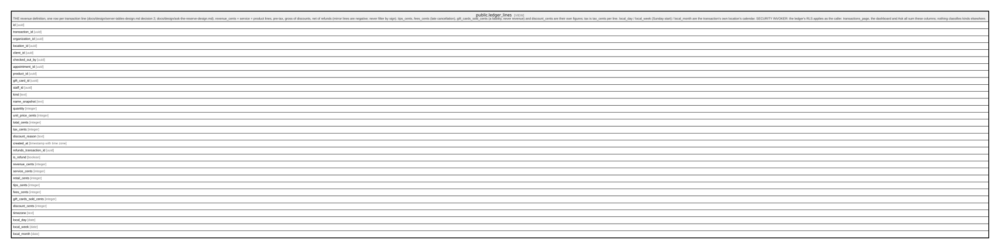

# public.ledger_lines

## Description

THE revenue definition, one row per transaction line (docs/design/server-tables-design.md decision 2; docs/design/ask-the-reserve-design.md). revenue_cents = service + product lines, pre-tax, gross of discounts, net of refunds (mirror lines are negative; never filter by sign). tips_cents, fees_cents (late cancellation), gift_cards_sold_cents (a liability, never revenue) and discount_cents are their own figures; tax is tax_cents per line. local_day / local_week (Sunday start) / local_month are the transaction's own location's calendar. SECURITY INVOKER: the ledger's RLS applies as the caller. transactions_page, the dashboard and Ask all sum these columns; nothing classifies kinds elsewhere.

<details>
<summary><strong>Table Definition</strong></summary>

```sql
CREATE VIEW ledger_lines AS (
 SELECT i.id,
    i.transaction_id,
    t.organization_id,
    t.location_id,
    t.client_id,
    t.checked_out_by,
    i.appointment_id,
    i.product_id,
    i.gift_card_id,
    i.staff_id,
    i.kind,
    i.name_snapshot,
    i.quantity,
    i.unit_price_cents,
    i.total_cents,
    i.tax_cents,
    i.discount_reason,
    t.created_at,
    t.refunds_transaction_id,
    (t.refunds_transaction_id IS NOT NULL) AS is_refund,
        CASE
            WHEN (i.kind = ANY (ARRAY['service'::text, 'product'::text])) THEN i.total_cents
            ELSE 0
        END AS revenue_cents,
        CASE
            WHEN (i.kind = 'service'::text) THEN i.total_cents
            ELSE 0
        END AS service_cents,
        CASE
            WHEN (i.kind = 'product'::text) THEN i.total_cents
            ELSE 0
        END AS retail_cents,
        CASE
            WHEN (i.kind = 'tip'::text) THEN i.total_cents
            ELSE 0
        END AS tips_cents,
        CASE
            WHEN (i.kind = 'late_cancellation_fee'::text) THEN i.total_cents
            ELSE 0
        END AS fees_cents,
        CASE
            WHEN (i.kind = 'gift_card'::text) THEN i.total_cents
            ELSE 0
        END AS gift_cards_sold_cents,
        CASE
            WHEN (i.kind = 'discount'::text) THEN (- i.total_cents)
            ELSE 0
        END AS discount_cents,
    l.timezone,
    ((t.created_at AT TIME ZONE l.timezone))::date AS local_day,
    ((date_trunc('week'::text, ((t.created_at AT TIME ZONE l.timezone) + '1 day'::interval)))::date - 1) AS local_week,
    (date_trunc('month'::text, (t.created_at AT TIME ZONE l.timezone)))::date AS local_month
   FROM ((transaction_items i
     JOIN transactions t ON ((t.id = i.transaction_id)))
     JOIN locations l ON ((l.id = t.location_id)))
)
```

</details>

## Columns

| Name                   | Type                     | Default | Nullable | Children | Parents | Comment |
| ---------------------- | ------------------------ | ------- | -------- | -------- | ------- | ------- |
| id                     | uuid                     |         | true     |          |         |         |
| transaction_id         | uuid                     |         | true     |          |         |         |
| organization_id        | uuid                     |         | true     |          |         |         |
| location_id            | uuid                     |         | true     |          |         |         |
| client_id              | uuid                     |         | true     |          |         |         |
| checked_out_by         | uuid                     |         | true     |          |         |         |
| appointment_id         | uuid                     |         | true     |          |         |         |
| product_id             | uuid                     |         | true     |          |         |         |
| gift_card_id           | uuid                     |         | true     |          |         |         |
| staff_id               | uuid                     |         | true     |          |         |         |
| kind                   | text                     |         | true     |          |         |         |
| name_snapshot          | text                     |         | true     |          |         |         |
| quantity               | integer                  |         | true     |          |         |         |
| unit_price_cents       | integer                  |         | true     |          |         |         |
| total_cents            | integer                  |         | true     |          |         |         |
| tax_cents              | integer                  |         | true     |          |         |         |
| discount_reason        | text                     |         | true     |          |         |         |
| created_at             | timestamp with time zone |         | true     |          |         |         |
| refunds_transaction_id | uuid                     |         | true     |          |         |         |
| is_refund              | boolean                  |         | true     |          |         |         |
| revenue_cents          | integer                  |         | true     |          |         |         |
| service_cents          | integer                  |         | true     |          |         |         |
| retail_cents           | integer                  |         | true     |          |         |         |
| tips_cents             | integer                  |         | true     |          |         |         |
| fees_cents             | integer                  |         | true     |          |         |         |
| gift_cards_sold_cents  | integer                  |         | true     |          |         |         |
| discount_cents         | integer                  |         | true     |          |         |         |
| timezone               | text                     |         | true     |          |         |         |
| local_day              | date                     |         | true     |          |         |         |
| local_week             | date                     |         | true     |          |         |         |
| local_month            | date                     |         | true     |          |         |         |

## Referenced Tables

| Name                                                    | Columns | Comment                                                                                                                                                                                                                                                                                                                                                           | Type       |
| ------------------------------------------------------- | ------- | ----------------------------------------------------------------------------------------------------------------------------------------------------------------------------------------------------------------------------------------------------------------------------------------------------------------------------------------------------------------- | ---------- |
| [public.transaction_items](public.transaction_items.md) | 14      | Line items with name/price SNAPSHOTS (catalog edits never rewrite sold history). kind=service carries appointment + staff attribution; kind=tip carries staff attribution for payroll reads; kind=discount is negative; kind=gift_card is a liability sale, excluded from revenue reporting.                                                                      | BASE TABLE |
| [public.transactions](public.transactions.md)           | 15      | The immutable money ledger: one row per checkout. Append-only for EVERY role, the service role included (trg_transactions_append_only); corrections are refunds — new rows with negative amounts referencing the original via refunds_transaction_id, one per original. Balanced at commit by assert_ledger_transaction. All financial reporting reads from here. | BASE TABLE |
| [public.locations](public.locations.md)                 | 14      |                                                                                                                                                                                                                                                                                                                                                                   | BASE TABLE |

## Relations



---

> Generated by [tbls](https://github.com/k1LoW/tbls)
