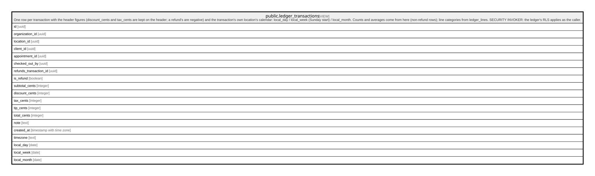

# public.ledger_transactions

## Description

One row per transaction with the header figures (discount_cents and tax_cents are kept on the header; a refund's are negative) and the transaction's own location's calendar: local_day / local_week (Sunday start) / local_month. Counts and averages come from here (non-refund rows); line categories from ledger_lines. SECURITY INVOKER: the ledger's RLS applies as the caller.

<details>
<summary><strong>Table Definition</strong></summary>

```sql
CREATE VIEW ledger_transactions AS (
 SELECT t.id,
    t.organization_id,
    t.location_id,
    t.client_id,
    t.appointment_id,
    t.checked_out_by,
    t.refunds_transaction_id,
    (t.refunds_transaction_id IS NOT NULL) AS is_refund,
    t.subtotal_cents,
    t.discount_cents,
    t.tax_cents,
    t.tip_cents,
    t.total_cents,
    t.note,
    t.created_at,
    l.timezone,
    ((t.created_at AT TIME ZONE l.timezone))::date AS local_day,
    ((date_trunc('week'::text, ((t.created_at AT TIME ZONE l.timezone) + '1 day'::interval)))::date - 1) AS local_week,
    (date_trunc('month'::text, (t.created_at AT TIME ZONE l.timezone)))::date AS local_month
   FROM (transactions t
     JOIN locations l ON ((l.id = t.location_id)))
)
```

</details>

## Columns

| Name                   | Type                     | Default | Nullable | Children | Parents | Comment |
| ---------------------- | ------------------------ | ------- | -------- | -------- | ------- | ------- |
| id                     | uuid                     |         | true     |          |         |         |
| organization_id        | uuid                     |         | true     |          |         |         |
| location_id            | uuid                     |         | true     |          |         |         |
| client_id              | uuid                     |         | true     |          |         |         |
| appointment_id         | uuid                     |         | true     |          |         |         |
| checked_out_by         | uuid                     |         | true     |          |         |         |
| refunds_transaction_id | uuid                     |         | true     |          |         |         |
| is_refund              | boolean                  |         | true     |          |         |         |
| subtotal_cents         | integer                  |         | true     |          |         |         |
| discount_cents         | integer                  |         | true     |          |         |         |
| tax_cents              | integer                  |         | true     |          |         |         |
| tip_cents              | integer                  |         | true     |          |         |         |
| total_cents            | integer                  |         | true     |          |         |         |
| note                   | text                     |         | true     |          |         |         |
| created_at             | timestamp with time zone |         | true     |          |         |         |
| timezone               | text                     |         | true     |          |         |         |
| local_day              | date                     |         | true     |          |         |         |
| local_week             | date                     |         | true     |          |         |         |
| local_month            | date                     |         | true     |          |         |         |

## Referenced Tables

| Name                                          | Columns | Comment                                                                                                                                                                                                                                                                                                                                                           | Type       |
| --------------------------------------------- | ------- | ----------------------------------------------------------------------------------------------------------------------------------------------------------------------------------------------------------------------------------------------------------------------------------------------------------------------------------------------------------------- | ---------- |
| [public.transactions](public.transactions.md) | 15      | The immutable money ledger: one row per checkout. Append-only for EVERY role, the service role included (trg_transactions_append_only); corrections are refunds — new rows with negative amounts referencing the original via refunds_transaction_id, one per original. Balanced at commit by assert_ledger_transaction. All financial reporting reads from here. | BASE TABLE |
| [public.locations](public.locations.md)       | 14      |                                                                                                                                                                                                                                                                                                                                                                   | BASE TABLE |

## Relations



---

> Generated by [tbls](https://github.com/k1LoW/tbls)
