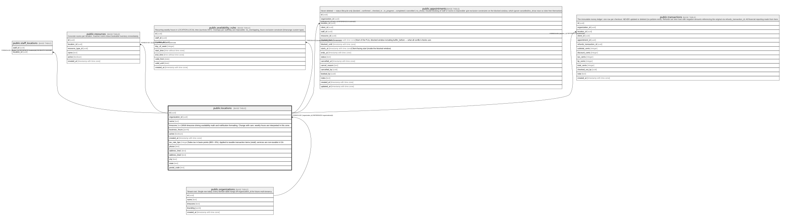

# public.locations

## Columns

| Name            | Type                     | Default           | Nullable | Children                                                                                                                                                                                                                                          | Parents                                         | Comment                                                                                                                           |
| --------------- | ------------------------ | ----------------- | -------- | ------------------------------------------------------------------------------------------------------------------------------------------------------------------------------------------------------------------------------------------------- | ----------------------------------------------- | --------------------------------------------------------------------------------------------------------------------------------- |
| id              | uuid                     | gen_random_uuid() | false    | [public.staff_locations](public.staff_locations.md) [public.resources](public.resources.md) [public.availability_rules](public.availability_rules.md) [public.appointments](public.appointments.md) [public.transactions](public.transactions.md) |                                                 |                                                                                                                                   |
| organization_id | uuid                     |                   | false    |                                                                                                                                                                                                                                                   | [public.organizations](public.organizations.md) |                                                                                                                                   |
| name            | text                     |                   | false    |                                                                                                                                                                                                                                                   |                                                 |                                                                                                                                   |
| timezone        | text                     |                   | false    |                                                                                                                                                                                                                                                   |                                                 | IANA timezone driving availability math and notification formatting. Change with care: weekly hours are interpreted in this zone. |
| business_hours  | jsonb                    |                   | true     |                                                                                                                                                                                                                                                   |                                                 |                                                                                                                                   |
| active          | boolean                  | true              | false    |                                                                                                                                                                                                                                                   |                                                 |                                                                                                                                   |
| created_at      | timestamp with time zone | now()             | false    |                                                                                                                                                                                                                                                   |                                                 |                                                                                                                                   |
| tax_rate_bps    | integer                  | 0                 | false    |                                                                                                                                                                                                                                                   |                                                 | Sales tax in basis points (800 = 8%). Applied to taxable transaction items (retail); services are non-taxable in GA.              |
| phone           | text                     |                   | true     |                                                                                                                                                                                                                                                   |                                                 |                                                                                                                                   |
| address_line1   | text                     |                   | true     |                                                                                                                                                                                                                                                   |                                                 |                                                                                                                                   |
| address_line2   | text                     |                   | true     |                                                                                                                                                                                                                                                   |                                                 |                                                                                                                                   |
| city            | text                     |                   | true     |                                                                                                                                                                                                                                                   |                                                 |                                                                                                                                   |
| state           | text                     |                   | true     |                                                                                                                                                                                                                                                   |                                                 |                                                                                                                                   |
| postal_code     | text                     |                   | true     |                                                                                                                                                                                                                                                   |                                                 |                                                                                                                                   |

## Constraints

| Name                           | Type        | Definition                                                 |
| ------------------------------ | ----------- | ---------------------------------------------------------- |
| locations_tax_rate_bps_check   | CHECK       | CHECK (((tax_rate_bps >= 0) AND (tax_rate_bps <= 3000)))   |
| locations_organization_id_fkey | FOREIGN KEY | FOREIGN KEY (organization_id) REFERENCES organizations(id) |
| locations_pkey                 | PRIMARY KEY | PRIMARY KEY (id)                                           |

## Indexes

| Name           | Definition                                                              |
| -------------- | ----------------------------------------------------------------------- |
| locations_pkey | CREATE UNIQUE INDEX locations_pkey ON public.locations USING btree (id) |

## Relations

---

> Generated by [tbls](https://github.com/k1LoW/tbls)
