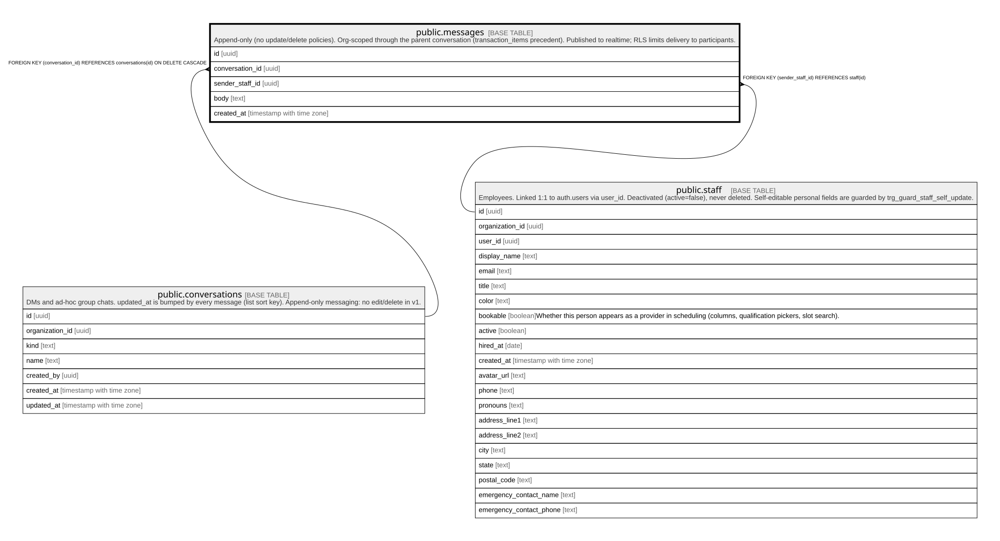

# public.messages

## Description

Append-only (no update/delete policies). Org-scoped through the parent conversation (transaction_items precedent). Published to realtime; RLS limits delivery to participants.

## Columns

| Name            | Type                     | Default           | Nullable | Children | Parents                                         | Comment |
| --------------- | ------------------------ | ----------------- | -------- | -------- | ----------------------------------------------- | ------- |
| id              | uuid                     | gen_random_uuid() | false    |          |                                                 |         |
| conversation_id | uuid                     |                   | false    |          | [public.conversations](public.conversations.md) |         |
| sender_staff_id | uuid                     |                   | false    |          | [public.staff](public.staff.md)                 |         |
| body            | text                     |                   | false    |          |                                                 |         |
| created_at      | timestamp with time zone | now()             | false    |          |                                                 |         |

## Constraints

| Name                          | Type        | Definition                                                                   |
| ----------------------------- | ----------- | ---------------------------------------------------------------------------- |
| messages_body_check           | CHECK       | CHECK (((length(body) >= 1) AND (length(body) <= 4000)))                     |
| messages_sender_staff_id_fkey | FOREIGN KEY | FOREIGN KEY (sender_staff_id) REFERENCES staff(id)                           |
| messages_conversation_id_fkey | FOREIGN KEY | FOREIGN KEY (conversation_id) REFERENCES conversations(id) ON DELETE CASCADE |
| messages_pkey                 | PRIMARY KEY | PRIMARY KEY (id)                                                             |

## Indexes

| Name                  | Definition                                                                                           |
| --------------------- | ---------------------------------------------------------------------------------------------------- |
| messages_pkey         | CREATE UNIQUE INDEX messages_pkey ON public.messages USING btree (id)                                |
| messages_conversation | CREATE INDEX messages_conversation ON public.messages USING btree (conversation_id, created_at DESC) |

## Triggers

| Name                           | Definition                                                                                                                               |
| ------------------------------ | ---------------------------------------------------------------------------------------------------------------------------------------- |
| trg_message_bumps_conversation | CREATE TRIGGER trg_message_bumps_conversation AFTER INSERT ON public.messages FOR EACH ROW EXECUTE FUNCTION message_bumps_conversation() |
| trg_notify_message_received    | CREATE TRIGGER trg_notify_message_received AFTER INSERT ON public.messages FOR EACH ROW EXECUTE FUNCTION notify_message_received()       |

## Relations

---

> Generated by [tbls](https://github.com/k1LoW/tbls)
