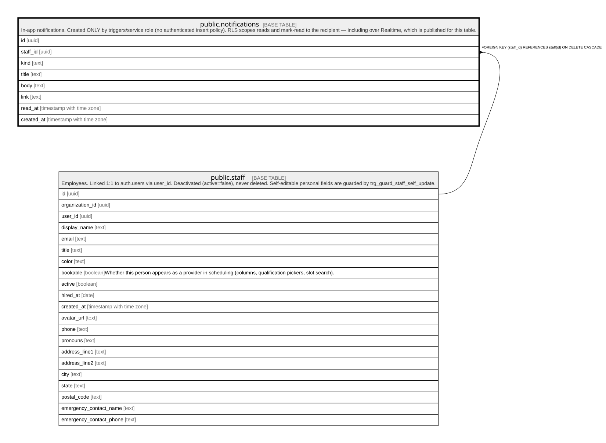

# public.notifications

## Description

In-app notifications. Created ONLY by triggers/service role (no authenticated insert policy). RLS scopes reads and mark-read to the recipient — including over Realtime, which is published for this table.

## Columns

| Name       | Type                     | Default           | Nullable | Children | Parents                         | Comment |
| ---------- | ------------------------ | ----------------- | -------- | -------- | ------------------------------- | ------- |
| id         | uuid                     | gen_random_uuid() | false    |          |                                 |         |
| staff_id   | uuid                     |                   | false    |          | [public.staff](public.staff.md) |         |
| kind       | text                     |                   | false    |          |                                 |         |
| title      | text                     |                   | false    |          |                                 |         |
| body       | text                     |                   | true     |          |                                 |         |
| link       | text                     |                   | true     |          |                                 |         |
| read_at    | timestamp with time zone |                   | true     |          |                                 |         |
| created_at | timestamp with time zone | now()             | false    |          |                                 |         |

## Constraints

| Name                        | Type        | Definition                                                    |
| --------------------------- | ----------- | ------------------------------------------------------------- |
| notifications_staff_id_fkey | FOREIGN KEY | FOREIGN KEY (staff_id) REFERENCES staff(id) ON DELETE CASCADE |
| notifications_pkey          | PRIMARY KEY | PRIMARY KEY (id)                                              |

## Indexes

| Name                 | Definition                                                                                               |
| -------------------- | -------------------------------------------------------------------------------------------------------- |
| notifications_pkey   | CREATE UNIQUE INDEX notifications_pkey ON public.notifications USING btree (id)                          |
| notifications_staff  | CREATE INDEX notifications_staff ON public.notifications USING btree (staff_id, created_at DESC)         |
| notifications_unread | CREATE INDEX notifications_unread ON public.notifications USING btree (staff_id) WHERE (read_at IS NULL) |

## Relations

---

> Generated by [tbls](https://github.com/k1LoW/tbls)
