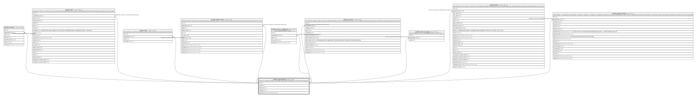

# public.organizations

## Description

Tenant root. Single row today; every domain table hangs off organization_id for future multi-tenancy.

## Columns

| Name       | Type                     | Default                     | Nullable | Children                                                                                                                                                                                                                                                                                                                                                                                                                                                                                                                                                                                                                                                                                                                                                                                                                                                                                                                                                                                                                                                                                                                                                                    | Parents | Comment |
| ---------- | ------------------------ | --------------------------- | -------- | --------------------------------------------------------------------------------------------------------------------------------------------------------------------------------------------------------------------------------------------------------------------------------------------------------------------------------------------------------------------------------------------------------------------------------------------------------------------------------------------------------------------------------------------------------------------------------------------------------------------------------------------------------------------------------------------------------------------------------------------------------------------------------------------------------------------------------------------------------------------------------------------------------------------------------------------------------------------------------------------------------------------------------------------------------------------------------------------------------------------------------------------------------------------------- | ------- | ------- |
| id         | uuid                     | gen_random_uuid()           | false    | [public.locations](public.locations.md) [public.staff](public.staff.md) [public.roles](public.roles.md) [public.staff_invites](public.staff_invites.md) [public.service_categories](public.service_categories.md) [public.services](public.services.md) [public.resource_types](public.resource_types.md) [public.clients](public.clients.md) [public.appointments](public.appointments.md) [public.products](public.products.md) [public.gift_cards](public.gift_cards.md) [public.transactions](public.transactions.md) [public.conversations](public.conversations.md) [public.card_consents](public.card_consents.md) [public.client_payment_methods](public.client_payment_methods.md) [public.ask_queries](public.ask_queries.md) [public.form_definitions](public.form_definitions.md) [public.form_responses](public.form_responses.md) [public.form_links](public.form_links.md) [public.prospect_intake](public.prospect_intake.md) [public.form_submission_attempts](public.form_submission_attempts.md) [public.leads](public.leads.md) [public.cancellation_tokens](public.cancellation_tokens.md) [public.communications_sent](public.communications_sent.md) |         |         |
| name       | text                     |                             | false    |                                                                                                                                                                                                                                                                                                                                                                                                                                                                                                                                                                                                                                                                                                                                                                                                                                                                                                                                                                                                                                                                                                                                                                             |         |         |
| timezone   | text                     | 'America/Los_Angeles'::text | false    |                                                                                                                                                                                                                                                                                                                                                                                                                                                                                                                                                                                                                                                                                                                                                                                                                                                                                                                                                                                                                                                                                                                                                                             |         |         |
| branding   | jsonb                    | '{}'::jsonb                 | false    |                                                                                                                                                                                                                                                                                                                                                                                                                                                                                                                                                                                                                                                                                                                                                                                                                                                                                                                                                                                                                                                                                                                                                                             |         |         |
| created_at | timestamp with time zone | now()                       | false    |                                                                                                                                                                                                                                                                                                                                                                                                                                                                                                                                                                                                                                                                                                                                                                                                                                                                                                                                                                                                                                                                                                                                                                             |         |         |

## Constraints

| Name               | Type        | Definition       |
| ------------------ | ----------- | ---------------- |
| organizations_pkey | PRIMARY KEY | PRIMARY KEY (id) |

## Indexes

| Name               | Definition                                                                      |
| ------------------ | ------------------------------------------------------------------------------- |
| organizations_pkey | CREATE UNIQUE INDEX organizations_pkey ON public.organizations USING btree (id) |

## Relations

---

> Generated by [tbls](https://github.com/k1LoW/tbls)
