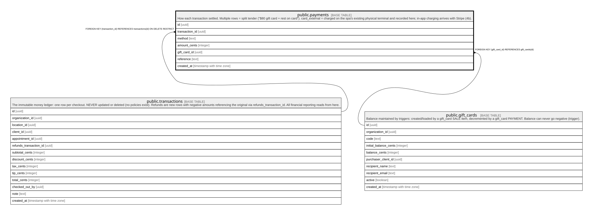

# public.payments

## Description

How each transaction settled. Multiple rows = split tender ("$80 gift card + rest on card"). card_external = charged on the spa's existing physical terminal and recorded here; in-app charging arrives with Stripe (4b).

## Columns

| Name           | Type                     | Default           | Nullable | Children | Parents                                       | Comment |
| -------------- | ------------------------ | ----------------- | -------- | -------- | --------------------------------------------- | ------- |
| id             | uuid                     | gen_random_uuid() | false    |          |                                               |         |
| transaction_id | uuid                     |                   | false    |          | [public.transactions](public.transactions.md) |         |
| method         | text                     |                   | false    |          |                                               |         |
| amount_cents   | integer                  |                   | false    |          |                                               |         |
| gift_card_id   | uuid                     |                   | true     |          | [public.gift_cards](public.gift_cards.md)     |         |
| reference      | text                     |                   | true     |          |                                               |         |
| created_at     | timestamp with time zone | now()             | false    |          |                                               |         |

## Constraints

| Name                         | Type        | Definition                                                                             |
| ---------------------------- | ----------- | -------------------------------------------------------------------------------------- |
| payments_check               | CHECK       | CHECK (((method = 'gift_card'::text) = (gift_card_id IS NOT NULL)))                    |
| payments_method_check        | CHECK       | CHECK ((method = ANY (ARRAY['card_external'::text, 'gift_card'::text, 'cash'::text]))) |
| payments_gift_card_id_fkey   | FOREIGN KEY | FOREIGN KEY (gift_card_id) REFERENCES gift_cards(id)                                   |
| payments_transaction_id_fkey | FOREIGN KEY | FOREIGN KEY (transaction_id) REFERENCES transactions(id) ON DELETE RESTRICT            |
| payments_pkey                | PRIMARY KEY | PRIMARY KEY (id)                                                                       |

## Indexes

| Name          | Definition                                                                |
| ------------- | ------------------------------------------------------------------------- |
| payments_pkey | CREATE UNIQUE INDEX payments_pkey ON public.payments USING btree (id)     |
| payments_txn  | CREATE INDEX payments_txn ON public.payments USING btree (transaction_id) |

## Triggers

| Name                  | Definition                                                                                                                   |
| --------------------- | ---------------------------------------------------------------------------------------------------------------------------- |
| trg_gift_card_payment | CREATE TRIGGER trg_gift_card_payment AFTER INSERT ON public.payments FOR EACH ROW EXECUTE FUNCTION apply_gift_card_payment() |

## Relations

---

> Generated by [tbls](https://github.com/k1LoW/tbls)
