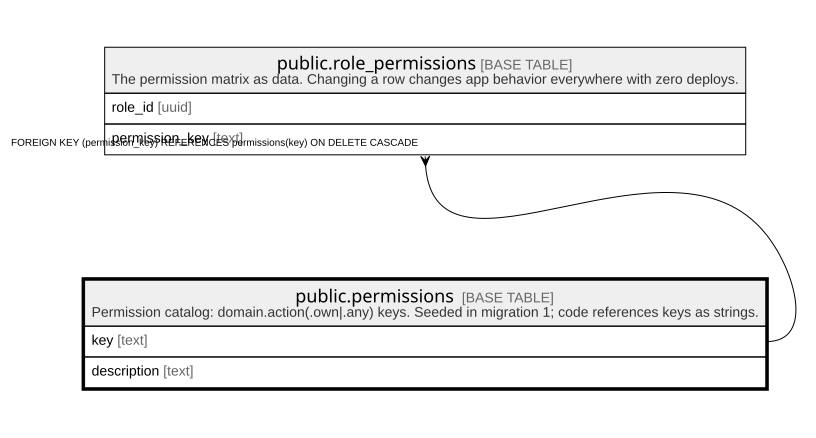

# public.permissions

## Description

Permission catalog: domain.action(.own|.any) keys. Seeded in migration 1; code references keys as strings.

## Columns

| Name        | Type | Default | Nullable | Children                                              | Parents | Comment |
| ----------- | ---- | ------- | -------- | ----------------------------------------------------- | ------- | ------- |
| key         | text |         | false    | [public.role_permissions](public.role_permissions.md) |         |         |
| description | text |         | false    |                                                       |         |         |

## Constraints

| Name             | Type        | Definition        |
| ---------------- | ----------- | ----------------- |
| permissions_pkey | PRIMARY KEY | PRIMARY KEY (key) |

## Indexes

| Name             | Definition                                                                   |
| ---------------- | ---------------------------------------------------------------------------- |
| permissions_pkey | CREATE UNIQUE INDEX permissions_pkey ON public.permissions USING btree (key) |

## Relations

---

> Generated by [tbls](https://github.com/k1LoW/tbls)
