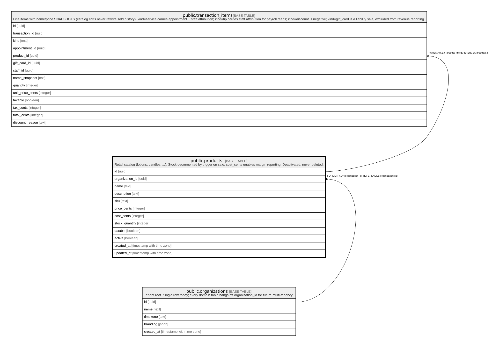

# public.products

## Description

Retail catalog (lotions, candles, ...). Stock decremented by trigger on sale. cost_cents enables margin reporting. Deactivated, never deleted.

## Columns

| Name            | Type                     | Default           | Nullable | Children                                                | Parents                                         | Comment |
| --------------- | ------------------------ | ----------------- | -------- | ------------------------------------------------------- | ----------------------------------------------- | ------- |
| id              | uuid                     | gen_random_uuid() | false    | [public.transaction_items](public.transaction_items.md) |                                                 |         |
| organization_id | uuid                     |                   | false    |                                                         | [public.organizations](public.organizations.md) |         |
| name            | text                     |                   | false    |                                                         |                                                 |         |
| description     | text                     |                   | true     |                                                         |                                                 |         |
| sku             | text                     |                   | true     |                                                         |                                                 |         |
| price_cents     | integer                  |                   | false    |                                                         |                                                 |         |
| cost_cents      | integer                  |                   | true     |                                                         |                                                 |         |
| stock_quantity  | integer                  | 0                 | false    |                                                         |                                                 |         |
| taxable         | boolean                  | true              | false    |                                                         |                                                 |         |
| active          | boolean                  | true              | false    |                                                         |                                                 |         |
| created_at      | timestamp with time zone | now()             | false    |                                                         |                                                 |         |
| updated_at      | timestamp with time zone | now()             | false    |                                                         |                                                 |         |

## Constraints

| Name                              | Type        | Definition                                                 |
| --------------------------------- | ----------- | ---------------------------------------------------------- |
| products_cost_cents_check         | CHECK       | CHECK ((cost_cents >= 0))                                  |
| products_price_cents_check        | CHECK       | CHECK ((price_cents >= 0))                                 |
| products_organization_id_fkey     | FOREIGN KEY | FOREIGN KEY (organization_id) REFERENCES organizations(id) |
| products_pkey                     | PRIMARY KEY | PRIMARY KEY (id)                                           |
| products_organization_id_name_key | UNIQUE      | UNIQUE (organization_id, name)                             |

## Indexes

| Name                              | Definition                                                                                                   |
| --------------------------------- | ------------------------------------------------------------------------------------------------------------ |
| products_pkey                     | CREATE UNIQUE INDEX products_pkey ON public.products USING btree (id)                                        |
| products_organization_id_name_key | CREATE UNIQUE INDEX products_organization_id_name_key ON public.products USING btree (organization_id, name) |

## Triggers

| Name               | Definition                                                                                                          |
| ------------------ | ------------------------------------------------------------------------------------------------------------------- |
| trg_products_touch | CREATE TRIGGER trg_products_touch BEFORE UPDATE ON public.products FOR EACH ROW EXECUTE FUNCTION touch_updated_at() |

## Relations

---

> Generated by [tbls](https://github.com/k1LoW/tbls)
