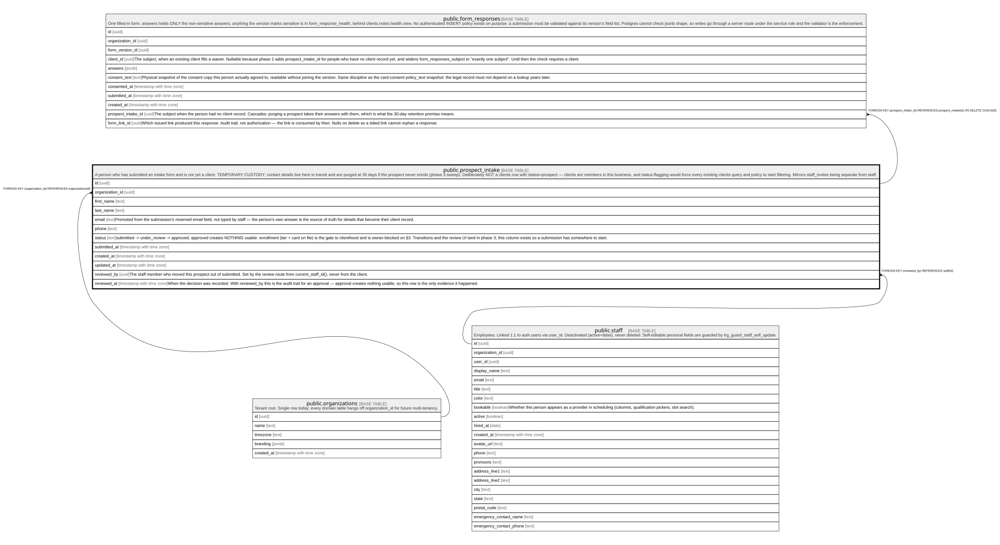

# public.prospect_intake

## Description

A person who has submitted an intake form and is not yet a client. TEMPORARY CUSTODY: contact details live here in transit and are purged at 30 days if the prospect never enrols (phase 3 sweep). Deliberately NOT a clients row with status=prospect — clients are members in this business, and status-flagging would force every existing clients query and policy to start filtering. Mirrors staff_invites being separate from staff.

## Columns

| Name            | Type                     | Default           | Nullable | Children                                          | Parents                                         | Comment                                                                                                                                                                                                                                                                    |
| --------------- | ------------------------ | ----------------- | -------- | ------------------------------------------------- | ----------------------------------------------- | -------------------------------------------------------------------------------------------------------------------------------------------------------------------------------------------------------------------------------------------------------------------------- |
| id              | uuid                     | gen_random_uuid() | false    | [public.form_responses](public.form_responses.md) |                                                 |                                                                                                                                                                                                                                                                            |
| organization_id | uuid                     |                   | false    |                                                   | [public.organizations](public.organizations.md) |                                                                                                                                                                                                                                                                            |
| first_name      | text                     |                   | false    |                                                   |                                                 |                                                                                                                                                                                                                                                                            |
| last_name       | text                     |                   | false    |                                                   |                                                 |                                                                                                                                                                                                                                                                            |
| email           | text                     |                   | false    |                                                   |                                                 | Promoted from the submission's reserved email field, not typed by staff — the person's own answer is the source of truth for details that become their client record.                                                                                                      |
| phone           | text                     |                   | true     |                                                   |                                                 |                                                                                                                                                                                                                                                                            |
| status          | text                     | 'submitted'::text | false    |                                                   |                                                 | submitted -\> under_review -\> approved. approved creates NOTHING usable: enrollment (tier + card on file) is the gate to clienthood and is owner-blocked on §3. Transitions and the review UI land in phase 3; this column exists so a submission has somewhere to start. |
| submitted_at    | timestamp with time zone | now()             | false    |                                                   |                                                 |                                                                                                                                                                                                                                                                            |
| created_at      | timestamp with time zone | now()             | false    |                                                   |                                                 |                                                                                                                                                                                                                                                                            |
| updated_at      | timestamp with time zone | now()             | false    |                                                   |                                                 |                                                                                                                                                                                                                                                                            |

## Constraints

| Name                                 | Type        | Definition                                                                                                  |
| ------------------------------------ | ----------- | ----------------------------------------------------------------------------------------------------------- |
| prospect_intake_status_check         | CHECK       | CHECK ((status = ANY (ARRAY['submitted'::text, 'under_review'::text, 'approved'::text, 'rejected'::text]))) |
| prospect_intake_organization_id_fkey | FOREIGN KEY | FOREIGN KEY (organization_id) REFERENCES organizations(id)                                                  |
| prospect_intake_pkey                 | PRIMARY KEY | PRIMARY KEY (id)                                                                                            |

## Indexes

| Name                    | Definition                                                                                                                                                                            |
| ----------------------- | ------------------------------------------------------------------------------------------------------------------------------------------------------------------------------------- |
| prospect_intake_pkey    | CREATE UNIQUE INDEX prospect_intake_pkey ON public.prospect_intake USING btree (id)                                                                                                   |
| prospect_intake_pending | CREATE INDEX prospect_intake_pending ON public.prospect_intake USING btree (organization_id, submitted_at DESC) WHERE (status = ANY (ARRAY['submitted'::text, 'under_review'::text])) |

## Triggers

| Name                      | Definition                                                                                                                        |
| ------------------------- | --------------------------------------------------------------------------------------------------------------------------------- |
| trg_prospect_intake_touch | CREATE TRIGGER trg_prospect_intake_touch BEFORE UPDATE ON public.prospect_intake FOR EACH ROW EXECUTE FUNCTION touch_updated_at() |

## Relations

---

> Generated by [tbls](https://github.com/k1LoW/tbls)
