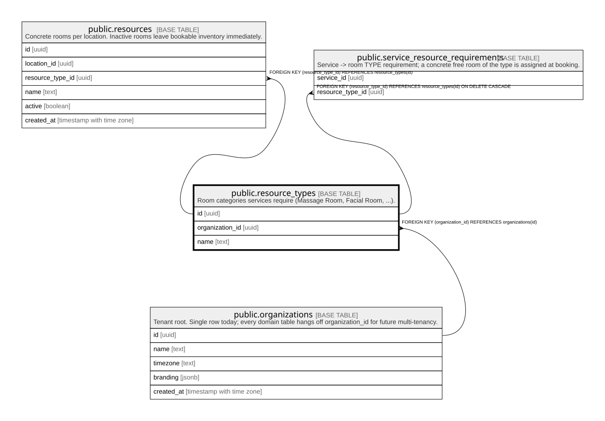

# public.resource_types

## Description

Room categories services require (Massage Room, Facial Room, ...).

## Columns

| Name            | Type | Default           | Nullable | Children                                                                                                                | Parents                                         | Comment |
| --------------- | ---- | ----------------- | -------- | ----------------------------------------------------------------------------------------------------------------------- | ----------------------------------------------- | ------- |
| id              | uuid | gen_random_uuid() | false    | [public.resources](public.resources.md) [public.service_resource_requirements](public.service_resource_requirements.md) |                                                 |         |
| organization_id | uuid |                   | false    |                                                                                                                         | [public.organizations](public.organizations.md) |         |
| name            | text |                   | false    |                                                                                                                         |                                                 |         |

## Constraints

| Name                                    | Type        | Definition                                                 |
| --------------------------------------- | ----------- | ---------------------------------------------------------- |
| resource_types_organization_id_fkey     | FOREIGN KEY | FOREIGN KEY (organization_id) REFERENCES organizations(id) |
| resource_types_pkey                     | PRIMARY KEY | PRIMARY KEY (id)                                           |
| resource_types_organization_id_name_key | UNIQUE      | UNIQUE (organization_id, name)                             |

## Indexes

| Name                                    | Definition                                                                                                               |
| --------------------------------------- | ------------------------------------------------------------------------------------------------------------------------ |
| resource_types_pkey                     | CREATE UNIQUE INDEX resource_types_pkey ON public.resource_types USING btree (id)                                        |
| resource_types_organization_id_name_key | CREATE UNIQUE INDEX resource_types_organization_id_name_key ON public.resource_types USING btree (organization_id, name) |

## Relations

---

> Generated by [tbls](https://github.com/k1LoW/tbls)
