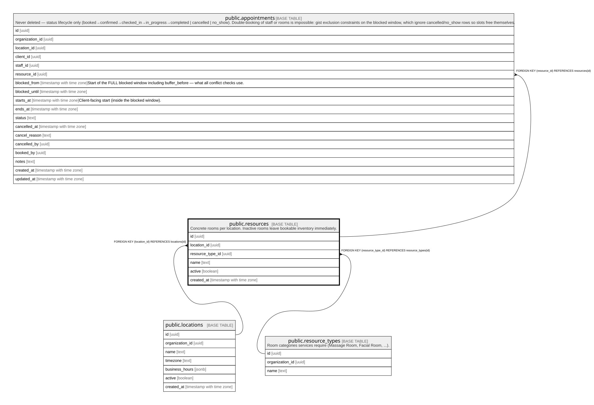

# public.resources

## Description

Concrete rooms per location. Inactive rooms leave bookable inventory immediately.

## Columns

| Name             | Type                     | Default           | Nullable | Children                                      | Parents                                           | Comment |
| ---------------- | ------------------------ | ----------------- | -------- | --------------------------------------------- | ------------------------------------------------- | ------- |
| id               | uuid                     | gen_random_uuid() | false    | [public.appointments](public.appointments.md) |                                                   |         |
| location_id      | uuid                     |                   | false    |                                               | [public.locations](public.locations.md)           |         |
| resource_type_id | uuid                     |                   | false    |                                               | [public.resource_types](public.resource_types.md) |         |
| name             | text                     |                   | false    |                                               |                                                   |         |
| active           | boolean                  | true              | false    |                                               |                                                   |         |
| created_at       | timestamp with time zone | now()             | false    |                                               |                                                   |         |

## Constraints

| Name                            | Type        | Definition                                                   |
| ------------------------------- | ----------- | ------------------------------------------------------------ |
| resources_location_id_fkey      | FOREIGN KEY | FOREIGN KEY (location_id) REFERENCES locations(id)           |
| resources_resource_type_id_fkey | FOREIGN KEY | FOREIGN KEY (resource_type_id) REFERENCES resource_types(id) |
| resources_pkey                  | PRIMARY KEY | PRIMARY KEY (id)                                             |
| resources_location_id_name_key  | UNIQUE      | UNIQUE (location_id, name)                                   |

## Indexes

| Name                           | Definition                                                                                             |
| ------------------------------ | ------------------------------------------------------------------------------------------------------ |
| resources_pkey                 | CREATE UNIQUE INDEX resources_pkey ON public.resources USING btree (id)                                |
| resources_location_id_name_key | CREATE UNIQUE INDEX resources_location_id_name_key ON public.resources USING btree (location_id, name) |

## Relations

---

> Generated by [tbls](https://github.com/k1LoW/tbls)
