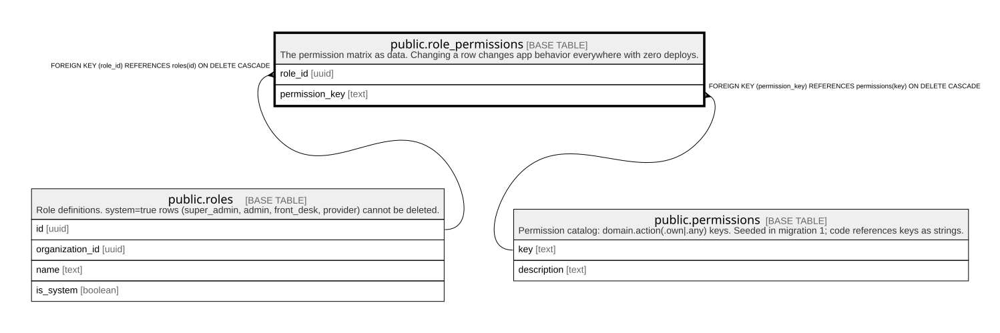

# public.role_permissions

## Description

The permission matrix as data. Changing a row changes app behavior everywhere with zero deploys.

## Columns

| Name           | Type | Default | Nullable | Children | Parents                                     | Comment |
| -------------- | ---- | ------- | -------- | -------- | ------------------------------------------- | ------- |
| role_id        | uuid |         | false    |          | [public.roles](public.roles.md)             |         |
| permission_key | text |         | false    |          | [public.permissions](public.permissions.md) |         |

## Constraints

| Name                                 | Type        | Definition                                                                 |
| ------------------------------------ | ----------- | -------------------------------------------------------------------------- |
| role_permissions_role_id_fkey        | FOREIGN KEY | FOREIGN KEY (role_id) REFERENCES roles(id) ON DELETE CASCADE               |
| role_permissions_permission_key_fkey | FOREIGN KEY | FOREIGN KEY (permission_key) REFERENCES permissions(key) ON DELETE CASCADE |
| role_permissions_pkey                | PRIMARY KEY | PRIMARY KEY (role_id, permission_key)                                      |

## Indexes

| Name                  | Definition                                                                                                 |
| --------------------- | ---------------------------------------------------------------------------------------------------------- |
| role_permissions_pkey | CREATE UNIQUE INDEX role_permissions_pkey ON public.role_permissions USING btree (role_id, permission_key) |

## Relations

---

> Generated by [tbls](https://github.com/k1LoW/tbls)
