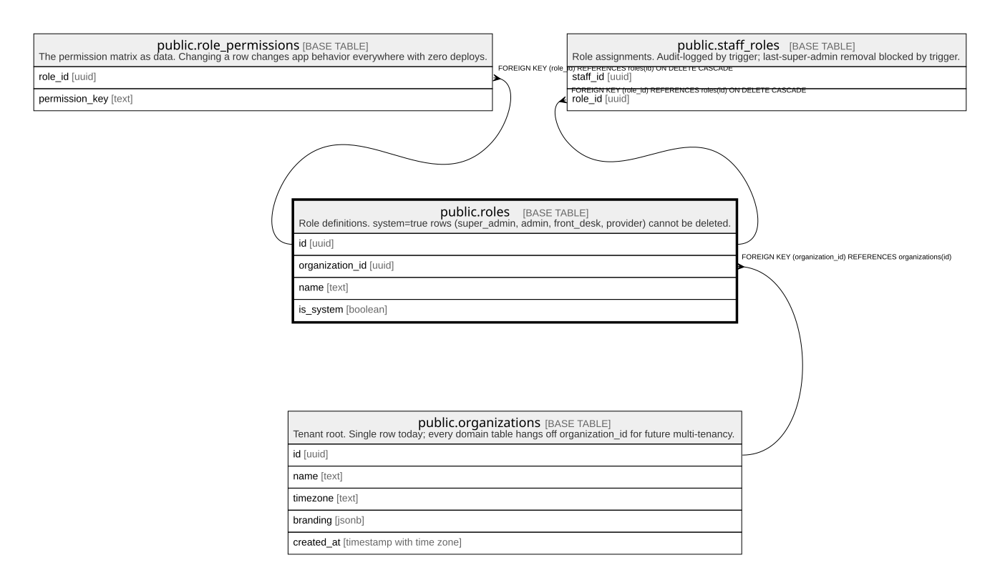

# public.roles

## Description

Role definitions. system=true rows (super_admin, admin, front_desk, provider) cannot be deleted.

## Columns

| Name            | Type    | Default           | Nullable | Children                                                                                          | Parents                                         | Comment |
| --------------- | ------- | ----------------- | -------- | ------------------------------------------------------------------------------------------------- | ----------------------------------------------- | ------- |
| id              | uuid    | gen_random_uuid() | false    | [public.role_permissions](public.role_permissions.md) [public.staff_roles](public.staff_roles.md) |                                                 |         |
| organization_id | uuid    |                   | false    |                                                                                                   | [public.organizations](public.organizations.md) |         |
| name            | text    |                   | false    |                                                                                                   |                                                 |         |
| is_system       | boolean | false             | false    |                                                                                                   |                                                 |         |

## Constraints

| Name                           | Type        | Definition                                                 |
| ------------------------------ | ----------- | ---------------------------------------------------------- |
| roles_organization_id_fkey     | FOREIGN KEY | FOREIGN KEY (organization_id) REFERENCES organizations(id) |
| roles_pkey                     | PRIMARY KEY | PRIMARY KEY (id)                                           |
| roles_organization_id_name_key | UNIQUE      | UNIQUE (organization_id, name)                             |

## Indexes

| Name                           | Definition                                                                                             |
| ------------------------------ | ------------------------------------------------------------------------------------------------------ |
| roles_pkey                     | CREATE UNIQUE INDEX roles_pkey ON public.roles USING btree (id)                                        |
| roles_organization_id_name_key | CREATE UNIQUE INDEX roles_organization_id_name_key ON public.roles USING btree (organization_id, name) |

## Triggers

| Name                     | Definition                                                                                                                         |
| ------------------------ | ---------------------------------------------------------------------------------------------------------------------------------- |
| trg_protect_system_roles | CREATE TRIGGER trg_protect_system_roles BEFORE DELETE ON public.roles FOR EACH ROW EXECUTE FUNCTION prevent_system_role_deletion() |

## Relations

---

> Generated by [tbls](https://github.com/k1LoW/tbls)
