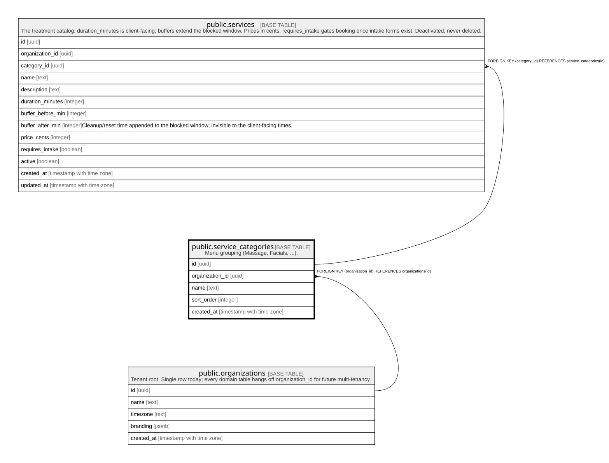

# public.service_categories

## Description

Menu grouping (Massage, Facials, ...).

## Columns

| Name            | Type                     | Default           | Nullable | Children                              | Parents                                         | Comment |
| --------------- | ------------------------ | ----------------- | -------- | ------------------------------------- | ----------------------------------------------- | ------- |
| id              | uuid                     | gen_random_uuid() | false    | [public.services](public.services.md) |                                                 |         |
| organization_id | uuid                     |                   | false    |                                       | [public.organizations](public.organizations.md) |         |
| name            | text                     |                   | false    |                                       |                                                 |         |
| sort_order      | integer                  | 0                 | false    |                                       |                                                 |         |
| created_at      | timestamp with time zone | now()             | false    |                                       |                                                 |         |

## Constraints

| Name                                        | Type        | Definition                                                 |
| ------------------------------------------- | ----------- | ---------------------------------------------------------- |
| service_categories_organization_id_fkey     | FOREIGN KEY | FOREIGN KEY (organization_id) REFERENCES organizations(id) |
| service_categories_pkey                     | PRIMARY KEY | PRIMARY KEY (id)                                           |
| service_categories_organization_id_name_key | UNIQUE      | UNIQUE (organization_id, name)                             |

## Indexes

| Name                                        | Definition                                                                                                                       |
| ------------------------------------------- | -------------------------------------------------------------------------------------------------------------------------------- |
| service_categories_pkey                     | CREATE UNIQUE INDEX service_categories_pkey ON public.service_categories USING btree (id)                                        |
| service_categories_organization_id_name_key | CREATE UNIQUE INDEX service_categories_organization_id_name_key ON public.service_categories USING btree (organization_id, name) |

## Relations

---

> Generated by [tbls](https://github.com/k1LoW/tbls)
