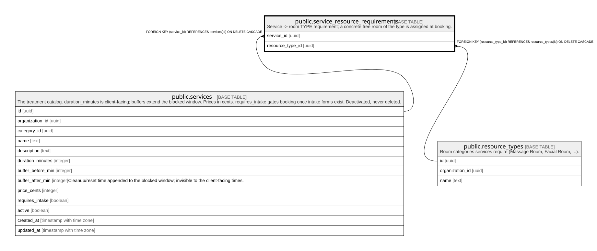

# public.service_resource_requirements

## Description

Service -> room TYPE requirement; a concrete free room of the type is assigned at booking.

## Columns

| Name             | Type | Default | Nullable | Children | Parents                                           | Comment |
| ---------------- | ---- | ------- | -------- | -------- | ------------------------------------------------- | ------- |
| service_id       | uuid |         | false    |          | [public.services](public.services.md)             |         |
| resource_type_id | uuid |         | false    |          | [public.resource_types](public.resource_types.md) |         |

## Constraints

| Name                                                | Type        | Definition                                                                     |
| --------------------------------------------------- | ----------- | ------------------------------------------------------------------------------ |
| service_resource_requirements_service_id_fkey       | FOREIGN KEY | FOREIGN KEY (service_id) REFERENCES services(id) ON DELETE CASCADE             |
| service_resource_requirements_resource_type_id_fkey | FOREIGN KEY | FOREIGN KEY (resource_type_id) REFERENCES resource_types(id) ON DELETE CASCADE |
| service_resource_requirements_pkey                  | PRIMARY KEY | PRIMARY KEY (service_id, resource_type_id)                                     |

## Indexes

| Name                               | Definition                                                                                                                                |
| ---------------------------------- | ----------------------------------------------------------------------------------------------------------------------------------------- |
| service_resource_requirements_pkey | CREATE UNIQUE INDEX service_resource_requirements_pkey ON public.service_resource_requirements USING btree (service_id, resource_type_id) |

## Relations

---

> Generated by [tbls](https://github.com/k1LoW/tbls)
