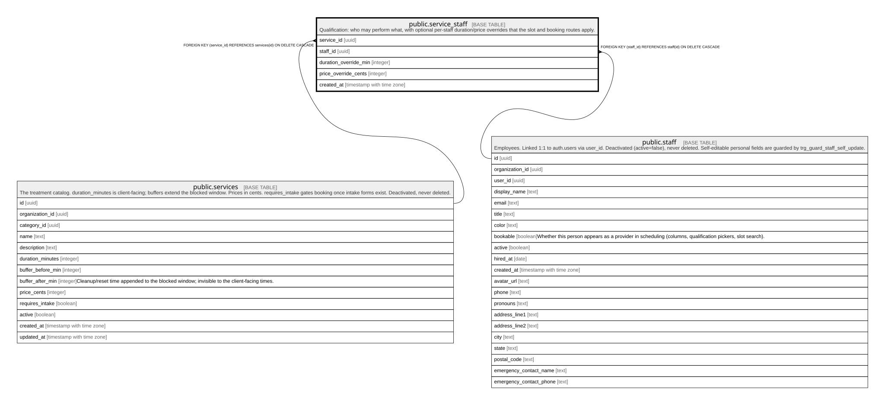

# public.service_staff

## Description

Qualification: who may perform what, with optional per-staff duration/price overrides that the slot and booking routes apply.

## Columns

| Name                  | Type                     | Default | Nullable | Children | Parents                               | Comment |
| --------------------- | ------------------------ | ------- | -------- | -------- | ------------------------------------- | ------- |
| service_id            | uuid                     |         | false    |          | [public.services](public.services.md) |         |
| staff_id              | uuid                     |         | false    |          | [public.staff](public.staff.md)       |         |
| duration_override_min | integer                  |         | true     |          |                                       |         |
| price_override_cents  | integer                  |         | true     |          |                                       |         |
| created_at            | timestamp with time zone | now()   | false    |          |                                       |         |

## Constraints

| Name                                      | Type        | Definition                                                         |
| ----------------------------------------- | ----------- | ------------------------------------------------------------------ |
| service_staff_duration_override_min_check | CHECK       | CHECK ((duration_override_min > 0))                                |
| service_staff_price_override_cents_check  | CHECK       | CHECK ((price_override_cents >= 0))                                |
| service_staff_staff_id_fkey               | FOREIGN KEY | FOREIGN KEY (staff_id) REFERENCES staff(id) ON DELETE CASCADE      |
| service_staff_service_id_fkey             | FOREIGN KEY | FOREIGN KEY (service_id) REFERENCES services(id) ON DELETE CASCADE |
| service_staff_pkey                        | PRIMARY KEY | PRIMARY KEY (service_id, staff_id)                                 |

## Indexes

| Name               | Definition                                                                                        |
| ------------------ | ------------------------------------------------------------------------------------------------- |
| service_staff_pkey | CREATE UNIQUE INDEX service_staff_pkey ON public.service_staff USING btree (service_id, staff_id) |

## Relations

---

> Generated by [tbls](https://github.com/k1LoW/tbls)
