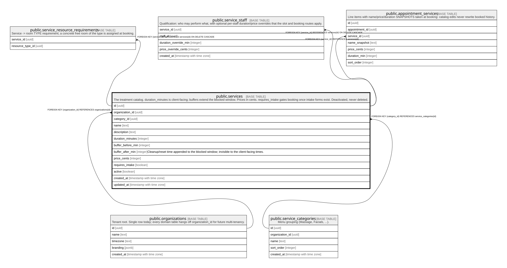

# public.services

## Description

The treatment catalog. duration_minutes is client-facing; buffers extend the blocked window. Prices in cents. requires_intake gates booking once intake forms exist. Deactivated, never deleted.

## Columns

| Name              | Type                     | Default           | Nullable | Children                                                                                                                                                                                      | Parents                                                   | Comment                                                                                  |
| ----------------- | ------------------------ | ----------------- | -------- | --------------------------------------------------------------------------------------------------------------------------------------------------------------------------------------------- | --------------------------------------------------------- | ---------------------------------------------------------------------------------------- |
| id                | uuid                     | gen_random_uuid() | false    | [public.service_resource_requirements](public.service_resource_requirements.md) [public.service_staff](public.service_staff.md) [public.appointment_services](public.appointment_services.md) |                                                           |                                                                                          |
| organization_id   | uuid                     |                   | false    |                                                                                                                                                                                               | [public.organizations](public.organizations.md)           |                                                                                          |
| category_id       | uuid                     |                   | true     |                                                                                                                                                                                               | [public.service_categories](public.service_categories.md) |                                                                                          |
| name              | text                     |                   | false    |                                                                                                                                                                                               |                                                           |                                                                                          |
| description       | text                     |                   | true     |                                                                                                                                                                                               |                                                           |                                                                                          |
| duration_minutes  | integer                  |                   | false    |                                                                                                                                                                                               |                                                           |                                                                                          |
| buffer_before_min | integer                  | 0                 | false    |                                                                                                                                                                                               |                                                           |                                                                                          |
| buffer_after_min  | integer                  | 10                | false    |                                                                                                                                                                                               |                                                           | Cleanup/reset time appended to the blocked window; invisible to the client-facing times. |
| price_cents       | integer                  |                   | false    |                                                                                                                                                                                               |                                                           |                                                                                          |
| requires_intake   | boolean                  | false             | false    |                                                                                                                                                                                               |                                                           |                                                                                          |
| active            | boolean                  | true              | false    |                                                                                                                                                                                               |                                                           |                                                                                          |
| created_at        | timestamp with time zone | now()             | false    |                                                                                                                                                                                               |                                                           |                                                                                          |
| updated_at        | timestamp with time zone | now()             | false    |                                                                                                                                                                                               |                                                           |                                                                                          |

## Constraints

| Name                             | Type        | Definition                                                  |
| -------------------------------- | ----------- | ----------------------------------------------------------- |
| services_buffer_after_min_check  | CHECK       | CHECK ((buffer_after_min >= 0))                             |
| services_buffer_before_min_check | CHECK       | CHECK ((buffer_before_min >= 0))                            |
| services_duration_minutes_check  | CHECK       | CHECK ((duration_minutes > 0))                              |
| services_price_cents_check       | CHECK       | CHECK ((price_cents >= 0))                                  |
| services_organization_id_fkey    | FOREIGN KEY | FOREIGN KEY (organization_id) REFERENCES organizations(id)  |
| services_category_id_fkey        | FOREIGN KEY | FOREIGN KEY (category_id) REFERENCES service_categories(id) |
| services_pkey                    | PRIMARY KEY | PRIMARY KEY (id)                                            |

## Indexes

| Name                | Definition                                                                                |
| ------------------- | ----------------------------------------------------------------------------------------- |
| services_pkey       | CREATE UNIQUE INDEX services_pkey ON public.services USING btree (id)                     |
| services_org_active | CREATE INDEX services_org_active ON public.services USING btree (organization_id, active) |

## Triggers

| Name               | Definition                                                                                                          |
| ------------------ | ------------------------------------------------------------------------------------------------------------------- |
| trg_services_touch | CREATE TRIGGER trg_services_touch BEFORE UPDATE ON public.services FOR EACH ROW EXECUTE FUNCTION touch_updated_at() |

## Relations

---

> Generated by [tbls](https://github.com/k1LoW/tbls)
