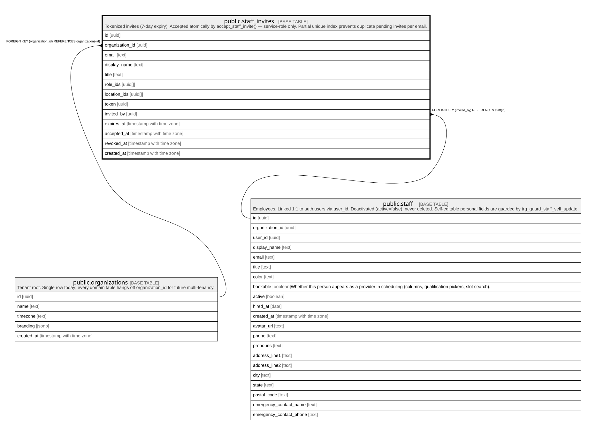

# public.staff_invites

## Description

Tokenized invites (7-day expiry). Accepted atomically by accept_staff_invite() — service-role only. Partial unique index prevents duplicate pending invites per email.

## Columns

| Name            | Type                     | Default                      | Nullable | Children | Parents                                         | Comment |
| --------------- | ------------------------ | ---------------------------- | -------- | -------- | ----------------------------------------------- | ------- |
| id              | uuid                     | gen_random_uuid()            | false    |          |                                                 |         |
| organization_id | uuid                     |                              | false    |          | [public.organizations](public.organizations.md) |         |
| email           | text                     |                              | false    |          |                                                 |         |
| display_name    | text                     |                              | true     |          |                                                 |         |
| title           | text                     |                              | true     |          |                                                 |         |
| role_ids        | uuid[]                   |                              | false    |          |                                                 |         |
| location_ids    | uuid[]                   | '{}'::uuid[]                 | false    |          |                                                 |         |
| token           | uuid                     | gen_random_uuid()            | false    |          |                                                 |         |
| invited_by      | uuid                     |                              | false    |          | [public.staff](public.staff.md)                 |         |
| expires_at      | timestamp with time zone | (now() + '7 days'::interval) | false    |          |                                                 |         |
| accepted_at     | timestamp with time zone |                              | true     |          |                                                 |         |
| revoked_at      | timestamp with time zone |                              | true     |          |                                                 |         |
| created_at      | timestamp with time zone | now()                        | false    |          |                                                 |         |

## Constraints

| Name                               | Type        | Definition                                                 |
| ---------------------------------- | ----------- | ---------------------------------------------------------- |
| staff_invites_organization_id_fkey | FOREIGN KEY | FOREIGN KEY (organization_id) REFERENCES organizations(id) |
| staff_invites_invited_by_fkey      | FOREIGN KEY | FOREIGN KEY (invited_by) REFERENCES staff(id)              |
| staff_invites_pkey                 | PRIMARY KEY | PRIMARY KEY (id)                                           |
| staff_invites_token_key            | UNIQUE      | UNIQUE (token)                                             |

## Indexes

| Name                      | Definition                                                                                                                                                               |
| ------------------------- | ------------------------------------------------------------------------------------------------------------------------------------------------------------------------ |
| staff_invites_pkey        | CREATE UNIQUE INDEX staff_invites_pkey ON public.staff_invites USING btree (id)                                                                                          |
| staff_invites_token_key   | CREATE UNIQUE INDEX staff_invites_token_key ON public.staff_invites USING btree (token)                                                                                  |
| staff_invites_one_pending | CREATE UNIQUE INDEX staff_invites_one_pending ON public.staff_invites USING btree (organization_id, lower(email)) WHERE ((accepted_at IS NULL) AND (revoked_at IS NULL)) |

## Relations

---

> Generated by [tbls](https://github.com/k1LoW/tbls)
